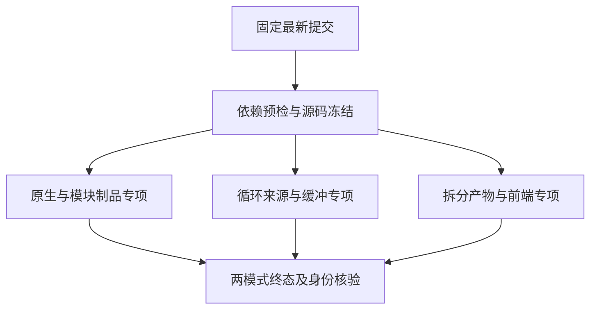
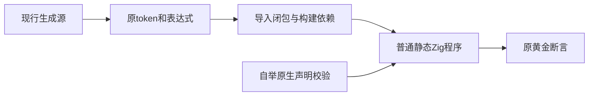

# 当前原生自举与测试拆分回归

## Intent：最终目标

在最新已提交的统一基线上，验证原生声明校验自举、后续生成器改动、新建循环调用来源测试及现行语义拆分。将此前候选拆分的需求与主分支等价实现对齐，避免覆盖已有实现。

## Data：可用证据

固定执行提交7229b342804b9aa542b7776c043d624df776ead1，包含f8aeef742原生声明校验自举。前两部分模块制品断言、循环调用来源测试均已提交，但实际执行分别固定149f20d61和b18d34220，不能从这些结果推断f8aeef742通过。

现行拆分已保留403个原始数字token、72个比较表达式和全部JSONL身份，并登记完整导入闭包；三个生成器--check通过，运行核验待完成。旧候选分支codex/test-source-granularity保留历史完整实现及证据，不直接合并覆盖主分支。

## Edges：边界与限制

独立检出固定提交，先预检现有Node依赖，冻结全部packages输入。门禁包括native-declarations、native-aliases、native-generation、module-artifacts、loop-call-origins、loop-initial-ownership、iterate-buffer、decimal-original、relational-whitespace、compound-whitespace、frontend；Debug和ReleaseSafe均需真实终态。未修改生产源码和测试断言。

旧完整ReleaseSafe89265继续运行，旧Debug已终态1，三个失败已分类。这里不重启旧门禁，也不将新专项等同全包通过。不放宽CLI冷安装超时；独立冷测待旧完整门禁终态后执行。

## Answer：交付格式与成功标准

两种模式完整组合门禁通过，保存真实日志、实际二进制、生成源身份、解析选项和源码快照。区分缓存与实际执行，核对候选需求由现行实现覆盖。若发现真实生产问题，先复现，再通知指定实现会话；完成验证部分后以英文Conventional Commit提交push文档证据。

## 自我批判

既有专项固定旧提交，发布父提交包含后续实现并不证明后续实现已通过。此次补齐准确基线上的组合验证，而不是复述旧通过数量。源码拆分需求可以由等价现行结构实现，不应为了合并自己分支而替换另一会话已提交的正确结构。
