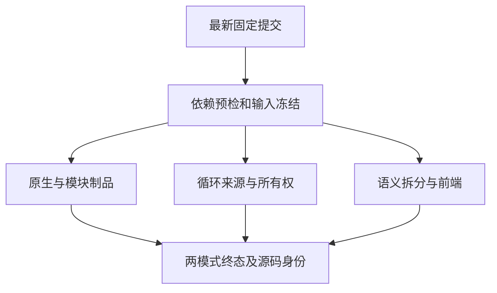
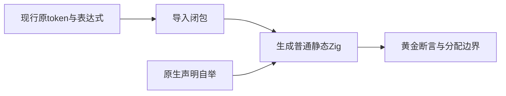

# 当前原生自举与测试拆分回归执行记录

## Intent：最终目标

补齐后续f8aeef742实现的准确源码验证，检查原生声明自举、列表循环来源及现行测试拆分共同成立。保留整体Test262和所有特性目标。

## Data：可用证据

固定7229b342804b9aa542b7776c043d624df776ead1，独立检出current-native-split-conformance，没有未提交正式源码草稿。复用既有根/测试包Node依赖，yaml真实导入和解析预检通过；冻结5,659个受版本控制的packages输入及原字节快照。

门禁包含11项：原生声明、原生别名、原生生成、模块制品、循环调用来源、循环初始所有权、迭代缓冲、原始数字、关系比较空白、复合赋值空白和完整前端。精确步骤与会话在运行状态.json。

Debug会话52803已终态0：268/268步、7,688/7,688实际Zig测试、69次实际测试二进制执行。两组Node摘要分别10/10和1/1，覆盖原生别名CLI及原生对象ABI生成/缓存复用/声明重排。Node内部临时程序由原驱动清理，未冒充已归档的Zig测试二进制身份，也不把Node断言数混入Zig总数。

ReleaseSafe会话37147已终态0，同样268/268步、7,688/7,688实际Zig测试、69次实际测试二进制执行，两组Node摘要同样10/10和1/1。两模式共15,376项实际Zig检查、138次原生二进制执行及22项Node测试，三者分开计数。旧完整ReleaseSafe89265仍活跃，未修改其输入或重启原进程。

现行拆分的只读身份核验确认403个原数字token、72个比较表达式字节及JSONL/review身份不变，完整导入闭包已登记；三个生成器--check通过。该核验原执行根记录保留，当前运行另有准确源码快照和门禁结果。

## Edges：边界与限制

本部分仅验证已登记专项；旧完整Debug为6846/6854步、111354/111354实际测试、三个门禁失败，不因这里通过而变为整包通过。CLI初始安装180秒超时仍待独立测量；两个旧NativeType断言编译失败已在另一部分迁移验证。

所有生成源保存路径与SHA，仅相关运行程序/ABI和解析选项保留原字节副本。原生生成模块使用确定性gzip存档，解压后核验原字节与SHA；不重复复制整套大型自举源码。

原候选codex/test-source-granularity已发布但无需直接合并：主分支149f20d61采用不同的等价职责分组，已满足原字符、case编号、文件行数和依赖闭包要求。现行结构的两模式运行核验已经完成，候选分支无需合并覆盖；保留其原分支代码和历史证据。

## Answer：交付格式与成功标准

两个当前门禁全部终态通过，固定输入、生成源、实际执行、Node摘要及缓存分离核验通过。候选需求已由现行实现覆盖，按精确文件清单发布本目录证据，使用英文Conventional Commit提交push。

## 自我批判

以前的旧固定专项不能证明新生成器实现，这次检查准确提交与实际执行。独立候选分支是保存当时冲突范围的手段，不应在等价现行实现已落地后继续为了形式合并而替换源码。

收集器按默认二进制名test只保存一个待运行编译记录，导致一个延后运行无法关联。真实二进制的完整测试名称唯一匹配invalid_test.zig；修正为同名编译队列，多候选必须通过完整测试名唯一匹配。重新收集和核验均通过，没有放宽身份或通过标准。

发布期间主分支新增9c177db5d类型缓存借用优化，发布父提交另行记录，并行生产路径保持原样。本部分仍准确验证固定7229b3428，不将新优化纳入已验证范围。下一批原文测试另建9c177db5d检出验证。

发布准备曾遇到Python标准输入编码错误，脚本未执行、未改变文件；改用明确补丁更新文档，再独立准备JSON与发布清单。
