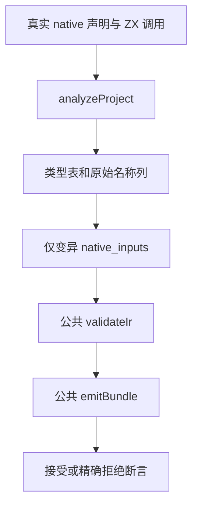

# 原生名称列覆盖审查

## Intent：最终目标

补齐前序名称列表示的新边界：名称必须对应规范类型表的节点位置，列长度必须精确，opaque 叶必须有正确别名；结构节点允许没有名字。防止迁移后只验证单叶旧断言，遗漏列与拓扑对应关系。

## Data：可用证据

在 `3e85c85d` 上只读检查以下实现与现有测试：

- `packages/compiler/src/zx/ir/canonical/native/type_bounds.zx`：初始类型位置、非空列、绑定列数量和深度入口。
- `type_walk.zx`：依照 object/tuple/list/optional 类型拓扑消费前序列，结束时必须恰好用完名称，拒绝 Task；最大访问深度为 256。
- `type_name.zx`：每个非空名称必须与当前 type_id 的模块绑定同时匹配；native reference 叶要求非空名称。
- `packages/compiler/src/zx/modules/native_types.zig`：真实接口构造名称列，object 按规范字段顺序排列，别名节点填写名字，其他节点保留 null。
- `packages/test/tests/native/references/ir/boundary_test.zig` 及 `mutation.zig`：已有空列、单叶错误名、并发引用、标量来源、Store 保留等测试；原有空列与单叶名断言已改用新列形状。
- `packages/test/tests/native/references/ir/allocation_test.zig`：已有同 owner alias 接受与嵌套并发拒绝的逐分配点清理。

初次定位时尝试了两个不存在的 aliases 路径及一个 shell 未匹配的 type_table glob；随后使用 `rg --files` 定位真实文件，没有把空搜索作为缺少实现的证据。

## Edges：边界与限制

以下为待验证草稿，尚未运行，不能算通过测试或已完成适配。没有生产文件改动，没有为用例新增特例；具体输入与预期仅存在于测试 fixture。

后续验证转入相邻的 `原生名称列拓扑边界/`，固定最新 `e968646c`。这里保留初始未执行草稿作为审查过程，不作为交付版本：实际首次编译证明相对父目录 fixture 导入越过模块根，已在新目录改为显式共享 fixture 模块。后续执行结果与正式发布应以新目录记录为准；完整回归仍保持其独立旧基线。

草稿使用两种 opaque 叶 Alpha/Beta，组合为 Packet 对象：左侧 list/optional、右侧 tuple/scalar、独立 scalar。接口故意以 scalar/right/left 顺序声明对象，期望列依照规范 left/right/scalar 顺序，用于观察实际构造次序。八节点列为 `Packet, null, null, Alpha, null, null, Beta, null`，其常量由这个测试形状决定，不能推广到其他类型。

直接以公共 `analyzeProject` 获得真实 IR，再仅修改 `functions.native_inputs`，保留类型、模块 owner、export 和其他表。使用成熟 `fixture.nativeOnly` 隔离调用者表达式，再经公共 `validateIr` 和 `emitBundle` 验证接受或拒绝；不直接调用 seed 替代正式生成路径。

九个拟新增测试：

| 检查         | 具体观察                                                     |
| ------------ | ------------------------------------------------------------ |
| 正常前序列   | 真实分析结果八个位置的名字/null 与独立预期相同，独立 IR 接受 |
| 所有截断前缀 | 0 到 7 个节点分别拒绝                                        |
| 多余尾部     | null、Alpha、Packet 三种额外节点均拒绝                       |
| 缺失叶名     | Alpha/Beta 各自置 null 均拒绝                                |
| 交换叶名     | 两个真实 exported 名交换位置仍拒绝                           |
| 未导出名字   | root、Alpha、Beta 三个命名位置分别换为 Missing 均拒绝        |
| 无名结构根   | Packet 根置 null 接受，同时保持叶的名字                      |
| 接受分配失败 | 正常列逐分配点清理                                           |
| 拒绝分配失败 | 缺末节点列逐分配点清理                                       |

不宣称这九项覆盖深度极值、库编码重排或解析 scratch 生命周期。这些仍需结合真正的可构造契约和既有 codec/cache 测试审查。不能把某个先行结构检查拒绝的 malformed 类型表归因于名称遍历。

## Answer：交付格式与成功标准

草稿存放于 `代码草稿/packages/test/tests/native/references/ir/name_columns/`，构建登记草稿只在现有 IR 验证入口增加 `name_columns/root`。完整回归的两个进程保持冻结；它们全部终态后，使用单独的固定执行基线测试这些草稿。

成功需要真实分析列位置、每个接受/拒绝结果、准确诊断与生成拒绝、分配清理都通过 Debug 和 ReleaseSafe；记录每条实际路径、源身份和执行日志之后再正式发布。当前不能完成该成功判断。

## 自我批判

前序列预期可能受真实类型规范化和 native alias 规则影响，所以必须先观察正常分析结果，不能遇到差异就修改生产实现或放宽到无关断言。该设计的主要价值是多种节点和两个不同叶类型；九个测试名不能等同于一般拓扑或生命周期证明。全文区分只读发现、草稿与未取得的执行证据。
