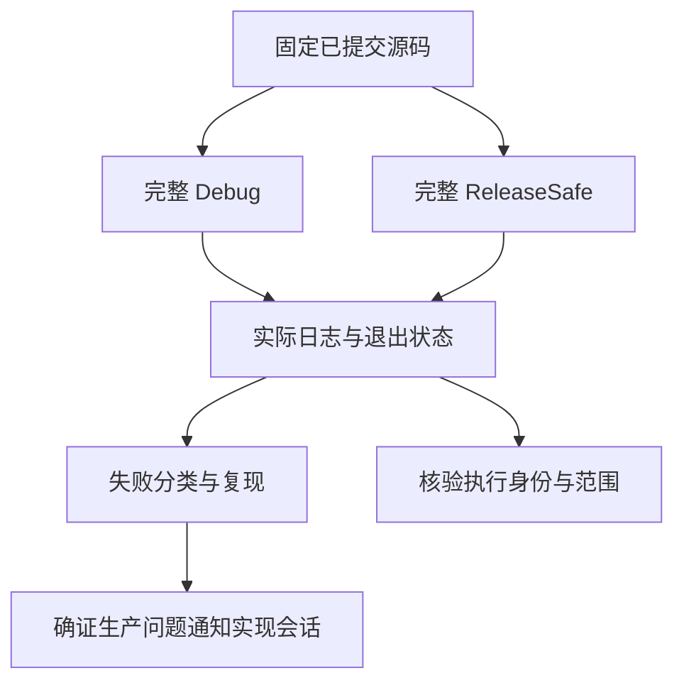
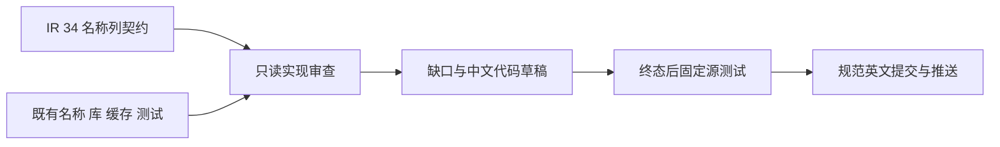

# 当前完整回归与原生名称列审查

## Intent：最终目标

在最新已提交源码上重新执行完整测试包，验证此前修复与最新迁移共同成立。审查 IR 34 原生输入名称列的现有边界覆盖，按真实缺口补充测试，不以登记数量或定向通过代替完整验证。

## Data：可用证据

当前起点为 `3e85c85d41ab925244aeca1856f29a912d165cfe`。最新生产提交 `1f4ea3ab` 将原生类型名改为前序名称列，并由 RX/ZX 校验。实现会话报告定向门禁 83 项 Zig 与 11 项 Node 通过，未执行完整门禁；本会话最近完成 reverse 的 628 项检查，但执行基线早于该生产提交。

既有完整回归曾暴露 CLI 冷构建超时、对象构造旧断言、Store 和循环边界问题，后续定向复验已解决部分问题。必须观察当前完整回归的实际结果，不沿用旧失败或旧成功。

## Edges：边界与限制

使用新的独立检出，保留所有历史证据所引用的旧检出不变。冻结全部受版本控制的 packages 输入，Debug 与 ReleaseSafe 分别执行 `zig build test`。两进程都终态前不修改执行检出的任何包源码。

可以同时只读审查原生名称列的契约、遍历、库与缓存测试；新的代码草稿写入本目录，正式测试仅在有完整证据与清晰范围后发布。没有确证生产缺陷则不消息通知实现会话。所有提交信息使用英文 Conventional Commits，每个完成部分正常提交并 push。

原始日志、退出状态、命令、源哈希和实际执行身份交叉核验。构建缓存不算新执行；stderr 标记不能单独决定失败。完整 test 包不自动证明仓库每个未登记特性已覆盖，也不证明全部 Test262 原文已适配。

## 独立冷 CLI 测量补充

环境中断后，原 ReleaseSafe 终态缺失，不补造结果。保留原完整 Debug 的 180 秒安装超时分类为待测，在同一 3e85c85d 固定源码上独立测量 CLI 初次 safe 安装。

执行前确认没有其他 Zig 构建/编译进程。编译本地与全局缓存均使用新的空目录；仅复制已缓存的依赖归档 p，不复用 o/h/z/b 等编译产物，避免把网络下载耗时与编译缓存命中混在一起。保存全部 source SHA、工具/依赖归档 SHA、初始进程清单和完整命令。

180 秒时观察原进程及子进程，但不修改用例 timeout、不终止本次测量，也不重新启动；继续取得完整退出结果和实际耗时，明确区分“越过原预算”与“构建本身失败”。观察后若其他构建启动，记录竞争与时间，不能继续称全过程完全无干扰。测试回归和 namespace 新门禁在该测量结束前不启动。

## Answer：交付格式与成功标准

交付固定源码身份、两种优化模式完整回归证据、真实失败分类、原生名称列覆盖审查和后续具体草稿。只有完整门禁实际通过才能报告该范围通过；失败必须从日志定位、复现并区分生产缺陷、失效断言、工具或环境问题。维持完整生产级目标，不缩减为局部测试数量。

