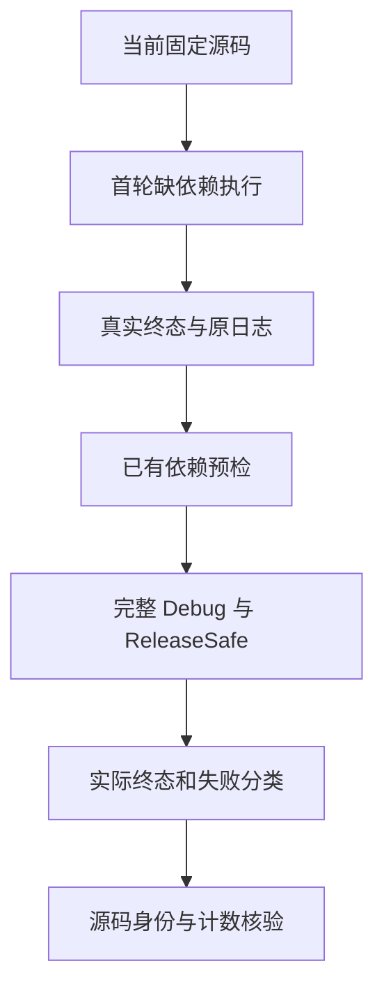
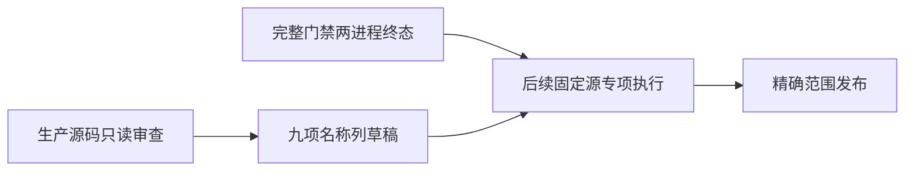

# 当前完整回归与原生名称列审查执行记录

## 独立冷 CLI 安装测量

共享类型压缩的两种模式已经完成并推送，系统进程表确认没有其他 Zig 构建后，恢复并核验原 3e85c85d 源码的 5529 个固定输入。测量使用新的本地与全局编译缓存，仅复制已缓存的两个不可变依赖归档 p；不复用编译产物。Zig 0.17.0 和官方 SDK 归档 SHA 均保存。

首轮 r1 因 build 不支持 --global-cache-dir，在参数解析阶段以 exit 1、0.075 秒结束，没有进入编译，不能解释原超时。核对本机 Zig 标准库 std/zig.zig 的 resolveGlobalCacheDir，确认环境变量 ZIG_GLOBAL_CACHE_DIR；新的 r2 使用该配置和另一个空缓存，保持首轮原始日志与状态。

执行命令、输入快照、依赖/工具 SHA、15 秒进程观察、180 秒边界和最终退出状态分别持久保存到 /Users/xiewendao/.codex/conformance/cold-cli-3e85c85d。namespace 新门禁在测量结束前不启动。本节只记录测量过程，终态前不修改原超时失败分类。

r2 已真实终态：exit 0，用时 289.314 秒；180 秒检查点仍在运行，超过原驱动预算。测量过程中观察到其他会话启动的构建，共保存 22 条竞争进程观察。因此，这次结果可以证明该固定源码的冷 CLI 安装最终成功及当次超出预算，不能证明独占资源时也会超时，不能确认原超时的根本原因。原始状态、边界记录、输入基线与日志身份见 `冷CLI测量终态.json`；不将本次安装成功改写成旧完整回归通过，也没有向实现会话报告未经确认的缺陷。

## Intent：最终目标

在当前已提交源码上运行完整测试包，查证新旧实现共同成立，并补齐 IR 34 名称列边界。完整 Test262 对齐与所有特性生产级测试目标保持不变。

## Data：可用证据

上一部分 `3e85c85d test(collections): cover reverse ownership boundaries` 已提交推送，HEAD 与 origin/master 一致；上一目标回合属于实际进展。

本部分新建并附加固定检出 `/Users/xiewendao/.codex/worktrees/current-full-conformance/zxc`，源提交为 `3e85c85d41ab925244aeca1856f29a912d165cfe`。冻结 5,529 个受版本控制的 packages 文件，逐文件身份见 `开始基线.json`，原字节快照为 `/tmp/zxc-current-full-source-3e85c85d`。旧检出均未移动或修改。

首次完整回归 Debug 会话 53031、ReleaseSafe 会话 78043 实际启动并多次确认仍活跃。Debug 的多个 Node 驱动在加载阶段遇到 `ERR_MODULE_NOT_FOUND: yaml`，具体涉及 semantic_lint、configuration/lock、configuration/manifest、iterate_calls/cli_fixture；不是已进入业务断言后的生产失败。新检出没有 Node 依赖，而 `packages/test/package.json` 已声明 yaml 2.9.1。

为避免继续把缺依赖执行当完整验证，先按完整命令、运行 seed 与实际 cwd 验证本会话的两个 Zig maker 进程和后代，再受控 SIGTERM。两会话均返回 143。记录明确 `complete_gate = false`，保存原始日志及哈希，不宣称完整失败计数或通过数量。只检索 `zig build` 的初次停止定位没有匹配，未发送信号；实际运行程序是 Zig maker，随后核验后才停止。

依赖准备脚本曾因 Python keyword 语法错误返回 1，编排却错误启动了后续会话 28389、52005。再次验证并停止这两个本会话进程，二者都终态 143；日志保留在 `准备失败重启*.txt`。修正为独立执行准备，并在新启动代码中要求预检 exit_code 为 0。

四个旧进程全部终态后，接入现有根与测试包 node_modules 的忽略目录符号链接，没有下载、升级或修改依赖。yaml 包版本和 package.json 哈希、真实入口身份、成功导入及解析 `ready: true` 的结果见 `依赖预检.json`。所有 5,529 个源码哈希仍一致。

最终完整回归正在运行：Debug 会话 92839、ReleaseSafe 会话 89265。准确命令、cwd、原始日志路径及终态待更新字段见 `运行状态.json`。不得重新启动或宣称结束，除非这些具体句柄返回终态或缺失；两个进程全部终态前不得修改执行检出的 packages 源码。

重跑 Debug 已观察 `test-build-modes` 初始 CLI 安装阶段 `spawnSync zig ETIMEDOUT`：内层构建固定为 safe，驱动上限 180,000 ms，尚未进入 app/relocated library 断言。该观察与此前历史冷构建超时同类，保存精确片段及 `冷构建超时观察.json`；完整门禁仍活跃，不能从这个片段提前生成终态摘要。待两完整进程终态后，单独测量同一安装，不先放宽 timeout，不以 warm 成功代替 cold 证明，尚未确证生产语义缺陷。

ReleaseSafe 随后也观察到同一驱动、同一初始 safe CLI 安装阶段的 180 秒超时；两种模式的精确片段分别保留。最后一次各 50 秒的句柄观察都仍返回原会话 id，日志没有终态 Build Summary，冻结输入再次全部一致。后续必须继续观察 92839/89265，不能将两处驱动失败等同于完整测试的终态计数。

已只读审查名称列生成与 RX/ZX 校验路径，准备九个边界测试草稿和最小构建登记；详见 `原生名称列覆盖审查.md`。这些仅位于本部分 `代码草稿/`，没有写入正式源码，没有执行，也没有计入通过数或 Test262 adapted 数。

## Edges：边界与限制

首轮与误启动轮都是受控终止，不具备完整构建摘要；不得用它们支持完整 test 包通过。最终运行可能重用此前成功步骤的缓存，收集脚本会区分实际运行身份与缓存摘要，不将缓存重复计为新执行次数。

当前证据只确证缺少已声明测试依赖，没有确证生产缺陷，未通知指定实现会话。原生名称列草稿的八节点预期仍需真实执行确认；不先假定它必然正确。

完整包门禁也不自动覆盖未登记特性或 50,630 个未审查上游文件。当前目录登记 128,468 项，812 个 adapted；这些是目录审计数，不是本次已通过的执行数。

## Answer：交付格式与成功标准

完整两模式都终态后保存 `收集完整门禁证据.py` 产出的摘要、日志、实际原生执行身份、生成模块哈希及 parser 选项副本。遇到真实业务失败，先按具体路径复现和分类，再决定通知实现会话；完成一个部分后使用英文 Conventional Commit 正常提交并 push。

当前本部分未完成，未提交。下一步继续观察最终两个具体句柄，不复用旧句柄、不移动冻结检出、不改源码。全部完整门禁终态后再将名称列草稿放入新的固定测试执行基线。

后续生产又提交 `e968646c` 的名称构造自举，调整执行顺序：另创建 `native-name-column-conformance` 独立检出，固定该新提交与三份草稿，启动九项新测试及完整 native IR 专项。其计划、源码身份与执行证据归入相邻的 `原生名称列拓扑边界/`；不修改这里的完整回归检出，也不把新专项作为旧完整门禁的结果。这个调整避免等旧基线终态才验证已更新的构造实现，完整回归仍继续观察原句柄。

名称列专项已完成两轮两模式核验，累计 54 项实际检查、10 次实际测试二进制执行。修正后的完整 IR 专项各 33/33 步，新组各 9/9 检查；既有四组缓存与首轮真实 18/18 来源分开记录。已正常提交、核验 hook 后范围并推送 `49edda5e test(native): cover input name column topology`，不改变本部分完整回归的未完成状态。

当前又新增 ZX 120 行硬约束，只读逐文件审计发现 20 个受版本控制的 ZX 文件超过限制，其中 10 个为测试源码。测试超限集中在关系比较空白、原始十进制词法分类和复合赋值空白三个生成家族。具体清单见 `当前ZX行数审查.json`，后续应从生成器按职责调整，同时保留原始字符、shape 编号、用例 ID 和断言；不能修改当前仍执行的完整检出。其余生产/标准源码不在本次已发布的名称列测试范围，另一个会话的未提交拆分文档保持原样。

上述旧计数随后纠正：Python splitlines 将 VT/FF payload 也当行，复合赋值五文件实际各 115 行。真正超限测试为五个文件；已在独立检出从两个生成器分组并登记依赖，403 原数字 token 与72原比较表达式字节不变。三轮两模式实际通过 14,522 项检查、6 次二进制执行，最终专项44/44步。因主检出存在另一会话同路径未提交拆分，完整候选代码与证据已单独提交推送分支 `codex/test-source-granularity`：`3d8a8991 test(conformance): split generated fixtures by syntax family`，尚未合并 master。详情在相邻 `测试生成源码职责拆分/`，没有覆盖并行源码。

完整 Debug 继续观察到两个 `test-module-artifacts` 编译失败，共同来自 `tests/incremental/artifact/mixed/metadata.zig:127` 访问已删除的 NativeType.children。实际 helper 还访问旧 name 字段；对应两个叶签名分别为 opaque Node 的 identity 与 u64 的 compute。等价新断言应为 names 长度1，identity 的 names[0]为 Node、compute 为 null；不能仅删去断言。原始片段与下一步约束见 `原生元数据旧断言观察.json`。当前属于测试表示迁移遗漏，未确证生产问题、未通知实现会话；完整两个进程仍需继续观察。

## 自我批判

新检出没有先检查 Node 依赖，是执行准备失误，导致首轮完整结果不可用。随后依赖脚本错误与编排未检查 exit_code 又浪费一次启动。最终流程加入真实导入预检与显式状态检查，而不是修改断言、掩盖日志或通知实现方承担环境问题。

受控停止只有在命令、seed/cwd 和后代归属核验后才执行。进程活跃和环境错误都来自当前状态；不能因为等待超时或一个旧记录就重启。后续应将依赖预检前置到每个新检出的首次 Node 门禁。

当前不能把草稿文件存在、完整门禁已启动或局部日志通过当完成目标。必须保留未完成状态，继续从真实终态结果推进。

模块制品共享旧断言已经在新的固定 149f20d61 检出迁移：两模式各32/32步、27/27检查，共54项实际检查和10次原生测试执行；源码身份与正式解析选项核验通过。该最小测试修复与证据已提交推送 master：b18d34220 test(artifacts): assert native input name columns。发布父提交为并行实现 d8fda95c，十个并行路径保持原样；实际专项执行基线仍明确为149f20d61，不宣称其验证了新生成器行为。完整旧基线门禁92839/89265仍活跃，不能把专项成功改写为完整通过。详情见相邻模块制品原生名称断言迁移目录。

已新增并推送7229b3428 test(collections): cover fresh loop call origins：八类新建/混合/借用/共享调用来源及无关原生标量场景，直接源码和库解码两路线；两模式完整组合最终各211/211步、106/106新检查。两轮累计784项实际检查、150次二进制执行；首轮literal误用数组spread已归档并改为显式空列表concat构造。实际执行固定b18d34220，发布父提交f8aeef742的25个并行路径保持原样；未将旧固定专项作为后续实现的验证结果。详情见相邻循环新建返回列表转交边界目录。整体完整回归仍需观察原两个句柄，未以专项代替。

完整Debug会话92839已真实终态1，收集证据脚本返回0：6846/6854构建步（3个失败），111354/111354实际Zig测试通过。整体门禁失败，不等同整包通过。三个失败分别为build-modes初始safe CLI安装180秒超时，以及两个module-artifacts测试引用旧NativeType.children共同helper编译失败。后者已在独立较新基线迁移断言并验证，但不能据此改写此旧完整结果。Debug终态原日志、实际执行与生成身份均已保存；ReleaseSafe89265仍活跃，继续观察，不重启或修改其输入，冷安装独立测量仍待该门禁终态。

最新固定7229b3428的原生自举/循环/测试拆分11项组合回归已完成并推送e984063ee test(conformance): verify native bootstrap and split fixtures。两模式各268/268步、7688/7688 Zig检查，共15376项实际检查和138次原生测试二进制，两组Node共22项；身份与同名编译关联核验通过。现行149f20d61拆分完整保留403原token、72原比较表达式及闭包依赖，无需合并旧候选代码覆盖。此结果仍不替代旧完整回归，后续9c177db5d优化正在另一原文测试基线验证。

已推送e42668e47 test(conformance): cover remaining concatenation boundaries：四份锁定原文19项诊断及一项独立显式字符串对照。固定9c177db5d，首轮过滤46项通过，最终Debug完整前端6661项通过、ReleaseSafe6688项通过；共13395实际检查、11次原生执行。四份review为excluded，不计为JS语义兼容或adapted；正式登记128488项，未审查50626，adapted812。整体对齐仍未完成，旧完整ReleaseSafe89265继续观察。

本轮新增原生签名批处理生命周期七项测试并 push 8ddf71d10（test(native): cover signature batch lifetimes）。执行固定 e42668e47，最终两种模式各 53/53 steps、7/7 新测试；首轮测试问题与提交钩子空行修改均保留并复跑，发布后身份守卫通过。发布父提交 94de53224 的共享类型列压缩尚需下一部分现行回归。原完整 ReleaseSafe session 89265 发布后再次 poll 仍 live，没有终态结果，未重启。

环境中断后从官方发布恢复固定 Z3 5.1.0 与 Zig 0.17.0 至 /Users/xiewendao/.codex/conformance/toolchains；两份官方 SHA 核验、仓库 Zig manifest 匹配，Z3 -version 与最小 check-sat 通过，详情见工具资源恢复.json。资源恢复没有重新运行原完整 ReleaseSafe，也未完成先前待测的独立冷 CLI 时间边界；不能据此修改旧失败分类。当前共享类型压缩门禁仍在 ReleaseSafe，冷测仍待其结束以控制干扰。
