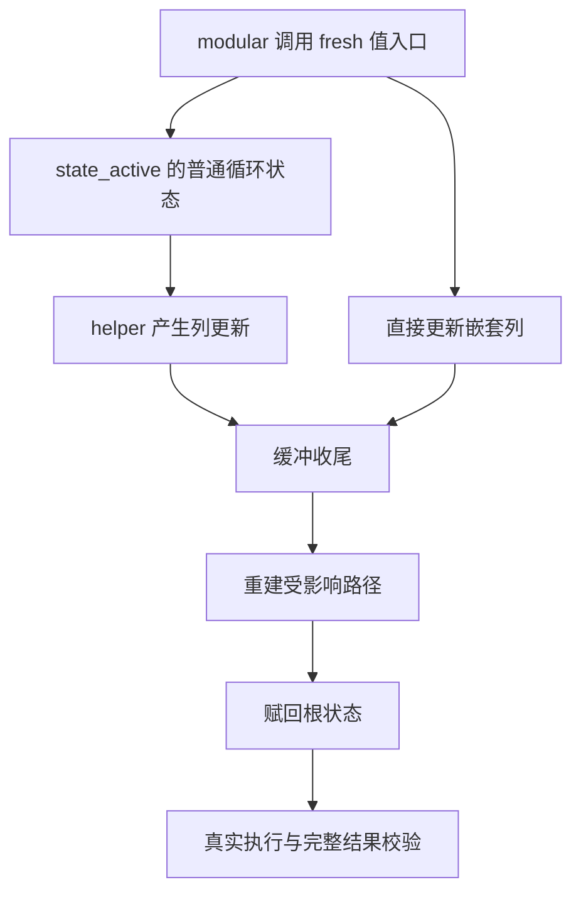

# 循环嵌套缓冲收束边界

## IDEA

- Intent：验证普通循环状态的嵌套缓冲收束通过重建路径保留值、借用输入和路径外字段，并排除生成 Zig 入口未被懒分析的假通过。
- Data：实现修复 f23a658e23f14385086440a4ad963c65809a5dcb，删除按更新来源控制的 rebuild 标志；普通状态统一 replaceLayout，deep 内联状态允许直接字段更新。成熟参考 loop_columns 与 loop_call_origins，现有 nested fixture 主要覆盖 deep 状态，不能替代普通状态重建验收。
- Edges：只测试和最小构建注册，不修改生产源码。直接源码及统一库编码/解码两条路径；每条路径必须真实调用生成 execute。最终第五轮 Debug 与 ReleaseSafe 均在 f23a658e2 冻结工作树完成，修复前 Debug 在 51bfbda29 独立冻结工作树完成。缓存复用，不作冷编译或独占资源计时声明。两批不做独占资源计时声明，也不共享可修改输入。不预设 fixture 必然命中普通状态，必须从生成代码和前后版本对照确认。
- Answer：语义分组的 ZX fixture、独立 Zig 值预期与生命周期/分配故障验证、固定输入和生成源码身份、两模式终态、英文 Conventional Commit 并 push。只报告独立确认的新实现缺陷，不重复通知已修复问题。

## 覆盖计划

1. 在同一循环中混合通过 helper 返回的列对象和直接 push 的嵌套列，覆盖零轮、单轮、多轮与已有借用前缀。
2. 分别使用对象路径、嵌套元组路径、两个相邻对象路径；更新一条路径时保留其他标量与借用字段。
3. 对零轮检查初始字节和身份；非零轮逐项比较结果，并确认调用方输入没有修改。
4. 对每个 fixture 的 source 与 library 产物强制调用 execute，独立检查所有结果字段，不能只 build-lib 无调用模块。
5. 对实际增长及第二条路径增长分别注入分配失败，核对已分配与已释放字节；仅在生成结构有依据时检查存储收束，不强加未承诺的分配次数。
6. 从生成代码确认普通状态实际重建；必要时在修复前固定版本做同一调用对照，证明新增测试覆盖该缺口。旧基线失败作为预期缺口证据，不算当前实现缺陷。

## 自我批判

深层 fixture 或文件名叫 nested 不足以证明命中了普通状态重建。必须结合 generated Zig 与修复前后强制调用证据。指针相同或值相同都不足以单独证明正确所有权；同时核对输入未修改、结果可用和故障清理。fixture 尚未执行时不计入通过数或覆盖完成数。
