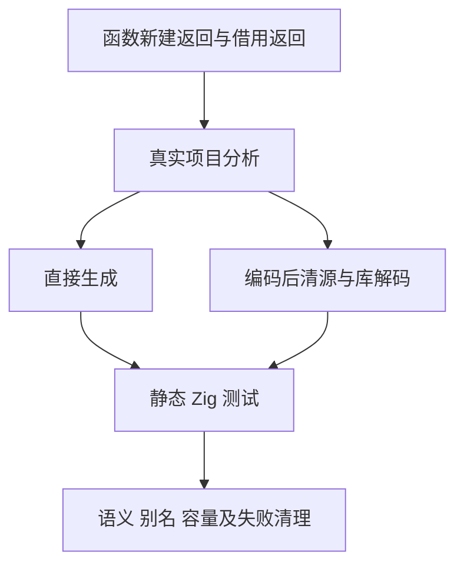
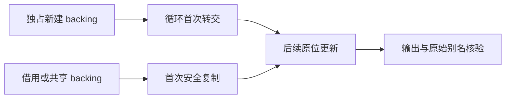

# 循环新建返回列表转交边界

## Intent：最终目标

验证 d8fda95c 的新分配来源摘要及循环 backing 转交：仅独占的新建列表可以接管；借用、混合来源及共享版本保留原语义。补充 zxc 特性边界，不修改生产算法。

## Data：可用证据

当前发布基线 b18d34220。实现增加按依赖顺序计算的函数返回来源，递归检查所有返回分支，并取消用整体 pure 条件屏蔽逐数组分析。现有 loop-initial-ownership 八个场景使用直接 map/filter 或借用，未覆盖新建返回函数调用链和循环内无关原生标量调用。

新增八类：新建 map 返回、普通列表构造返回、两层调用链、全新建条件返回、混合新建/借用返回、借用返回、共享新建返回及含原生标量调用的循环。每类通过真实源码分析和编码后清除源字节的库解码路径运行。

## Edges：边界与限制

测试源码及草稿按职责存放；ZX 实际行数含 CR/LF，全部不超过120行。生产源码保持不变，不将所有调用视为新分配，不更改旧全量回归检出。生成普通静态 Zig；原生宿主只提供明确标量测试调用。

语义覆盖空列表、零轮、首轮/次轮、多轮、两个返回分支、源输入和共享别名、全分配失败、禁止原地 resize。容量检查比较零轮/首轮/多轮及两个输入尺度，核验首写没有新增完整 payload 和后续不会逐轮复制。不能把登记数、生成源模式或缓存摘要当实际通过数。

## Answer：交付格式与成功标准

新增完整专项 test-loop-call-origins 与既有 loop-initial-ownership、iterate-buffer 在 Debug/ReleaseSafe 验证。保存冻结输入、真实命令和终态、每个实际二进制、生成源 SHA 与相关原字节副本；分类失败，只对已复现生产缺陷通知实现会话。每完成本部分使用英文 Conventional Commit 提交并 push。

## 自我批判

新来源摘要是保守证明，不应要求混合来源自动优化。容量断言只约束明确独占且所有返回分支新建的场景；借用和共享场景以语义及指针保护为准。成本验证必须真实执行，不能只搜索 constCast 就判通过。
