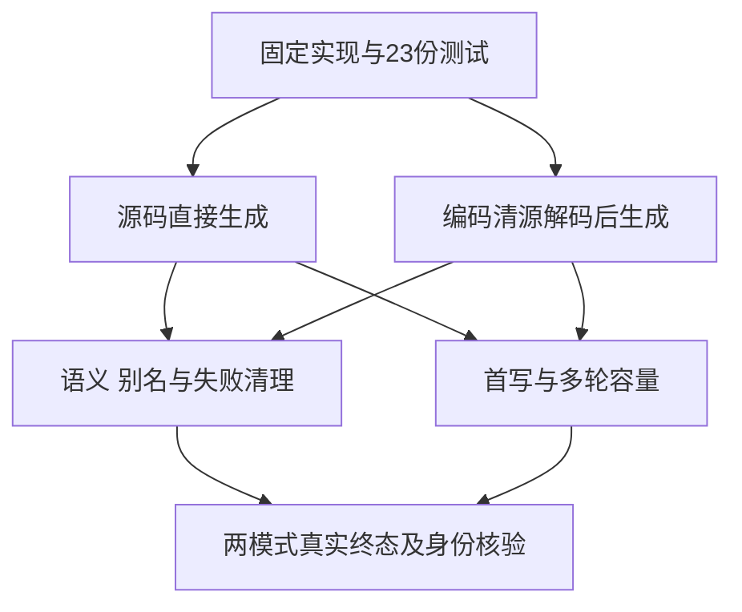

# 循环新建返回列表转交边界执行记录

## Intent：最终目标

补齐 d8fda95c 新分配返回来源和循环 backing 转交的直接回归。独占来源验证首写转交与后续原位更新，借用和共享来源验证原值与别名保护。

## Data：可用证据

固定执行提交 b18d3422005c981d8d65d59cadd0c416e07937da，包含 d8fda95c 实现；独立检出 loop-call-origin-conformance。23份正式测试文件先在本目录创建、格式化，再复制到检出。首轮与最终各冻结5,650个输入及不同原字节快照，只有factory/literal.zx一个helper不同。首轮23份原草稿以txt保存，未移动执行检出HEAD。

八类真实程序为 fresh、literal、chain、branch、mixed、borrowed、shared、impure。literal使用显式空列表concat构造。六项语义测试覆盖零轮与空列表、首轮/次轮、长执行及两个返回分支、空列表写入边界、禁止resize、全分配失败。原生标量宿主记录真实调用次数和顺序校验值，不访问列表backing。

五类明确独占的新建来源额外检查实际容量，两个enabled、两个长度2048/16384，分别运行零轮、首轮和64轮。断言首轮没有增加完整payload的底层分配，并且首轮与64轮的分配字节和次数相同。每类通过直接源码生成及库编码、清空编码字节、解码后重新生成两条路径执行。

完整组合门禁包含新组及既有loop-initial-ownership、iterate-buffer：

| 轮次 | 每模式构建步                 | 每模式实际检查            | 每模式实际二进制   |
| ---- | ---------------------------- | ------------------------- | ------------------ |
| 首轮 | 201/211，literal语法草稿失败 | 286/286：既有194、新组92  | 49：既有27、新组22 |
| 最终 | 211/211，完整通过            | 新组106/106，既有两组缓存 | 新组26             |

两轮两模式累计784项实际检查、150次实际二进制执行。不能把最终缓存的194项再计为新执行。最终两模式各40条容量观察，完整包含五类来源、两路线、两enabled、两尺度。准确命令、日志、实际二进制、编译/运行关联、生成源身份及副本见证据JSON。正式编译器/CLI解析选项均为generated_parser=true；自举生成器选项另行记录。

三个既有生成器的--check也全部返回0：数字、关系比较和复合赋值空白产物与生成源一致，此只读检查不增加adapted数量。

## Edges：边界与限制

首轮literal草稿误用了未支持的数组spread，语法拒绝发生在运行前。两首轮都终态1并完成原字节归档后，才改为既有concat构造；长度、元素、别名及容量验收未放宽。未把该失败当生产缺陷，未通知实现会话，也不声称本部分实现了spread。

执行期间主分支又提交f8aeef742的原生声明校验自举，包含生成器改动。发布父提交与并行路径清单见发布基线.json，全部并行文件保持原样。本专项实际证明的是固定b18d34220的上述行为；不宣称已验证后续生产提交的新行为。旧完整回归92839/89265仍在固定3e85c85d运行，不能由本专项推出最新整包通过。

## Answer：交付格式与成功标准

核验执行证据已通过：两轮输入及唯一修改范围、23份草稿原字节、四个终态结果、实际执行与缓存分离、二进制及生成源身份、两路线覆盖和解析选项。正式源码仅包括23份测试/构建文件，没有生产算法改动。发布按精确文件清单核验，使用英文Conventional Commit：test(collections): cover fresh loop call origins，随后push。

## 自我批判

最初没有先核对数组spread的既有能力边界，导致一类草稿不可执行。修正保留了真正要检验的新建返回来源及完整动态长度，并归档失败，未删除场景或放宽成本断言。容量从底层实际分配测量，不以某个生成字符串替代运行证明。整个Test262及全部特性目标仍未完成，后续实现提交和完整回归尚待验证。
