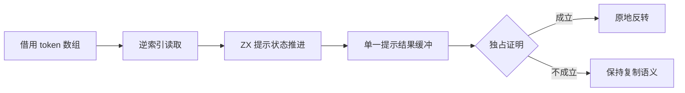

# 提示扫描与独占列表反转

## Intent：最终目标

提示算法借用原 token 列逆序读取，消除 token 投影对象及中间数组；通用生成器仅在证明列表独占时原地反转结果，保持共享和借用数据的不可变语义。

## Data：可用证据

基线 70474460。expressions/prepare/scan.zx 先 map 投影 token，再 reverse、reduce、reverse。生成 function_193 具有逐 token 投影 create、两份 token 指针数组及最后 Hint 指针数组复制。genz collections.zig 的 reverse/sort 分支无条件分配复制；现有 iteration_buffer/ownership 已有独占使用图，iteration_buffer.analysis 可证明同一列表沿循环更新且仅在指定路径返回。

## Edges：边界与限制

不引入占位 Hint 对象、不假设 map 支持捕获、不按生产函数名特判。原 token 只读，空输入不得发生减一或索引。独占证明需同时成立：使用次数与执行区域唯一、列表来源可写、循环不暴露其他别名且返回保留其所有权。非空字面量可能被 static_list 静态化，不能仅凭 list 节点就 constCast；不确定时仍按原语义复制。

不新增测试、不执行全量测试。通用 reverse 优化须审查别名、借用、零轮和错误路径，再以既有反转与解析准备专项验证。

## Answer：交付与成功标准

1. ZX 提示扫描用原 token 的逆索引推进同一 step 状态，保留提示顺序。
2. 复用现有独占图与循环缓冲分析证明 reverse 输入可消费；只对通过证明的数组生成原地反转。
3. 生成结果不再创建 Token 投影对象或其中间数组，独占 Hint 结果反转不再 alloc/memcpy；共享输入仍复制。
4. 记录生成证据、实际专项结果和未覆盖边界，不从单个产物推断全部编译器已零复制。

