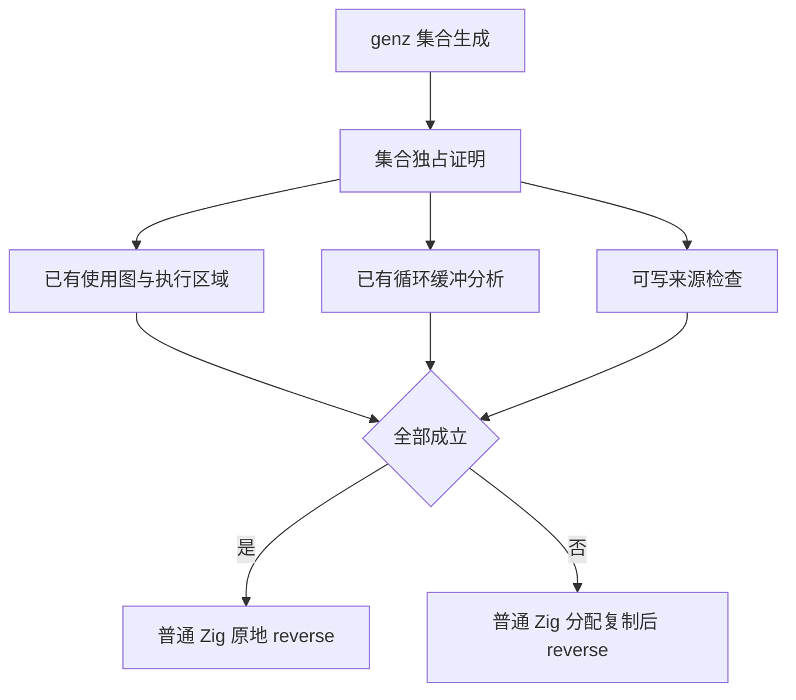

# 提示扫描零复制执行记录

## Intent：最终目标

消除提示扫描为读取顺序而创建的 token 投影数组，以及最终独占 Hint 列表的反转复制；维持通用列表不可变语义。

## Data：实现与验证证据

基线为 70474460。正式源码仅修改提示扫描、集合生成分支及新增集合独占证明文件。

提示扫描的关键推进如下，完整实现在 packages/compiler/src/zx/frontend/parser/expressions/prepare/scan.zx：

```zx
while: current => current.remaining != 0,
next: current => {
    const index = current.remaining - 1
    const token = current.tokens[index]

    current.state = step({ state: current.state, kind: token.kind, symbol: token.symbol, word: token.word })
    current.remaining = index
}
```

集合生成分支仅在 reverse 且 consumable 证明成功时接管缓冲：

```zig
const reuse = operation.kind == .reverse and try @import("collections/ownership.zig").consumable(self, operation.target);
const mutable = if (reuse) try self.builtin(.constCast, &.{source}) else try allocate(self, &body, child_type, length);

if (!reuse) try copy(self, &body, mutable, source);
```

新增证明复用已有独占使用图，沿 reference、对象字段、元组字段、scope 与 iteration 初始状态回溯。循环分析必须确认目标列表无旁路借用并保持返回路径；终点只接受新建 map/filter 结果或空列表。缓存覆盖、跨区域、多个引用、未知来源、非空静态字面量及循环 lowering 内调用均拒绝优化。



实际验证：

- 根构建 `zig build -j2 --summary all`：36/36 步成功。
- packages/test 内 `zig build test-list-reverse test-expression-preparation test-iterate-buffer -j2 --summary all`：117/117 步成功，212/212 项通过。
- `zig fmt --check` 对本次两个 Zig 文件通过；`git diff --check` 通过。
- 未新增测试，未运行全量测试，未调用浏览器。

生成产物路径、SHA-256 与函数统计记录在同目录生成证据.json。function_193 和 function_196 均无数组 alloc/memcpy，末尾生成 `std.mem.reverse(*const zx_type_44, @constCast(operand_1))`。各自四处 create 位于循环入口与出口，并非逐 token 投影；各有一次空列表 dupe。Hint 实体创建及缓冲增长仍由算法需要决定，统计不代表调用链无分配。

## Edges：安全边界与自我批判

单独的 detached(string) 不能证明不存在借用。这里 reader 摘要同时要求 pure；native_value.valueBoundary 不接受列表输入作为 pure 值边界，ZX wrapper 传播调用 purity，borrowing/call 在 reader 快速路径之前拒绝 external、Store 和 contracts。因此当前没有找到 bytes 到借用 string 逃逸的可达路径。以后若放宽 pure native 列表输入或增加 ZX 零复制 bytes-to-string，必须重新审查这一组合约束。

该证明是保守的静态分析，不是完整语言的形式化证明。共享或无法证明独占的列表继续复制；sort 未更改。临时使用图在编译期建立并释放，没有新增生成程序运行库。现有专项通过不代表全部编译器已零复制，也不代表全部自举工作完成。

## Answer：交付与成功标准

本阶段三个目标已达到：逆索引扫描保留既有提示行为；通用独占 reverse 消除已证明安全的复制；生成证据与既有专项相互核验。架构图在本文，算法数据流图在执行计划.md。后续继续按当前源码核查 RX 编排与 ZX 原子边界。
