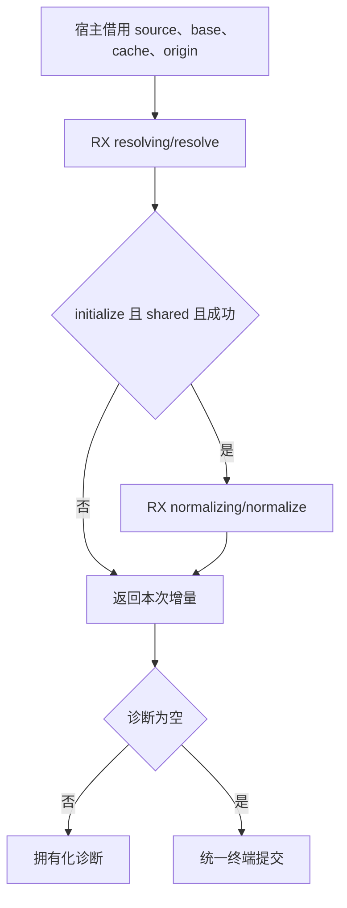
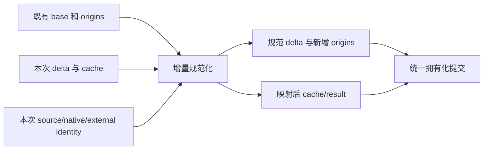

# 普通类型初始化与名义合并自举

## Intent

普通 ZX 类型初始化也由 RX 连接解析结果、诊断短路及共享名义增量规范化，复用已经接入原生接口的普通 ZX 算法，撤除 generated 路径的 shared_types 宿主调度。

## Data

- types/resolve.zig 仍先调用 generated resolution，再由 shared_types.resolve 生成来源、Pool.compact、重映射全部 resolved。
- 初始化产生的 delta 引用旧 base 与自身前缀；已有 resolved IDs 属于 base，新 cache 属于 delta，适配同一 suffix mapping。
- native/commit.zig 已能先准备来源，再无失败发布；移动到 semantic/resolving/host 可服务两条入口，原类型增量提交成为内部 delta.zig。

## Edges

- 只有 initialize 且 shared 且无诊断时执行规范化；普通 named/node 请求不改变处理顺序。
- context.resolved/aliases/visiting 借用原快照，不强制清空，区别于原生接口新建缓存契约。
- 旧 TypeId 不变，只重映射本次新增 cache/result；source/native/external 来源身份编码保持。
- 诊断在提交前复制到结果生命周期，不保留临时 arena 的诊断字节。
- seed 原实现仍保留在 types/shared_seed.zig；不把 seed 移位计为算法迁移。
- 终端容器拥有化仍为 Zig；不新增专用原生接口或运行库。

## Answer

源码先保存到代码草稿，再接正式路径。检查普通 source/native/external 名义来源、类型合并及相关资源失败专项；不新增测试、不运行全量测试、不调用浏览器。

## 自我批判

本次只适用于初始化边界；不能推断所有模块联结、缓存恢复及通用合并 Writer 已删除。共享状态仍以宿主存储承接，完整自举需继续检查传递依赖和状态模型。

## 只读复核与外部来源失败清理

普通源码模块会带入导入 aliases，其 ID 都属于 base；Snapshot 保留，规范化只映射新增 cache/result。现有调用方在初始化失败后停止分析，不依赖旧路径的部分提交。

通用提交会复制 external 来源。nominal_origins.copy 的 external 分支原先在复制 member 失败时漏释放已复制 module；现单独保存 module 并加 errdefer，随后再构造完整 Origin。没有扩大到无关字符串所有权重构。
