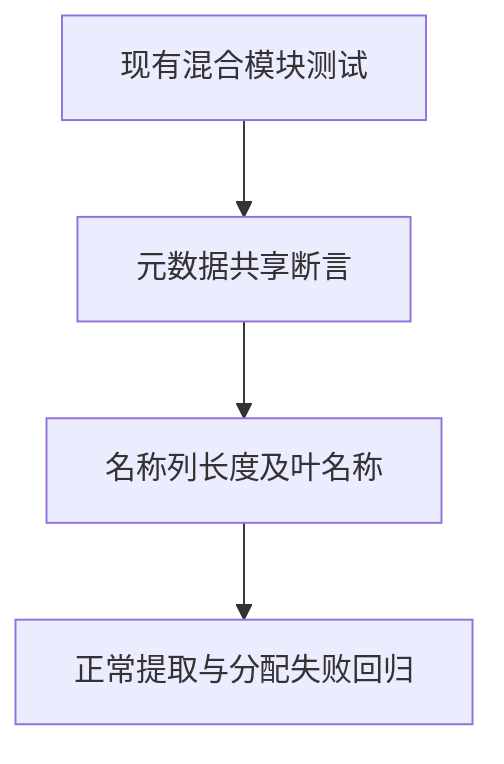

# 模块制品原生名称断言迁移

## Intent：最终目标

恢复模块制品提取及分配失败回归对原生输入元数据的检查。保持 opaque Node 与普通 u64 的类型含义和所有其他断言。

## Data：可用证据

完整 Debug 回归两处编译失败共同指向 mixed/metadata.zig 的旧 children 字段。当前 core 的 NativeType 只保存 names 名称列。两个签名都是叶类型，所以名称列长度为 1；Node 叶节点命名为 Node，u64 叶节点无名称。

代码草稿位于本目录，正式变更仅三处：children 长度 0 改为 names 长度 1；Node 的 name 改为 names[0]；u64 的 name 改为 names[0]。

## Edges：边界与限制

不改生产实现、不删断言、不改测试数量、不修改正在执行的完整回归检出。另建当前提交的固定执行检出，冻结输入后运行完整 test-module-artifacts 的 Debug 和 ReleaseSafe。

## Answer：交付格式与成功标准

两模式门禁终态通过，保存源码身份、准确命令、原始日志、实际测试二进制及生成源身份。核验只有本次测试 helper 和本目录文档进入提交，再使用英文 Conventional Commit 提交推送。完整 Test262 与所有特性目标仍未完成。

## 自我批判

编译失败本身没有证明生产语义错误。这里按实际类型结构保留同等断言，必须通过完整提取专项验证，不能以改到可编译或单个断言通过代替回归结果。
