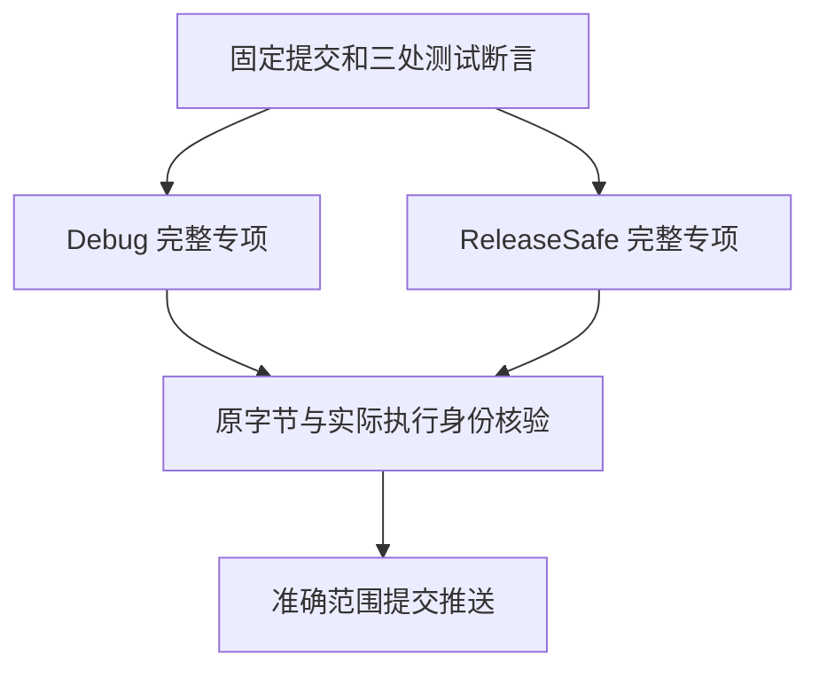

# 模块制品原生名称断言迁移执行记录

## Intent：最终目标

保持模块制品提取、原生签名引用和分配失败清理的原有检查，把共享元数据断言迁移到现行名称列表示。

## Data：可用证据

基线为 149f20d6118a8dbc15e9289c1428c8ff787db36f。独立执行检出为 `/Users/xiewendao/.codex/worktrees/artifact-native-names-conformance/zxc`，没有移动此前完整回归或候选执行检出。冻结 5,626 个 packages 输入及独立原字节快照，清单见 `执行输入.json`。

正式候选只有 `tests/incremental/artifact/mixed/metadata.zig` 的三处断言：长度 1、Node 名称、u64 空名称。其余断言与两个调用者保持原样。两种叶类型原本没有子节点，现行名称列仍应分别保留一个节点，迁移不删检查。

Debug 会话 17608 已终态 0：32/32 步、27/27 检查、五个测试二进制实际执行。完整覆盖 extract、invalid、resources、mixed/extract、mixed/resources；记录实际命令、生成源副本、二进制身份和正式 generated_parser=true 的选项。

ReleaseSafe 会话 82280 已终态 0，同样为 32/32 步、27/27 检查、五个测试二进制实际执行。累计 54 项实际检查、10 次实际二进制执行；核验执行证据脚本已通过。

发布准备的第一次父提交检查拒绝继续，因为另一会话已提交并推送 d8fda95c 的列表存储转交实现。失败发生在复制源码之前，没有修改正式 helper。核对其十个路径均不含本次 helper，再以该新提交为发布父提交，保留所有并行路径。测试执行基线仍是 149f20d61；本记录不宣称已验证 d8fda95c 的新生成器行为。

## Edges：边界与限制

此处修复的是旧测试 schema 引用，没有确证生产缺陷，未通知指定实现会话。原完整回归 92839/89265 仍在旧基线运行，这里没有改它们的输入，也不能替代完整包结果。

名称列专项仅覆盖对应元数据和提取边界，不增加 adapted 上游文件数量，不证明全部 Test262 或所有 zxc 特性完成。

## Answer：交付格式与成功标准

两种模式均终态通过后，核验冻结输入、日志、实际执行、生成源及准确提交范围；正式 helper 与本目录证据独立提交并 push。使用英文标题 `test(artifacts): assert native input name columns`。两种模式验收与源码核验已完成，正常 hook 已完成，发布前复核中。

## 自我批判

本部分不应根据旧编译错误猜测生产行为。把无子节点迁移为一节点名称列是按实际类型结构建立的等价断言；两模式完整专项是必要验证。计数只来自实际运行摘要，缓存构建步骤不重复计为测试执行。首个未推送提交误复制全部生成模块，导致近 51 万行证据，超过本次核验所需范围。发布前收束为全部生成源路径与 SHA 身份，只有名称列构造/校验及 parser 选项保留原字节副本；仍对每个缓存源核验 SHA，并正常修改未推送的本次提交。
