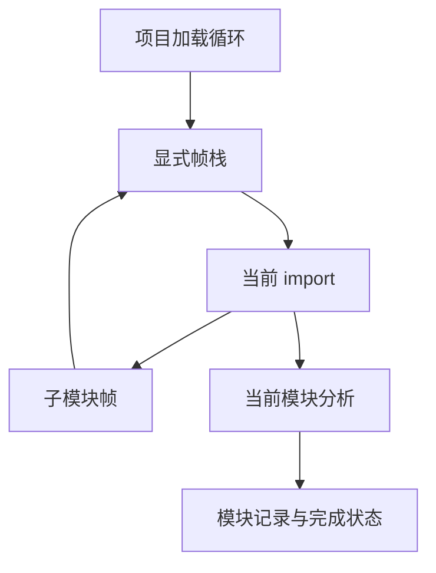

# 模块加载显式帧

## IDEA

- Intent：消除模块依赖深度导致的机器栈放大，保留 256 层规则。
- Data：现有深度重放在 65 层通过、129 层于项目分析崩溃；Project.load 经 loadInput 递归并持有 Analyzer 等大局部值。
- Edges：保持逐条 import、副作用、类型编号、缓存和诊断归属；不提高栈上限、不降低验证深度、不新增测试。不将这次 Zig 过渡修复宣称完整自举。
- Answer：显式 DFS 帧、独立当前模块分析步骤、现有深度重放结果与源码镜像。

## 架构图

## 数据流图

## 实施边界

ParseCache 的 Entry 独立分配；帧仅借用解析结果。暂停保存已解析目标，避免再次登记名称。追加子帧后不保留旧帧指针。错误时由项目 arena 统一释放元数据。后续自举仍须迁移该调度与状态模型。

## 实施复核

- 源码中模块依赖不再递归调用 load；唯一调用是项目入口。
- 每次循环重取尾帧，push 后不引用旧地址。
- pending 保留已解析目标；恢复时不重复登记名字，原生与外部导入仍在首次经过该 import 时执行。
- visiting 检查先于深度检查，检查发生在切换 current_source 之前；子解析错误归属子模块，父后处理恢复父位置。
- 帧借用 ParseCache 独立 Entry；项目分析先验证规范化路径唯一，不会在遍历中替换同路径缓存。
- Function 与 ModuleRecord 的追加顺序、类型缓存恢复及所有权分析保持原顺序。

## 自我批判与验证状态

此次改动仅修复现有 Zig 项目加载器的机器栈使用，不能证明模块联结职责已自举。新增帧集合使用项目 arena，增加 O(depth) 的编译期元数据，不复制应用数据或解析表。

静态 diff 检查通过；格式化与现有深度重放编译尚未返回。多个 Zig 进程同时处于系统 U 状态，编译日志为空，当前不能将无输出视为成功或失败。没有修改栈上限、现有重放深度或冻结回归检出。

## 2026-10-09 验证更新

主机未签名程序启动故障经本地签名恢复工具执行后，zig fmt 成功；现有深度重放编译与运行均退出 0。65、129、193、255 层完成分析和提取，257 层正常返回深度限制诊断。未更改测试输入或提高栈限制。诊断与工具恢复记录位于 ../2026-10-09/工具启动阻塞诊断/。
