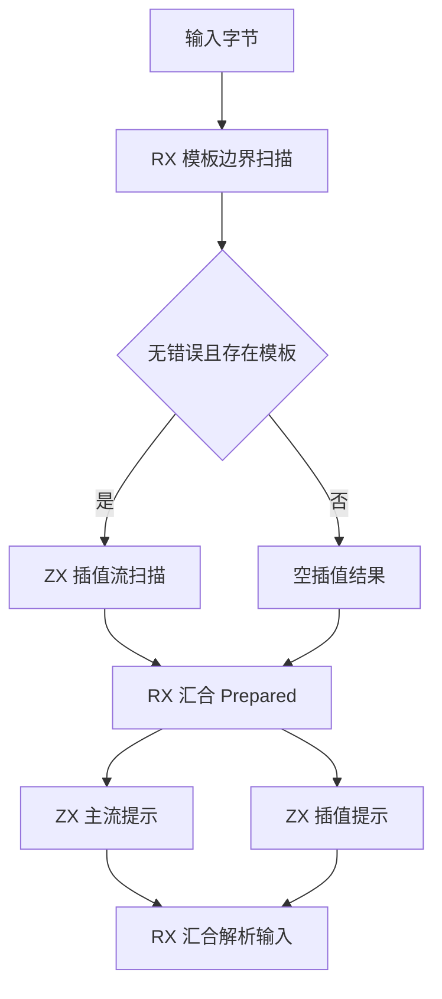
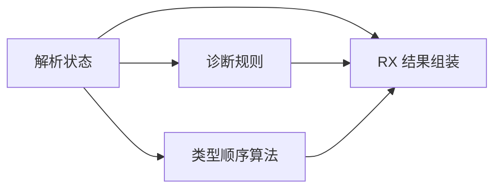

# 模板与解析阶段编排

## Intent：最终目标

模板边界、插值流扫描、表达式提示准备和类型顺序派生由 RX 显示阶段依赖；ZX 保留内聚的扫描、映射和诊断规则。继续完成现行 RX/ZX 全面对齐。

## Data：可用证据

基线 b447f05a。templates/prepare.zx 隐藏边界扫描与条件性插值扫描；boundary/scan.zx 隐藏 UTF-8 门禁及收尾。expressions/prepare/all.zx 同时计算主流和插值提示。program/native 的 finish.zx 均把诊断、类型顺序计算和结果组装放在同一函数。测试构建直接引用上述入口，必须一起迁移。

## Edges：边界与限制

扫描 tick/step、类型索引生成算法留 ZX；不按循环数量机械拆分。保留既有 lexical.rx 公开入口和 templates/prepare 的直接入口：内部 prepare 改为真实 RX 流程，现有入口引用改为模块调用，不新增 ZX 转发层。测试路由名称改为 direct/module，不再声称迁移后的两条路径分别验证 ZX 和 RX。

诊断优先级、模板为空时不扫描插值、EOF 与 token_templates 对齐必须保持。不会新增测试或运行全量测试；提交标题与正文用英文。

## Answer：交付与成功标准

- boundary/scan.rx 显示 UTF-8→初始化→字节扫描→flush→finish→结果发布或 empty。
- templates/prepare.rx 显示边界扫描→有模板且无错误时的插值扫描→Prepared 汇合。
- parser/prepare.rx 分别调用主 token 提示和插值提示算法，并组装 PreparedInput。
- program/native RX 显式调用诊断与类型顺序，直接组装公开结果；删除旧 finish 总控。
- 同步既有测试入口与内容追踪，核对生成代码与定向验证，不将本批等同于完整自举。

## 实施与自我复核

已删除 boundary/scan.zx、templates/prepare.zx、expressions/prepare/all.zx 和 program/native finish.zx 总控；扫描循环与插值 map 各自留在明确职责的 ZX 文件中。原 lexical.rx 入口继续指向 prepare 的真实 RX 流程，未增加 ZX 转发层。

独立静态审查逐项确认：UTF-8 与扫描收尾顺序保持，EOF 和 token_templates 的尾部 0 同步追加，插值扫描条件等于旧早退条件的取反；program/native 输出字段及首错诊断优先级保持。空原生接口规则合入 native/diagnostic，仍只在没有既有错误时触发。

测试入口由旧 ZX 聚合入口迁为 RX，路由名称 direct/module 描述实际入口；expression direct 的 cwd 使用仓库根，所有相关 RX 已纳入内容追踪。没有新增或删除测试断言，也不再把这两条入口称为 ZX/RX 不同编译前端。

## 验证结果

- 根构建退出 0，36/36 steps succeeded。
- 模板准备、表达式准备、类型解析与原生模块边界专项退出 0，83/83 steps succeeded，105/105 tests passed。
- 首次专项命令误用了不存在的 test-native-modules，未执行测试；已改为仓库真实目标 test-native-module-checks。最终日志对应正确命令。
- 跨分支空数组的 Interpolation 类型、可空 body 及结果 ABI 已通过真实生成与宿主编译。生成 parser/native 的公开编排入口 dupe 数均为 0，文件哈希另存；这不证明所有内层算法均无复制。
- packages 中 1743 个 ZX 文件均不超过 240 行，最大 232 行；源码 diff 空白检查通过。
- 未运行全量测试。提示扫描的 token 投影和逆序中间数组尚待消除；专用原生状态与编译器宿主迁移仍未完成。
