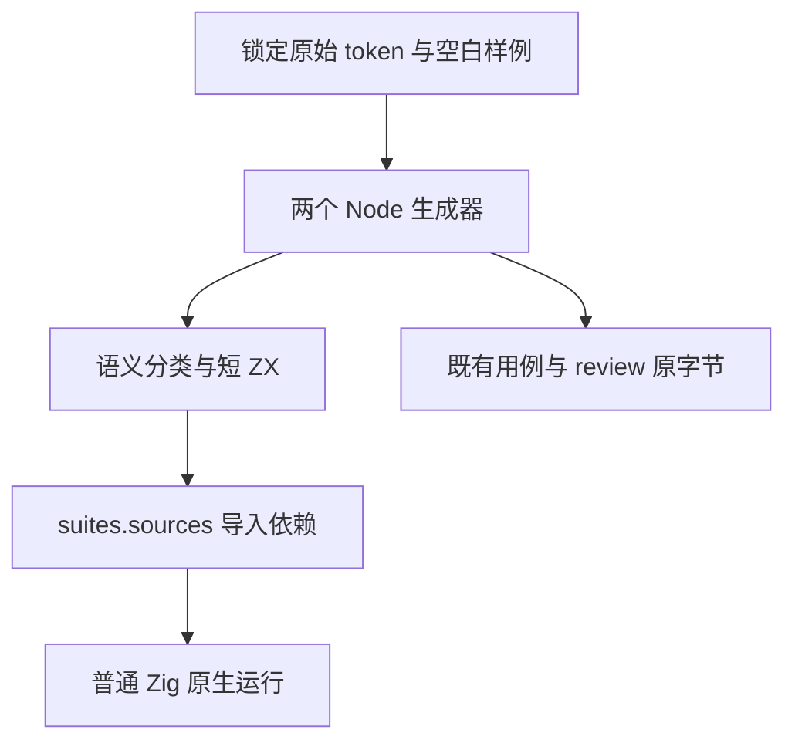

# 测试生成源码职责拆分

## Intent：最终目标

让已适配的原始十进制与关系比较空白测试符合 ZX 120 行限制，同时保持每个原始 token、空白字节、shape 编号、用例 ID、期望值与上游 review 不变。构建显式登记所有导入源码，防止缓存只观察入口文件。

## Data：可用证据

固定起点 `49edda5e15776dccf22b756ab1487de9bdaed2e9`，独立检出 `test-source-granularity`。主检出含其他会话正在拆分的生产源码，不能复制其未提交状态；旧完整回归仍运行于 3e85c85d 的另一冻结检出。

真正超限的测试源码为关系比较 whitespace（186 行）和四个 decimal 分类（174、170、232、170 行）。五个复合赋值文件实际 115 行：原审查使用 Python splitlines 错把原始 VT/FF 字符计为换行。本部分按 LF、CRLF、独立 CR 计行，保留复合赋值文件原字节，不做无关改动。

十进制保留七个既有语义家族和原入口；指数家族按 unsigned/positive/negative 分组，multi_digit 按无前导零或实际前导零宽度分组。关系比较按真实运算符分组，不能按 family 标签改写运算符，因为原文部分组合项的 family 与实际运算符不相同。

## Edges：边界与限制

从两个生成器调整并自动再生，不逐文件手工裁切产物。没有把源 token 变成宿主预计算常量，没有压缩排版、删除空行或改变测试输入。新 helper 都是普通静态 ZX；源码拼接、行数检查与依赖登记只在现有 Node 生成阶段执行，不新增语言 runtime。

原始 JSONL 和 review 必须逐字节不变。源码分组与测试目录职责对应，最终所有本部分 ZX 均不超过 120 行。通过现有 suites.sources 登记依赖，生成器 --check 同时验证产物与登记；只调整两项 suite 的 sources，其他目录注册保持不变。

保存中文草稿、完整源基线和实际日志。两个模式执行 decimal-original、relational-whitespace 和完整 frontend 门禁，覆盖原始值与诊断；活跃执行期间不改该检出源码。现有完整回归继续观察其原句柄，不以本专项代替全部结果。

## Answer：交付格式与成功标准

交付两个生成器及其职责明确的短 helper、自动生成的短 ZX、两项依赖登记、原用例身份不变证明与实际两模式门禁。生成 --check、目录审计、原始分支/token 字节比对、导入闭包登记和行数检查均通过后发布。

完成后使用英文 Conventional Commit：`test(conformance): split generated fixtures by syntax family`，正常 hook 前后核验精确范围，再 push。未确证生产缺陷则不通知实现会话。

