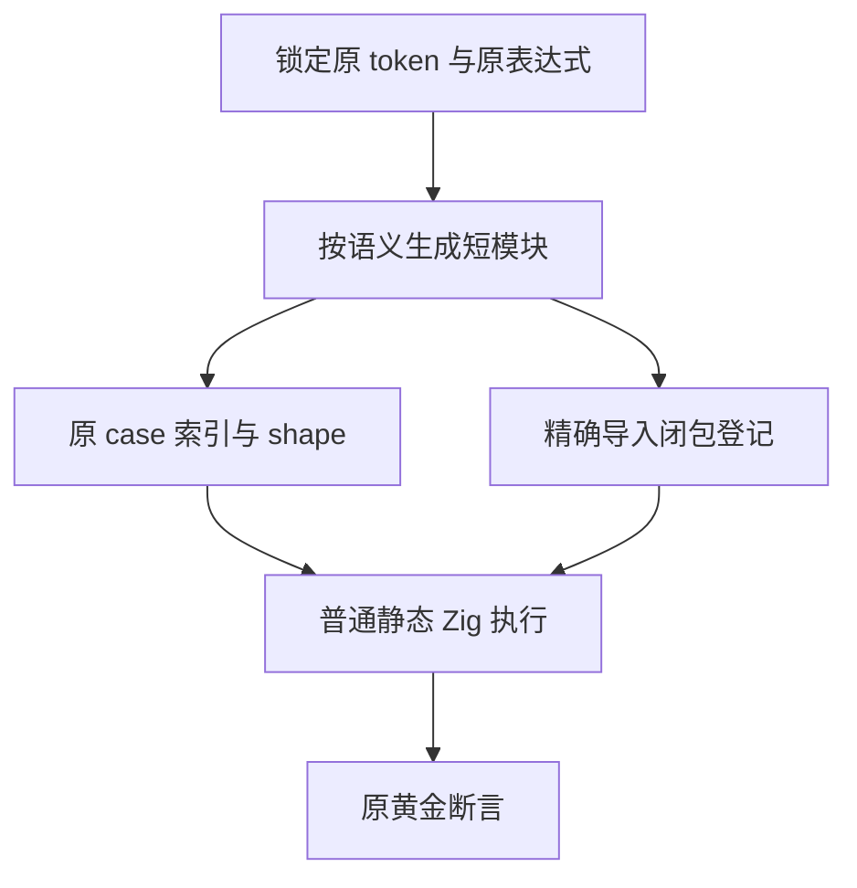
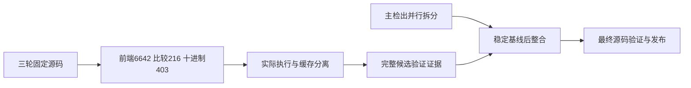

# 测试生成源码职责拆分执行记录

## Intent：最终目标

使既有 Test262 十进制与关系比较空白测试符合 ZX 120 行限制，保持每个原始断言和输入字节，并让构建缓存观察所有导入源码。不得通过预计算结果、压缩行数或减少用例达到目标。

## Data：可用证据

独立执行检出 `/Users/xiewendao/.codex/worktrees/test-source-granularity/zxc` 固定在 `49edda5e15776dccf22b756ab1487de9bdaed2e9`，加 31 份候选文件，共冻结 5,563 个 packages 输入。三轮基线与原字节快照分别记录，最终快照为 `/tmp/zxc-test-source-granularity-source-49edda5e-names-fixed`。活跃执行期间不修改该检出的源码。

候选改动从两个生成器开始，增加六个职责明确的短 helper：十进制分类与渲染、关系比较渲染、索引区间表达式、ZX 行数检查和 suite 导入依赖登记。17 个新叶模块加五个既有入口/家族调整；`suites.json` 仅新增两个 suite 的 sources，共 20 个十进制依赖和 4 个关系比较依赖。

十进制保持原七个分类入口和总入口。指数按真实符号分 unsigned/positive/negative；多位整数按无前导零或实际前导零宽度分组。表达式仍逐项返回原 token，未使用 JS 预计算值替代源码。

比较按实际运算符分组，保留全局 shape 与每条表达式字节。原数据中部分 family 标签对应混合运算符，不能强制将 family 转成某个运算符。候选选择正确的 helper；helper 仍执行原比较表达式。

`核验生成身份.py` 独立检查以下证据并返回 0：

- 403 个十进制 token 及原 case 索引逐项相同，原总入口字节不变。
- 72 条关系比较表达式逐项字节相同，包括 TAB、VT、FF、CR 和 LF；对应 216 个运行输入的 JSONL 不变。
- 所有受版本控制 JSONL、上游 review 及五个复合赋值文件原字节不变。
- 两项 sources 精确等于实际导入闭包，删除这两项新字段后整个 suite 对象与基线相同。
- 26 个相关 ZX 文件全部不超过 120 行，最大 90 行；行终止定义为 LF、CRLF、独立 CR。

两个生成器实际生成及 --check 通过。TypeScript 使用已安装 6.0.3，显式 --ignoreConfig、--types node 的 strict 检查通过。原目录矩阵仍为 128,468 项、812 adapted、50,630 未审查；这里不新增适配数量。

完整专项为 `test-decimal-original test-relational-whitespace test-frontend`，各模式实际结果如下：

| 轮次   | Debug / ReleaseSafe 每模式步骤        | 每模式实际检查   | 每模式实际二进制 |
| ------ | ------------------------------------- | ---------------- | ---------------- |
| 首轮   | 36/44，两个候选入口被 import 排序拦截 | 前端 6,642/6,642 | 1                |
| 第二轮 | 40/44，十进制导入名被 camelCase 拦截  | 比较 216/216     | 1                |
| 最终轮 | 44/44，完整专项成功                   | 十进制 403/403   | 1                |

三轮、两模式累计 **14,522 项实际通过检查、6 次原生二进制执行**。最终前端与比较使用此前通过缓存，不能重复计数。每模式缓存构建摘要分别为 17、32、34 条。每轮正式 CLI/前端编译选项两条，均为 generated_parser=true；实际二进制、编译/运行关联、生成源码、日志与 SHA 都已保存。

核验脚本确认三轮生产输入一致、只有候选范围变化，各轮源身份与计数可核对。三个快照、两份失败草稿以 `.txt` 保存，不被正常 hook 格式化；生成身份核验默认只读，只有显式 --save 才更新证据。

## Edges：边界与限制

最初行数审查使用 Python splitlines，把原 VT/FF 测试字符也当作换行，错误认定五个复合赋值文件超限。纠正后它们实际各 115 行，保留原样。真正需要调整的是五个文件：比较 186 行，以及十进制 174、170、232、170 行。

第一次 suite 序列化扩大了无关数组排版；紧凑输入传给 Prettier 又压缩了无关对象。最终采用有缩进的 JSON 输入及现有 Prettier 配置，diff 只涉及两项 sources。没有为避免差异修改格式配置或跳过 hook。

首轮 import 使用样例插入顺序，未满足 CLI 规范排序，两个模式都拒绝运行入口。排序后第二轮比较通过，十进制暴露带数字子组名 leadingZero_2 不符合 callable camelCase。第三轮将其改为 leadingZero2，snake_case 文件名不变。两次修正均在两个进程都终态后进行，没有禁用 lint 或放宽断言；属于候选生成错误，未通知实现会话。

发布检查发现另一会话也在主检出进行全局 ZX 拆分：20 个候选路径已有未提交并行改动，当时 13 个新模块字节相同，其他路径不同或被删除。详见 `并行路径当前观察.json` 与 `发布范围重叠.json`。本部分尚未将 31 个候选文件覆盖到主检出，也没有把并行代码混入自己的提交。后续需要在并行改动形成稳定提交基线后整合，再针对最终源码核验。

为保存可审阅的完整代码，另建 `test-source-granularity-publication` 发布检出，固定同一 49edda5e 父提交，将候选正式文件与完整证据单独提交到 `codex/test-source-granularity` 分支。原执行检出仍保持原 HEAD 和冻结源码，主检出的并行源代码与索引不动。分支提交采用 `test(conformance): split generated fixtures by syntax family`；正常 hook 后核验并推送该分支。主分支整合仍待完成，不能因分支发布而宣称已经合并。

已有完整 Debug/ReleaseSafe 回归仍在另一 3e85c85d 检出运行，记录在相邻目录；其冷构建超时与未完成状态不因这里的专项成功而消失。不能以本部分证明最新整个仓库、所有深度边界或全部 Test262 对齐。

## Answer：交付格式与成功标准

目前可交付并审阅的是完整候选草稿、原始三轮日志、固定源证据、生成身份与执行核验、IDEA 计划和记录。候选验证已完成，正式源码发布仍未完成。保留整体目标，不把文档存在或候选通过等同最终整合成功。

后续保持所有并行修改，等稳定基线后选择合适的最终生成结构，再证明原断言/字符不变、实际依赖完整、所有产物 ≤120 行并执行相应门禁。完成部分按英文 Conventional Commits 提交并 push。

## 自我批判

行数计数必须尊重测试原字节的含义，不能把任何空白都当换行。初稿又漏了 import 顺序和数字前下划线的 callable 命名，这些应在生成设计阶段遵循真实 lint。两次失败已保留，最终使用真实 CLI 规则校正，没有修改上游断言来迁就方案。

严格源码身份和真实执行比“最终摘要通过”更重要：最终只执行了十进制组，前两组来自同生产输入的历史实际通过和有效缓存。已按各轮来源核验，14,522 不是重复统计。

并行路径冲突出现后不能为了最快提交覆盖他人工作。当前候选保持可审阅，但正式发布必须继续推进；此记录不代表该整合步骤已完成。
