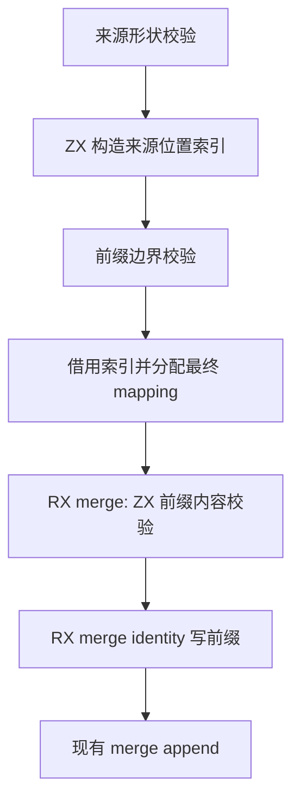
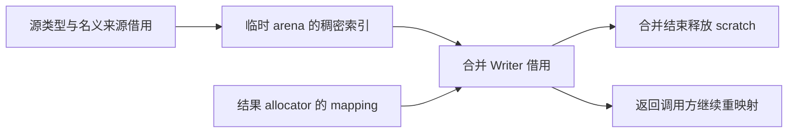

# 类型合并预检自举

## Intent

撤除 merge_workspace 原生状态桥，将来源索引构造与前缀校验完整表达为 RX/ZX；为后续通用合并 Writer 迁移建立显式数据契约。

## Data

preflight.prepare 只有 Pool.appendFrom 一个调用点。origins 索引仅在本次合并内使用，mapping 则返回给调用者。两者生命周期不同，不能放进同一短期 arena 后一起释放。

## Edges

- 来源索引使用 u64 加一编码，零表示缺失；避免把 ZX 固定宽度索引强转为平台 usize。
- 单次线性遍历构造稠密索引，保持 bounds、重复来源和既有 binding 规则；不改成逐类型扫描全部来源。
- 生成索引由 Result 持有临时 arena，merge 返回后释放；索引直接借用，不复制到第二张表。
- mapping 由结果 allocator 分配，RX merge 的 prefix 阶段通过既有 Writer 写 identity；失败释放尚未交付 mapping。
- seed 使用同一索引表示和 scratch 生命周期，保留原校验顺序及 prefix 初始化。
- 当前 merge_writer 仍是过渡边界；本次移除 Workspace 不代表通用合并已完成自举。

## Answer

先保存草稿，正式接入后检查生成索引循环是否复用容量与原地更新；主构建与类型合并、名义来源、模块产物专项验证。未要求新增测试，不运行全量测试，不使用浏览器。

## 自我批判

需用生成代码证明 O(n) 索引写入没有变成逐次复制列表；临时 arena 只管理生命周期，不得隐藏校验规则。identity 写入仍使用已有 Writer，后续迁移必须继续处理它，不能把边界移动误报为最终完成。

## 定长索引与产物检查

索引长度已知为 source.kinds.length，采用已有消费计数模块的 map 零初始化写法。生成代码一次 allocator.alloc(u64, source_length)，后续基于唯一拥有的新数组直接写索引，没有列表复制和扩容。输出 slice 由 Result.arena 保持生命周期。

新增 merge prefix 调用在生成入口以栈上参数对象连接，保留旧 merge 的零字节临时 arena 执行契约。首轮宿主 catch 包含生成函数并不产生的 IntegerOverflow，Zig 类型检查拒绝；已按实际错误集合收束。最终主构建已通过 36/36 步骤，专项终态记录在执行记录中。

## 既有失败顺序契约

现有资源专项明确要求来源 shape 错误先于任何 allocator 失败，mapping 分配先于 prefix 内容比较。初版对象返回在 shape 失败时仍需分配描述符，并把 prefix 比较放在 mapping 分配前，导致两项失败。

修正以普通数据契约表达：预检返回可空索引列表，shape、binding 或 bounds 无效时返回 null；shape 错误直接返回，不创建结果对象。宿主对成功索引分配最终 mapping；随后 merge.rx 调 table 与 prefix 做内容校验，成功后 identity/append，失败以既有状态协议新增 InvalidModule 状态返回。实际执行顺序保持，不伪造 allocator 失败、不修改测试、不增加手写校验。
