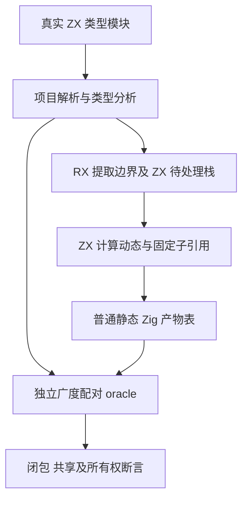
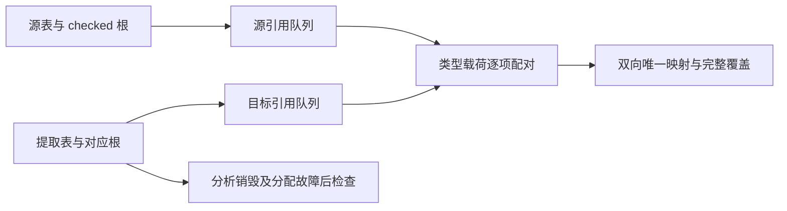

# 类型提取共享依赖前沿

## IDEA

- Intent：验证类型提取迁移后，真实源码项目中的较宽、较深及重复共享依赖能正确提取；输出类型引用完整且不夹带不可达类型，产物拥有自己的数据，失败清理保持输入不变。
- Data：执行前参考从 982804d36 更新到 c3c147245，覆盖显式集合回调上下文用于类型子引用映射的最新实现；相关生产迁移 9c2fc3606 与 beb0e2982。现有 artifact/mixed 已覆盖九种类型标签、小型共享图、名义元数据和生命周期。新增覆盖聚焦依赖前沿规模、重复引用与空动态载荷。
- Edges：只增加测试及最小构建注册，不修改生产实现。必须先从真实 ZX 源码分析，不能用手写 IR 冒充解析。每个生成 ZX 文件最多 120 物理行；一个依赖节点一个独立类型模块，宽对象最多 65 个字段。执行输入冻结后不改动。完整回归使用独立检出，不被本批影响。
- Answer：按职责拆分的 source/fixture/oracle/check 与具名 graph/resources 测试，源码格式与行数证据、两模式真实执行、生命周期及分配故障验证，英文 Conventional Commit 并 push；仅确证新实现问题时通知指定聊天。

## 测试设计

生成 leaf、节点模块和 main 类型入口：leaf 含被使用的枚举及无关 Noise；每个节点交替使用 optional、list、重复 child 的 tuple 和 object，保持无环且真实共享前一节点。main 导入终点与枚举，导出宽对象 Root 与 ScalarZero=void。

宽度 0/1/17/65、合法深度 0/1/2/3/4/17/65/129/255 根据语义边界组合。项目分析有明确的模块依赖深度上限 256，因此另用深度 257 精确验证 module 诊断、消息及 0:0 源码范围。深图不把多个类型挤进一行规避限制：每个节点本身就是独立类型实体和模块。宽对象字段独立换行，总行数不超过 120。

独立 oracle 沿源/目标根配对做广度遍历，逐项比较类型标签、值、字段名称和有序子引用，并维护双向映射。包含完整标量前缀、exports 和 checked imports；不得误称未使用但已检查的 import 应被删除。覆盖集合大小必须等于实际提取表大小，重复 source 引用必须落到同一个 local id。

另检查两次提取互不依赖、分析与源码释放后产物可读，以及 extraction-only 的全部分配失败。图规模参数不是用例 ID 分支；预期不调用生产提取或重映射生成。

## 自我批判

合法输入图测试不是一般图算法的数学证明。配对 oracle 必须先检查索引范围，避免错误目标导致测试自行 panic；闭包根必须包含真实 checked imports。深度失败若命中公开限制，应精确记录限制，不自行降低规模凑绿色。通过本批不证明所有九种类型标签在所有上下文或自举闭包均完成。
