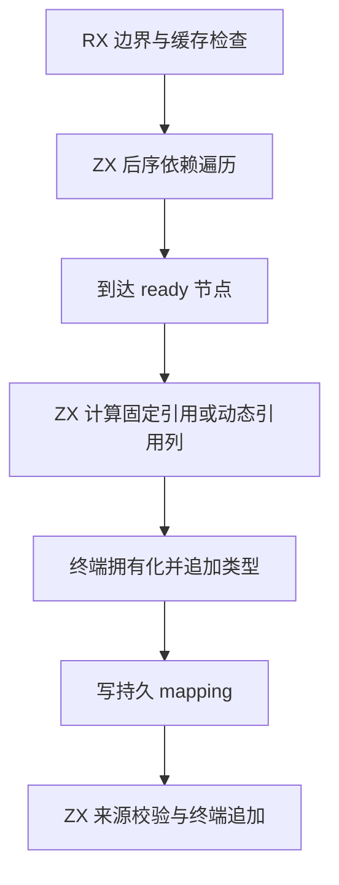
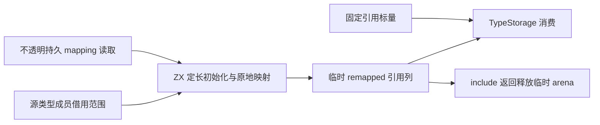

# 类型提取引用结果自举

## Intent

删除类型提取专用的临时引用输出缓冲，使用 ZX 构造显式重映射结果，再交给终端拥有化追加。

## Data

当前 ready 节点先通过 prepareReferences 分配或选择 Workspace 输出数组，再由 types/remap 通过 references.set 写入。该数组只被随后的 appendType 消费，不需要作为跨阶段可变原生状态。持久 mapping 跨 include 更新，不能直接作为普通不可变 ZX 列表暴露并在 opaque 调用背后修改。

## Edges

- 保留 mapping 的不透明访问边界，不复制整张映射，不引入新可变视图契约。
- optional/list/task 的固定引用通过标量参数传递，不创建一两个元素的临时列表。
- tuple/object 借用成员范围，map 零初始化一条定长引用列，再在 loop 中逐格重映射；不逐项扩容或复制源列。当前有两次线性遍历，不宣称单遍。
- DFS、type 追加、mapping 写入及 origin 校验顺序不变。
- 删除 extract 输入 Buffer、Workspace scalar/references 字段和 prepareReferences；终端 appendType 接收明确引用参数。
- 持久映射及 TypeStorage/origin 拥有化仍为过渡边界，不能宣称整个 Workspace 或类型提取已完成自举。
- 不新增测试、不运行全量检查、不使用浏览器。

## Answer

保存草稿并接入；检查生成代码的标量路径与动态引用列分配，再运行主构建和现有模块产物专项。通过后英文提交推送。

## 自我批判

不能仅把 prepareReferences 改名或搬到另一原生文件。本阶段必须实际删掉可变输出数组状态；新增终端参数应表达已计算数据，不能承载隐藏重映射规则。标量路径与动态路径要分别检查实际分配，不能仅凭 map 源码推断零复制。

## 生成成本复核

现有 map callback 不允许捕获外部 workspace，也没有独立 context 参数；首版快速编译已明确拒绝该写法。采用既有能力：借用 splice 移除结果范围，map 初始化输出，loop 显式携带 workspace 并原地写入。动态输出只分配一次，但保留零初始化遍历。

DFS 只需要循环最终 status，因此直接提取该标量，再决定返回值，避免把整个临时 pending 状态作为普通循环结果反复装箱。快速生成结果中，ready 节点的固定引用使用标量，动态 helper 的输入在栈上构造；每个 ready 节点没有额外结果对象分配。
