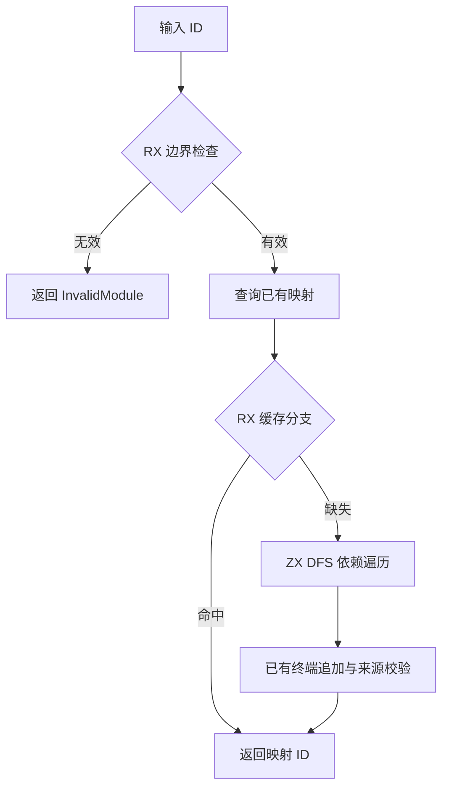
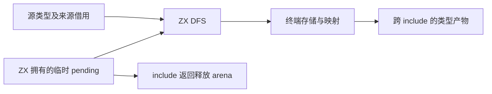

# 类型提取遍历状态自举

## Intent

将类型提取的 DFS 待处理栈从编译器专用 Zig Workspace 迁入普通 ZX 数据；RX 显式表达无效 ID、已有映射和新依赖提取分支，保留跨调用映射与已有产物顺序。

## Data

artifact/types 的 mapping 跨多次 include 保留。source 已经经过类型表和来源形状校验。现有 DFS 按 task 的 errors/result、tuple/object 的正向成员顺序完成子类型，再追加父类型；origin 校验发生在类型追加和 mapping 写入后。pending 仅服务一次 include，适合由生成函数 arena 管理。

## Edges

- 保留 source、origin 与 mapping 借用；不复制类型表，也不创建全表 visited 数组。
- 使用普通 ZX 栈数据，先以生成代码核对 push/pop 是否复用容量；不得把每次出入栈变成全栈复制。
- 保持 nominal 错误、mapping 写入及 append 的相对顺序，不预先批量追加或排序闭包。
- 已有映射与无效 ID 分支不创建临时栈。
- extract_workspace 的 mapping、终端 TypeStorage 与引用重映射仍为过渡依赖；本阶段不能宣称完整类型提取自举。
- 未新增测试；仅按现有专项核对行为，不运行全量测试。

## Answer

保存代码草稿、接入正式源码、检查生成代码与专项结果，英文提交并推送。若普通列表不能保持摊销线性的栈操作，先解决通用代码生成能力，不以专用桥替代。

## 自我批判

单纯把入口改成 RX 不足以证明职责迁移。本阶段验收必须同时检查原生 pending 字段与 API 真正消失、生成栈操作无重复复制，以及 RX 的实际短路分支。剩余终端状态边界需继续迁移。

## 发现的通用生成缺口

生成的 dependencies buffered 函数已接收到调用方 lane，但嵌套 loop 的 iteration_value 路径优先于 Lower.regular，绕过 append_overrides，另建本地容量。重复复制之外，还会导致外层容量与返回切片脱节。

修复位于 genz：iteration_value 在缓存之后尊重已验证的 append override，使用既有 unpack → regular → conversion 路径。普通循环列表保持 ABI 表示；inline_lists 仅在叶子类型布局兼容时复用，产品元素内联列表不能直接写入 ABI 缓冲。保留本地 capacity 作为未传 lane 时的现有分支，每列独立判断。修复不依赖类型提取的文件、函数名或输入样例。

首版草稿在普通函数中使用了仅允许 loop update 内使用的赋值语法，快速编译已拒绝；已改为返回新记录并通过内置格式化。正式主构建首轮捕获旧草稿而失败，修正后重新验证，不能将该轮视为通过。
