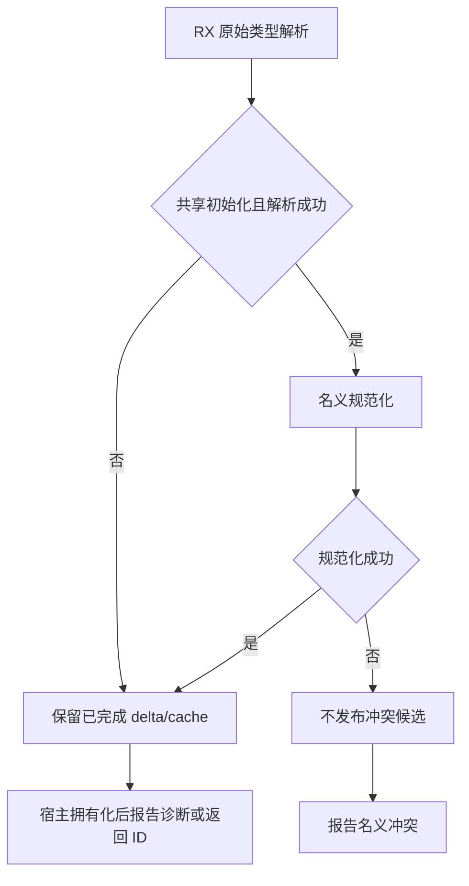
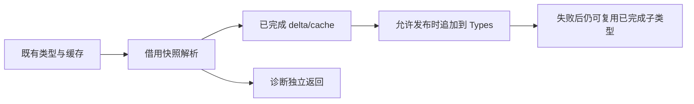

# 类型解析失败状态修复

## Intent

恢复普通解析诊断前已完成类型与缓存的保留契约，同时阻止失败的共享名义规范化发布不一致结果。

## Data

回归会话在固定 2a30e71a0 完整 Debug 检查及两个独立二进制重放中确认：非法名称初始化诊断正确但标量前缀从 11 行变为 0 行；后续字段 Missing 诊断使此前完成的 Child 列表类型缓存丢失。573e35226 将宿主 commit 从诊断之前移到之后，是对应行为变化。已有 initialization_test 与 names_test 明确检查部分进度与失败后重试。

## Edges

- 错误诊断不等于所有结果无效。原始解析输出中的 delta/cache 只包含已完成部分，必须保留；visiting 临时状态不提交。
- 共享规范化失败可能存在名义冲突，其候选结果不可发布。该边界属于规范化阶段，不能扩大为全部解析诊断的回滚。
- RX 显式给出 publish 决策；宿主仅执行终端拥有化，再报告诊断。
- 不更改诊断内容、不放宽现有断言、不修改回归会话的冻结检出、不新增测试、不运行全量测试。

## Answer

最小修改 resolve.rx 与 resolution.zig，保存草稿；验证现有类型解析、名义来源专项和主构建，英文提交推送。

## 自我批判

前次只检查调用方是否继续，忽略了类型解析组件自身已明确的失败状态契约。修复必须以阶段含义决定提交边界，不能把一项规范化事务原则泛化为所有解析失败都回滚。
