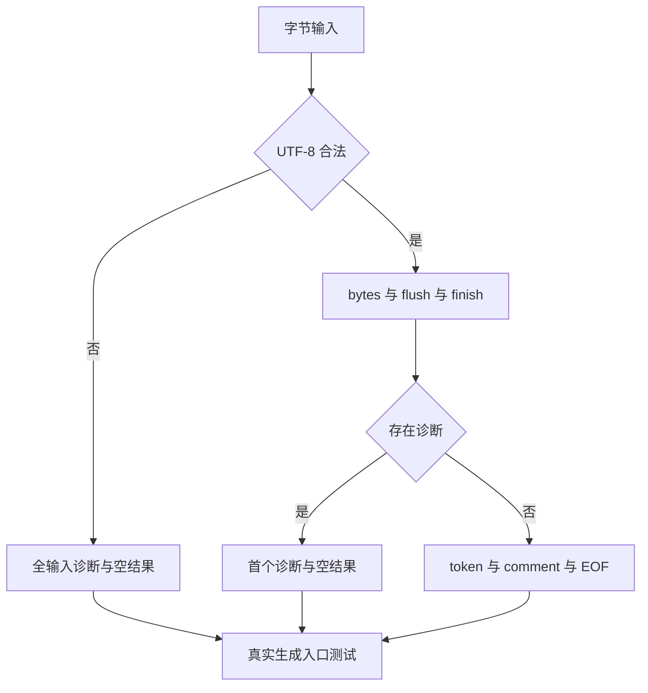
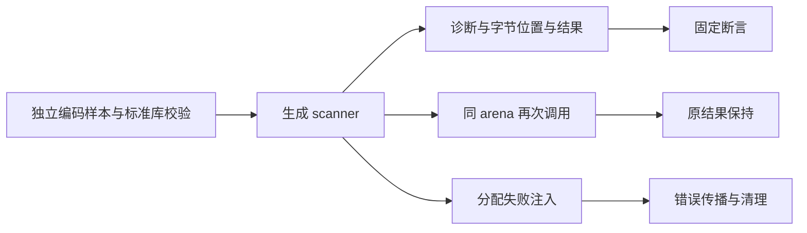

# 词法编排结果分支覆盖

## Intent：最终目标

为新发布的普通 lexer RX 编排补充结果分支回归，验证 UTF-8 拒绝、扫描失败与成功发布保持诊断优先级、空结果、字节位置和跨调用生命周期。同时复验旧完整回归中的 type-resolution views 夹具编译失败和 consumed 对象诊断。

## Data：可用证据

当前正式 lexer 从 scan.rx 生成普通 Zig，入口在 UTF-8 校验后连接 initial、bytes、flush、finish 和 publish/failure。现有 scanner metadata 覆盖词、符号、模板及边界，但没有系统枚举 UTF-8 拒绝分支与已累计 token/comment 的丢弃组合。

新增 flow_test.zig：77 个非法单字节、13 个非法序列、8 个合法 Unicode 边界、3 个编码错误优先级输入、3 个终态失败、3 个首次诊断保留，以及三个结果分支的恢复和全分配失败注入。Zig 标准库 utf8ValidateSlice 独立确认编码样本合法性，不用生成 lexer 自身作为期望计算器。

旧 views 故障实际位于 test-type-resolution 的 graph.zig：对 SymbolTable 直接 foreach 导致编译失败，当前已使用 count/at。旧 consumed/o.a、o.b 已由 09160135 根据对象持久值契约改为 source_preservation/o.a、o.b 的正向分析检查。当前执行完整 frontend，并补跑 test-object-construction 的运行值断言；不能把旧 ownership 拒绝预期误称原样通过。

## Edges：边界与限制

两个正式测试文件先保存在本目录草稿，再放入固定 e668ab79 的独立检出执行。仅新增七个命名测试和原 scanner 构建枚举中的 flow；不修改生产实现、已有断言或公共 ABI。

两个模式各执行 test-scanner-metadata、test-type-parser、test-type-resolution、完整 test-frontend；另补跑原 test-object-construction。type-parser 保留 plain 与 template 路线及原资源测试。独立检出源码冻结至全部终态，不依赖共享主检出保持不动。禁止把缓存步骤计入本轮执行数。

普通 UTF-8 输入校验与固定源码的内部词法契约不是新增 Test262 原例适配；UTF-8 文件解码与 JavaScript 已解码源码不是同一层。正式生成入口不证明完整自举闭包，种子编译和过渡原生桥仍按自举完成标准单独验收。

## Answer：交付格式与成功标准

新增测试使用真实生成 scanner.execute，验证两个优化模式中的所有新增断言及原门禁。归档输入哈希、真实日志、生成源码、测试二进制和终态，记录失败与修正（若存在），自我复核后提交并 push。只有已验证的当前生产缺陷才通知指定实现会话。

