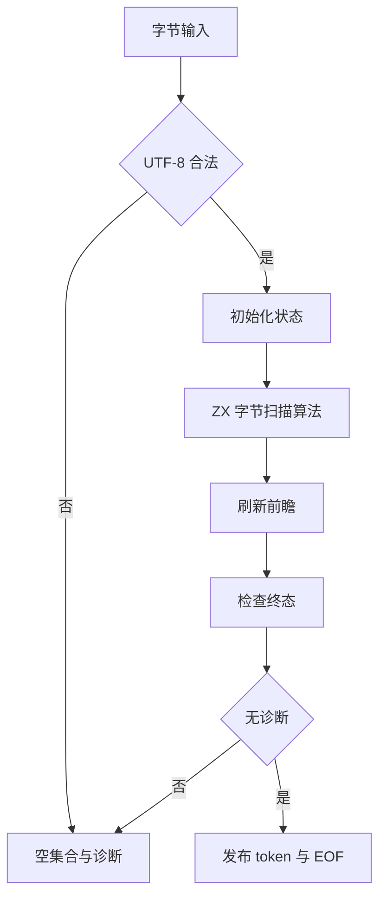
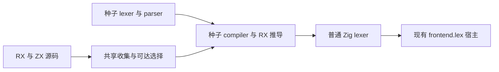

# 普通词法阶段编排

## Intent：最终目标

普通 lexer 通过 RX 显式编排 UTF-8 门禁、扫描、flush、finish 和结果发布，ZX 保留字节扫描算法与原子转换。保持输入字节切片、Result 输出、诊断和 EOF 行为。

## Data：可用证据

基线 3bda0e58。lexer/scan.zx 目前承载完整流程，generate_lexer.zig 只收 ZX 并以 scan.zx 分析。generate_parser.zig 已有 RX 收集和推导管线；build/parser.zig 已有不依赖生成前端的 seed RX 模块配置。额外调用者包括 parser/native.rx、lexer/lex.zx 旧结果入口、测试 type_parser/source.zx。

## Edges：边界与限制

生成器继续使用 bootstrap lexer 和 seed frontend，不可引用正式生成 lexer/parser 导致自依赖。共享现有 seed RX 配置和源码收集，不复制另一套 walker。保留普通扫描与模板扫描两条既有类型解析验证路线，不增加用例、不运行全量测试。

ZX 最多 240 行，原算法保持完整，结果不得因模块拆分复制 token 数组。兼容结果的 token 映射是原有契约转换，不把它误当新增复制。模板边界扫描及表达式提示准备仍是后续整改，不能用普通 lexer 完成替代前端整体完成。

## Answer：交付与成功标准

1. scan.rx 连接 validate→initial→bytes→flush→finish→publish/error。
2. lex.rx 调普通扫描再做旧形状转换；parser/native.rx 使用模块调用。
3. generate-lexer 复用 seed RX 配置、源码收集、可达模块选择和推导，输出仍由普通 Zig emitter 生成。
4. 源码内容追踪纳入 RX；既有 type-parser 入口转换 RX 并保留扫描差异。
5. 检查生成 ABI、根构建和已有 scanner/type-parser 专项，记录真实终态。

## 实施与自我复核

scan.rx 已连接各词法阶段，bytes.zx 保留原 reduce/tick 算法，publish.zx 发布原 EOF，failure.zx 维持空 tokens/comments 的错误结果。lex.rx 与 legacy.zx 保留旧形状入口。独立审查确认 source_length 始终等于原输入长度，EOF 元数据、flush/finish 顺序及错误结果保持；两个 failure 调用属于不同分支作用域。

seed_rx.zig 提取已有种子 RX 配置，source_collection.zig 提取既有目录收集和排序。generate_lexer 仍只依赖 bootstrap lexer 与种子前端，生成单文件 Zig；没有依赖正式生成 lexer。lexer 和测试源内容追踪均纳入 RX。

plain 测试入口转换 RX 后，首轮因 cwd 为 test 包而触发兄弟包路径越界，48/58 步骤完成、19/19 已执行测试通过。已将该路线 cwd 显式设为仓库根，template 路线保持 compiler 根；没有放宽 RX 项目边界。README 已更新 scan.rx/lex.rx，原测试断言与两条扫描路线保持。

## 验证结果

- 根构建退出 0，36/36 steps succeeded。
- `test-scanner-metadata test-type-parser` 最终退出 0，58/58 steps succeeded，8/8 本轮执行测试通过，其余步骤命中缓存；首轮与最终日志一并归档。
- 生成入口签名仍为 ArenaAllocator 与 `[]const u8` 输入，公开 Result 返回指针由现有宿主成功编译；编排入口 dupe 调用数为 0，完整文件哈希另存。此项仅覆盖新增编排入口，不证明全部扫描内部操作都无分配。
- 1745 个 ZX 文件均不超过 240 行，最大 232 行；diff 空白检查通过。
- 没有新增测试或运行全量测试。模板扫描、提示准备、类型顺序派生与宿主迁移仍待整改。
