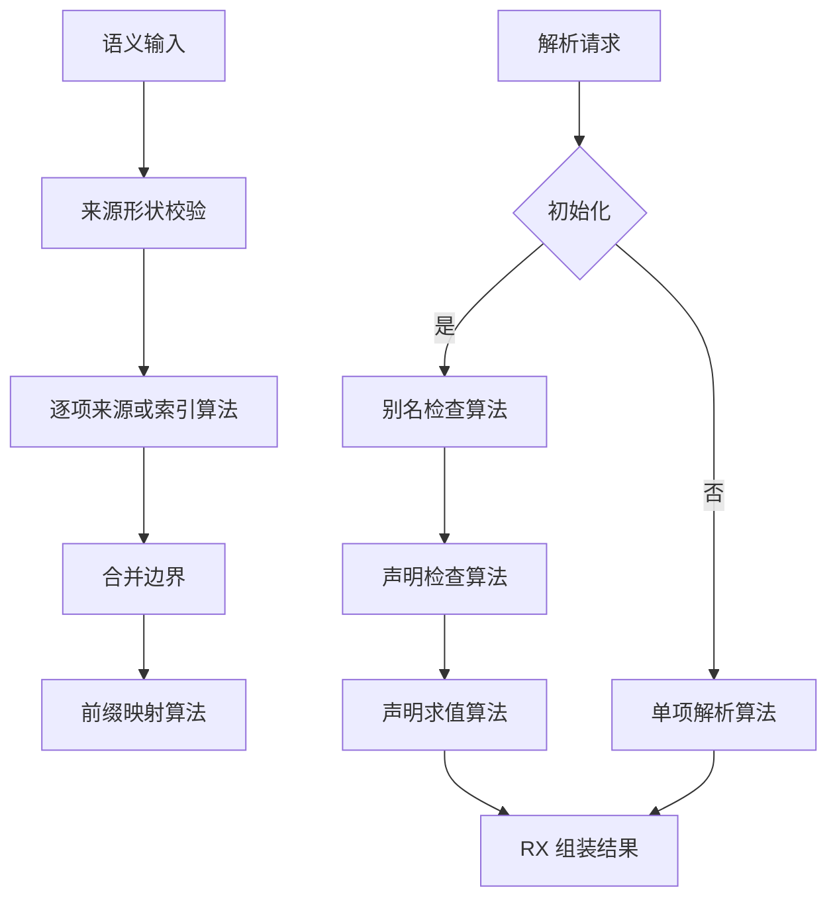

# 语义阶段编排

## Intent：最终目标

继续现行 RX/ZX 全面对齐，使来源校验、合并预检与解析初始化的真实阶段在 RX 中可见。ZX 保留单一语义规则或完整遍历算法，每文件最多 240 行。

## Data：可用证据

基线 e5c67484。origins.rx 仅调用包含 shape 门禁及遍历的 validate.zx；preflight.rx 仅调用包含来源验证、边界判断与映射准备的 preflight.zx；resolve.rx 的 execute.zx 内还隐藏初始化分流，而 initialize.zx 内包含导入别名和声明两次遍历。对照成熟的 validate_types.rx，现有 Switch 与 Call 已足以表达这些依赖。

## Edges：边界与限制

不改变公开入口、失败结果、校验顺序和 native workspace 的分配顺序。Workspace/Writer 仍属于待迁移的专用原生状态，本批组织整改不代表这些依赖已完成自举。不新增测试、不运行全量测试，使用已有语义及类型专项验证。所有正式改动沿用户已授权范围执行。

## Answer：交付格式与成功标准

- 来源校验：RX 先 shape，再调用 ZX 的逐项规则遍历。
- 合并预检：RX 先 shape，再建立来源索引、检查合并边界、建立前缀映射。索引及映射的分配与对应算法留在同一 ZX 原子职责中。
- 类型解析：RX 区分初始化和普通解析；初始化模块显式连接别名检查与声明检查；批量声明求值保留一个 ZX 遍历算法，最终 Result 由 RX 组装。
- 删除被替代的 ZX 总控，核对静态引用、构建和已有专项结果，不以文件扩展名或标签数量作为完成证据。

## 实施与自我复核

已拆出来源索引、边界谓词、前缀映射、别名检查、声明检查和声明求值的 ZX 原子，删除旧 preflight/execute/initialize 总控。独立审查确认来源分配、部分写入及失败顺序保持，解析阶段返回的 context 不变。

初版仍由后续 ZX 循环的 diagnostic guard 隐式短路，虽结果一致但不符合 RX 展示阶段决策的目标。已在 initialize.rx 和 resolve.rx 增加显式 Switch；ZX 内部 guard 继续处理逐项停止。跳过的 count 仅查询纯长度，无原生副作用。

既有 views_test.zig 仍把 native module 的列式绑定当作 Export 切片，导致首轮专项未能编译。仅在原测试内按 count/at 读取真实绑定、适配为其既有断言输入，未增加用例或降低断言。首轮根构建 35/35 通过，专项 67/70 steps、264/264 已执行测试通过，失败是上述旧接口适配；最终源码的构建与专项复验另行记录。

最新生成目录 b40bf8705e589c17eecbadd99b6b8aa2 中，三个公开 execute 入口均为静态调用与 if 分支，没有 dupe 调用；其生成文件哈希另存。这个证据只证明新增编排入口没有复制数组，不证明所有内层算法的内存成本已经满足最终自举要求。

## 最终验证

- `zig build -j2 --summary all`：退出码 0，35/35 steps succeeded。
- `zig build test-type-resolution test-type-validation test-type-merge test-nominal-origins -j2 --summary all`：退出码 0，70/70 steps succeeded，273/273 tests passed。
- `git diff --check` 通过；全部 1744 个 ZX 文件不超过 240 行，最大 232 行。
- 未新增测试、未执行全量测试。Workspace/Writer、前端阶段整改和其余手写宿主迁移仍待完成，本批不宣称全部自举完成。
