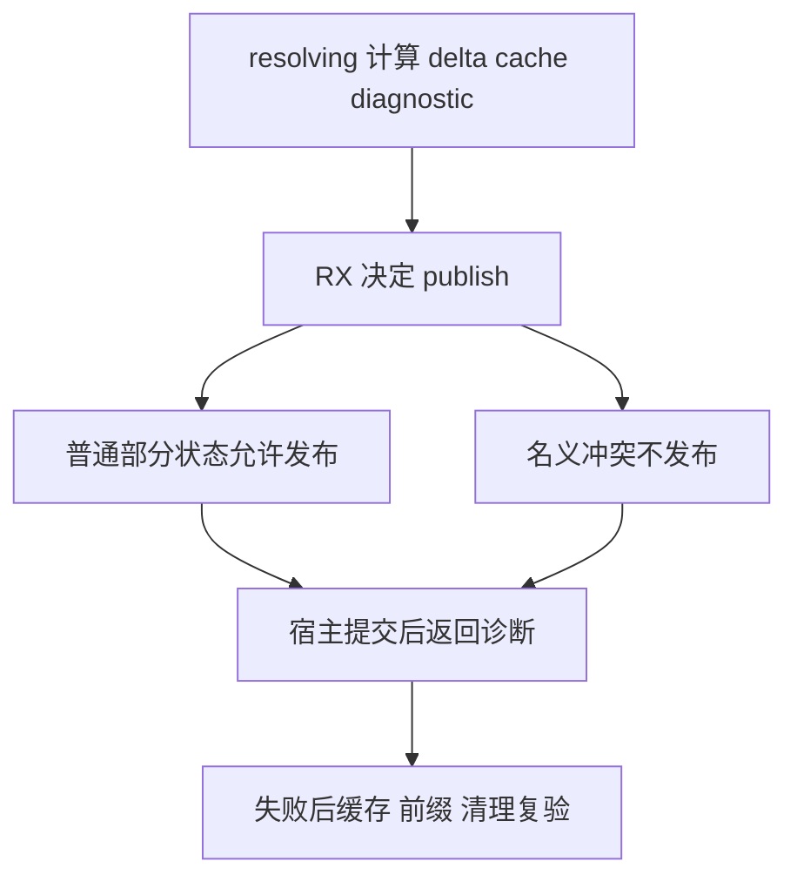

# 类型失败状态修复复验

## IDEA

- Intent：确认 a658998031c80df2596eb84e03a97134ec913651 修复普通类型解析失败后的有效状态丢失，验证缓存、诊断、visiting 清理及资源边界。
- Data：2a30e71a0 完整 Debug 与两个独立二进制重放已复现六项标量前缀状态失败和 Child 缓存丢失；573e35226 的提交顺序变更为具体原因。新修复由 RX publish 字段表达提交决策，宿主只根据输出执行提交。
- Edges：新的独立固定检出；旧完整回归与 Filter 两批的输入不变。不把生产者报告或源码差异代替测试结果。使用原有五组具名回归，不为了绿色删除原断言；成功范围仅是这个定向门禁。
- Answer：完整 test-type-resolution 的 Debug 与 ReleaseSafe 终态、真实五个二进制、固定源码/工具身份和原始日志，具体确认旧失败场景已执行。未完成的新完整范围另行记录。

## 执行与验证

冻结所有 packages 文件，使用持久 type-resolution-state-a65899803/r1 保存输入快照、缓存、日志与进程状态。执行 initialization、names、nodes、views、resources 五个原有根，独立缓存、分别 -j1。不新增机械重复测试；原有失败用例已精确命中缺口。

## 自我批判

普通失败后的已完成状态与 shared 名义冲突的事务边界不同。已有非 shared Child 场景通过不能自动证明所有名义冲突恢复已正确；该定向门禁也不能替代全部 Test262、完整测试包或自举闭包核验。
