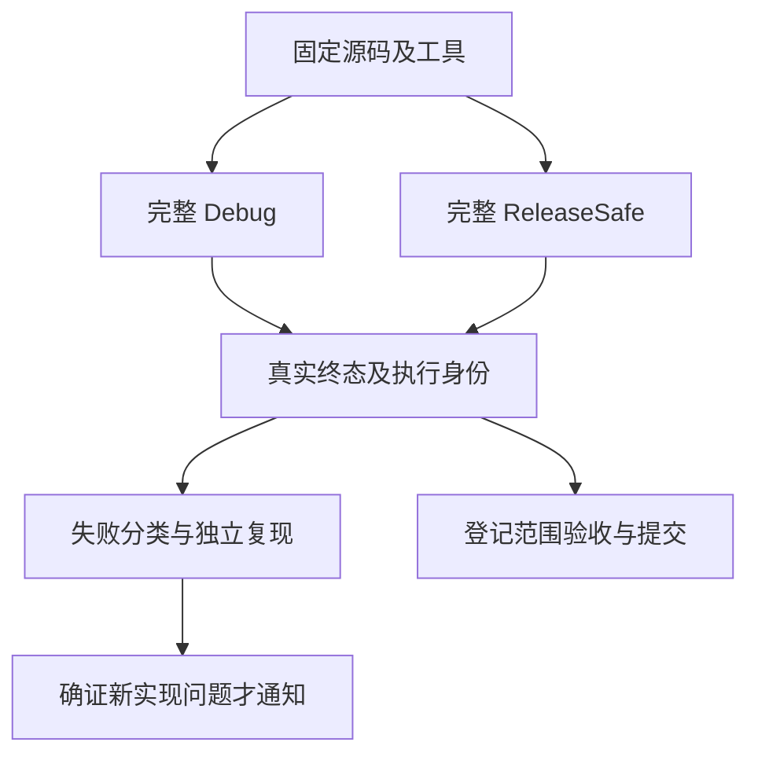
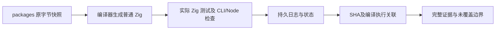

# 迁移后完整回归

## IDEA

- Intent：在嵌套缓冲测试及最近原生解析、类型初始化、合并预检迁移共同存在的固定源码上执行完整测试包，找出组合回归，并继续推进所有 zxc 特性及 Test262 对齐目标。
- Data：固定起点 2a30e71a0e726f85e2ee65ab778f9b1f1b4dd6ac；此前完整回归 3e85c85d 的 Debug 有安装超时和两个旧元数据断言编译错误，ReleaseSafe 因环境中断缺少终态。后续定向验证不能填补完整门禁的缺失。
- Edges：新的独立检出，保留旧执行检出及证据不变；执行前冻结 packages 源码、脚本、工具和声明依赖身份。每个已启动进程均实际终态前不修改本批输入。缓存与实际运行分开；不作冷编译、独占机器计时或自举完成声明。只在独立确认新生产缺陷后通知实现聊天。不得为了绿色修改测试预算或契约。
- Answer：Debug 与 ReleaseSafe 的完整退出状态、原始日志、实际二进制及生成源码身份；失败分类与必要复现；每个完成部分使用英文 Conventional Commit 并 push。完整门禁绿色仅证明登记的测试范围，不等于全部 Test262 或全部特性覆盖已经完成。

## 执行步骤

1. 核对独立检出提交和干净的 tracked 状态，准备本地声明依赖与官方 Zig/Z3 资源；记录环境与工具身份。
2. 冻结全部 packages 文件，保存原字节快照；使用持久 conformance 目录存放缓存、完整日志和进程状态。
3. 执行完整 Debug；ReleaseSafe 使用独立缓存。两个模式均以实际终态为准，超时观察不重启。
4. 从 verbose 编译与执行记录核对实际运行身份，保持 Node 子检查和 Zig 汇总计数分开。
5. 将任何失败区分为生产缺陷、测试契约错误、工具/依赖或资源问题。旧失败不能直接作为当前失败根因；对新生产问题先复现再通知。
6. 复核输入未变、原日志 SHA 和成功范围，保存可恢复的中文执行记录。后续生产提交另行固定参考验证。

## 自我批判

测试目录数量、矩阵审计和定向绿色均不能替代完整执行。完整登记范围通过也不能证明未登记功能、全部 Test262 语义或自举依赖闭包成立。复用依赖安装可减少环境错误，但会失去全新网络安装条件；必须记录这一边界。执行提交必须保持不变，不能把之后主分支更新当成本次已经验证的输入。
