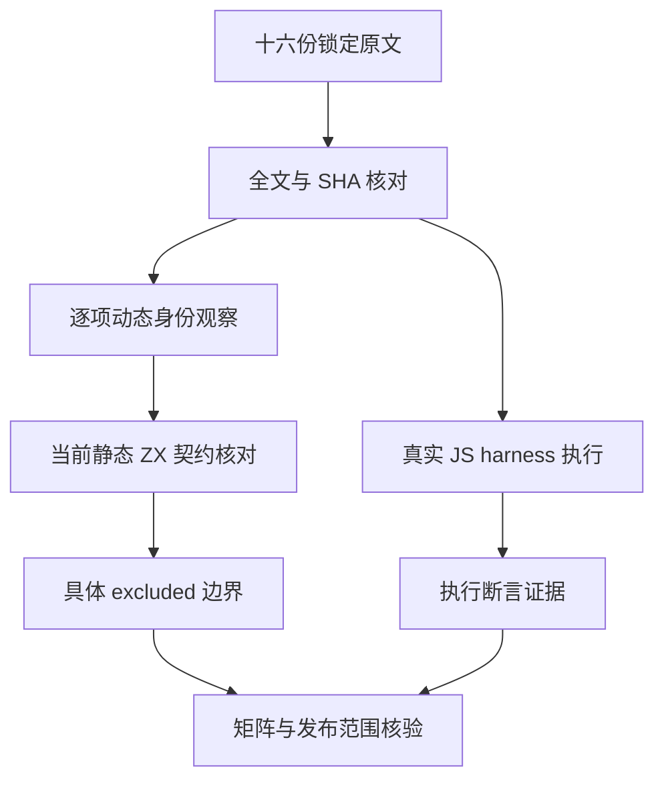
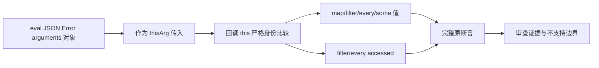

# 集合动态上下文身份审查

## IDEA

- Intent：逐份审查四种集合方法的动态 thisArg 身份观察，防止新显式上下文参数被误认为实现了 JS 对象身份协议。
- Data：锁定 Test262 revision 7ab7fafa0003f73fc85c1b95d88094d33f7eb8bd。已完整读取 map/filter/every/some 的 5-7、5-17、5-18、5-19 共十六份原文；原输入均为 [11]，回调逐份严格比较 this 与 eval、JSON、RangeError 实例或 arguments 对象。当前 c3c147245 支持静态显式上下文参数，回调不能引用外层符号，不提供动态 this 绑定。
- Edges：每份核对索引 SHA、全文和全部原断言。status=excluded、cases/assertions 为空；不能用 true 常量、字段相等、静态错误枚举或普通参数列表替代严格对象身份。原 JS 通过不等于 ZX 通过，不生成重复语法拒绝用例增加数量。此批只修改上游审查记录及证据，不修改测试源码或编译器。
- Answer：十六份独立审查、完整原文、真实 harness 普通/严格两模式的三十二次执行和四十八条断言、Node 矩阵及身份/范围核验、英文 Conventional Commit 并 push。没有新实现缺陷，不发送实现聊天消息。

## 逐份观察

map 四份各检查首项 true；some 四份各检查最终 true。filter 四份除首项为 11 外，还检查 accessed=true；every 四份除最终 true 外，也检查 accessed=true。这些访问观察一并保留，不能只摘一个值断言。

5-7 传入内建 eval 函数并比较同一函数身份；5-17 传入全局 JSON 对象并比较同一对象；5-18 构造 RangeError，回调比较指定实例；5-19 从三参数函数取得 arguments，回调比较指定 arguments 对象。后两组还依赖非捕获回调之外的外层值，不与静态 context 字段回归合并。

当前契约证据为 IR契约的表达式/聚合比较与所有权/集合回调，以及 transforms.zig 的显式参数绑定。仅有限错误值、JSON 数据解析或编译期导入函数存在，均不能证明这些 JS 动态对象的严格身份。

## 自我批判

excluded 是当前语言契约下的范围记录，不是功能实现或生产级完成证明。不能因为最终值简单而删去使它成立的身份协议，也不能仅凭文件名批量排除。四十八条 JS harness 断言不增加 ZX 通过数；系统 Zig 等待仍限制其他批次的真实验证。
