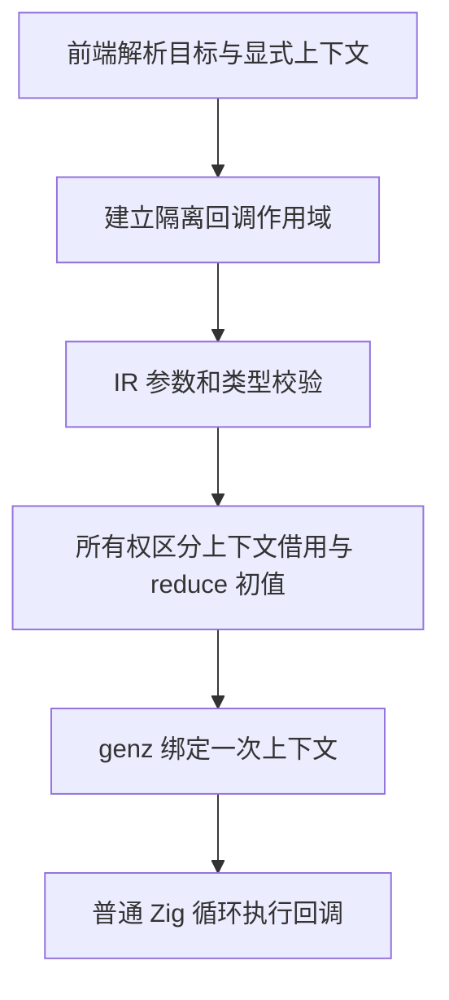
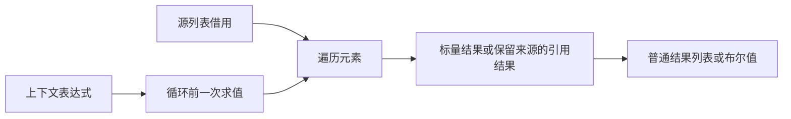

# 集合回调显式上下文

## Intent

让 map、filter、every、some 在不捕获外部变量的前提下接收显式只读上下文，静态生成普通 Zig 局部绑定与循环。用真实类型引用映射替代零初始化再填值的两遍实现。

## Data

当前 transforms 只接受非捕获单参数回调，无法把 workspace 显式传给 map。IR 已有 optional initial 与任意参数列表；reduce 使用 initial 作为累加器，非 reduce 可按 kind 区分为上下文，不必新增编码字段。现有作用域、重映射与错误效果遍历已访问 initial。

## Edges

- 保留单参数形式；新增 values.map((item, context) => expression, context_value)，filter/every/some 同形。
- reduce 的 (accumulator, item)、初值及移动语义不变；非 reduce 参数顺序为 item、context。
- target 求值一次，再求值 context 一次，随后才分配结果与执行回调。空输入、回调不使用上下文、谓词短路都不能省略 context 求值。
- 上下文是每次回调共享的只读借用，不能在一轮中消耗后继续复用；不允许其他隐式捕获。
- Task 句柄不得作为非 reduce 的共享上下文，避免重复消费。
- map 返回上下文引用时保留来源借用；上下文只参与标量计算时，不能把新建标量结果列表误标为借用。
- 保持无上下文 SIMD 路径；带上下文的转换先走普通静态循环，不能丢失实参求值。
- 不新增测试；运行已有集合、所有权、IR 与模块产物相关专项，不运行全量检查。

## Answer

同步前端、seed 与 RX/ZX IR 校验、所有权分析及 genz；实际引用映射改用新语法。提供使用参考与执行记录，检查生成代码单遍定长分配，再英文提交推送。

## 自我批判

复用 initial 字段不代表语义自动兼容。必须检查参数位置、空输入评价顺序、SIMD 快路和上下文返回引用的生命周期；不能只验证 opaque workspace 的正向案例就宣称任意上下文都安全。
