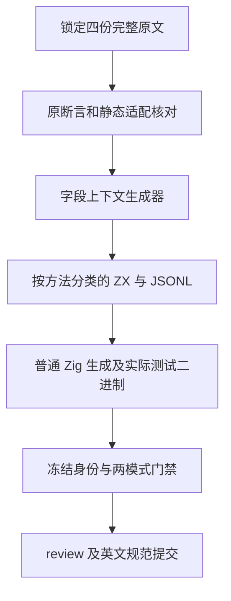
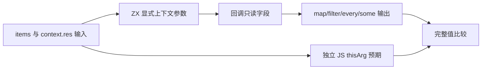

# 集合显式上下文字段回归

## IDEA

- Intent：为 c3c147245 新增的 map/filter/every/some 显式上下文参数建立真实生成代码回归，并逐份保留 Test262 的对象字段观察。
- Data：锁定 revision 7ab7fafa0003f73fc85c1b95d88094d33f7eb8bd 中四份 5-2 原文，均尚未登记；输入为 [1]，对象 res=true，外层同名 res=false，回调返回 this.res。原断言分别为 map 首项 true、filter 长度 1、every true、some true。当前接口将上下文作为第二个回调参数，提供静态只读借用。
- Edges：标记 adapted；静态对象字段取值保留原观察，不宣称 JS this 绑定、new Object、动态原型、对象身份、idx/array 或 arguments 协议实现。只测试字段上下文，不宣称上下文一次求值、Task 拒绝和所有引用生命周期均已验证。每份生成 ZX 保持语义空行且最多 120 物理行。使用独立固定检出，不修改仍运行的类型前沿检出。
- Answer：四个方法各 20 个动态具名用例，共 80 个；四份原文完整字节与 SHA、真实原文执行、独立 JS 预期、分类 catalog/review、生成器重放、矩阵检查、Debug/ReleaseSafe 实际二进制证据。完成后英文 Conventional Commit 并 push；只报告已确认的新实现缺陷。

## 实施边界

参考 generate_array_callbacks.ts 及同职责成熟 catalog helper。新增独立 generate_callback_contexts.ts，负责四个方法的同一上下文语义；沿用既有 array-callbacks 构建门禁，通过名称前缀接入，不新增测试运行框架。生成源按方法放在 built_ins/list/callbacks/<method>/context/。

用例矩阵覆盖 res=true/false 与 empty/single/zero/signed/repeated/ordered/reversed/17/65/257。预期来自普通 JS 集合方法和显式 thisArg 字段读取，不使用生产分析或生成结果计算。每个原例关联 true/single 的完整结果，额外值断言强于原断言但不替换原断言。

## 自我批判

返回字段的矩阵不能证明所有上下文语义。原例的未使用参数省略必须说明，不能把原例改写成无上下文的常量谓词；true/false 必须来自输入对象。参数规模不能代替短路访问次数、一次求值、借用所有权及失败传播的单独回归。本批范围完成不代表 Test262 或整个新特性完成。
