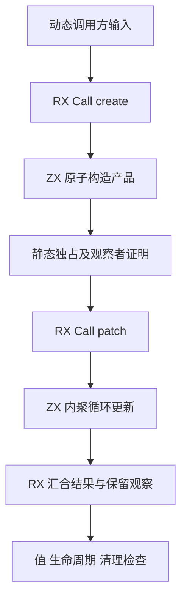
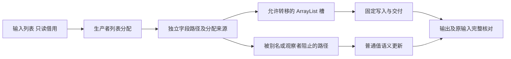

# RX 产品缓冲转移边界

## IDEA

- Intent：验证 de4600719 的独立产品列表转移，确保跨 RX 阶段的固定索引写入能复用真正独占的容器，遇到别名、保留观察者或借用输入时保持值语义。
- Data：当前 c83c2a80e 包含新 fresh/selection/observers 与 transfer 逻辑。已有 loop_call_origins 和 nested_buffer 覆盖单列表来源与循环重建；实现记录承认多字段准入仍缺专门测试。
- Edges：不修改生产实现。RX 真实表达生产、消费与结果汇合；ZX 保留原子的产品构造和内聚循环更新。仅验证固定写入的转移能力，增长路径不能通过 fromOwnedSlice 伪造原分配容量。每个 ZX 最多 120 物理行，输入冻结后不修改。
- Answer：九组真实 RX/ZX 场景、五类运行检查及两个正向容量检查，Debug/ReleaseSafe 实际执行，生成结构证据、全量分配失败清理、IDEA 执行记录、英文 Conventional Commit 和 push。仅确认新实现缺陷时通知指定聊天。

## 场景与观察

| 场景            | 原子生产者与观察者                 | 预期转移槽 |
| --------------- | ---------------------------------- | ---------: |
| object          | 两个独立 map 容器                  |          2 |
| nested          | tuple/object 嵌套的两个独立容器    |          2 |
| shared          | 两个字段共享同一新容器             |          0 |
| retained_target | 保留一个目标字段                   |          1 |
| retained_parent | 保留包含两个目标的祖先产品         |          0 |
| borrowed        | 产品列表来自调用方输入             |          0 |
| branch          | 一条分支独立，另一条分支共享       |          0 |
| duplicate       | 将同一新字段组装到两个消费参数路径 |          0 |
| growth          | 一条路径追加，另一条路径固定更新   |          1 |

运行期检查全体字段值、调用方 canary 和原始输入、空与非对称长度、真正执行的索引范围、同 arena 里的早期产物保持不变，以及所有分配失败释放。分配次数比较只用于两个全独占正向场景，结合生成槽证据，避免用指针或速度替代所有权证明。

参考 tests/collections/nested_buffer 的生成及生命周期检查、loop_call_origins 的有界分配检查，并将真实阶段放入 RX。统一模块公开契约保持完整，不把 RX/ZX 当作独立库。

## 自我批判

创建了两个列表不自动代表独立，必须有共享来源和分支相交的反例。生成槽数量不是运行语义证明，运行期值与资源检查也不能单独证明走了优化路径，两者必须同时成立。本批直接验证编译 API 生成的 RX 入口，不代替 CLI、统一库编码或完整自举验收。参数矩阵和故障轮次不重复计为用例。
