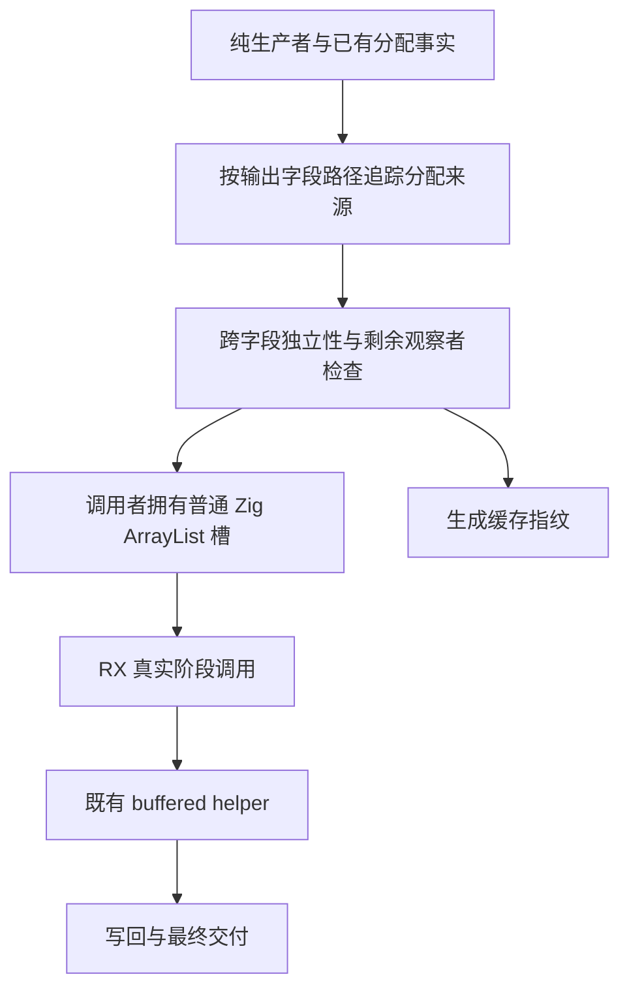

# 产品缓冲所有权与类型提取状态

## Intent

将类型提取 mapping、类型列和名义来源的自有状态移入 RX/ZX。先补足普通产品值跨 RX 阶段传递独占缓冲的通用能力，再移除 extract_workspace 的状态读写桥。不能以新增专用桥、移动函数或一次无意义 loop 包裹全部流程替代迁移。

## Data

当前 591e59acc 已把 roots 根收集与闭包迁入 RX/ZX，并实现唯一全新列表字段的固定索引更新转移。artifact/types.zig 仍拥有 mapping / TypeStorage / NominalOrigins；semantic/native/extract_workspace.zig 仍执行 hasMapping / getMapping / setMapping / appendType / appendOrigin。

buffer_call/analysis/flow.zig 已枚举 object/tuple 嵌套列表路径并排除同输入路径的重复输出；context 和 iteration 能承载多 lane；iteration_buffer/capacity.zig 已有扩容、写回、交付及失败清理。缺口是普通阶段边界的字段别名证明和容量所有者，不是缺少 RX 标签。

## Edges

- 不降低现有版本、逃逸、合同、并行和动态区域校验。
- 新建不等于互不别名。两个字段返回同一新列表不能创建两个可变 owner。
- 只证明列表容器来源，不能据此证明字符串字节可跨来源生命周期借用。
- fromOwnedSlice 视图当前只用于固定索引写入。切片长度不能代替原分配容量；不得直接开放增长、pop 或嵌套可变调用。
- 类型提取顺序必须保持：初始根集合纳入、按即时 mapping 扫描原生模块、type imports、显式原生依赖、function imports、exports、body、stores 和依赖结果。
- 不预收集所有迟到原生类型，避免改变类型编号与诊断顺序。
- 不新增测试用例，不运行全量；使用现有所有权、缓存、生命周期专项并检查生成代码。未覆盖的证明边界明确记录。

## Answer

1. 完整字段路径的新分配来源摘要；证明候选输出字段与其他输出存储没有重叠。
2. 调用点沿完整路径检查消费，复用现有多 lane 协议。
3. RX 调用序列中由调用者持有容量，末次使用后交付；复用既有 Capacity 清理与写回。
4. 迁移完整 extraction 状态及真实 RX 阶段，撤除正式执行对专用 workspace 状态桥的依赖。
5. 每个可独立验证的功能节点记录结果并提交推送，但前两步完成不等于整个状态职责完成自举。

## 架构图



## 数据流图


## 第一步的具体实现方向

复用 allocation/trace.zig 的现有递归，不建立另一套表达式解释器。为 Trace 增加可选的编译期分配来源收集器；旧调用不启用时保持原行为。在 list / map / filter / 已证实新分配的直接 list call 处记录当前 ExprId。对象字段、条件、match、引用、迭代等继续沿原规则追踪。

```zig
allocations: ?*std.AutoHashMapUnmanaged(ir.ExprId, void) = null,

fn allocated(self: *Self, id: ir.ExprId) Error!bool {
    if (self.allocations) |origins| {
        try origins.put(self.allocator, id, {});
    }

    return true;
}
```

摘要以完整字段路径为键。只有每个输出列表都得到有效来源，且来源集合互不相交，才允许这组列表建立独立缓冲视图。条件分支合并来源集合，宁可保守拒绝无法证明的情况。记录的是编译器 IR 元数据，不新增应用运行库。

迭代参数的假设继续绑定初始路径；初始和 body 的分配集合均被收集。现有 Trace 不能跨产品返回的 call 追踪字段，后续应使用已有输出流向摘要补足，不能直接把未知 call 判作新分配。

## 状态模型草稿

```zx
export type State = {
    mapping: u64[]
    types: Table
    origins: Bindings
    names: string[]
}
```

mapping 使用明确编码保留未映射状态，具体编码和对外错误状态独立。Table 与 Bindings 复用既有模型，不新增同义列结构。最终容器生命周期与字符串所有权必须在统一产物边界核对后确定。

## 自我批判

多字段固定索引复用只是容量保留的前提。不能在它通过后仍让增长阶段反复复制完整状态，却把状态迁移标成完成；也不能把 host 生命周期适配继续扩成新的编译器专用可变状态实现。

## 首轮执行记录

已完成现有机制和专用状态桥的源码核对，并保存 Trace 可选来源收集器的完整草稿；正式源码尚未改动。下一步将完整字段路径摘要接到独占投影检查与现有多 lane 参数，统一审计后才写入正式实现。

调用点证明需要区分：通向目标列表的祖先产品路径、目标列表本身、与目标分叉的独立旁支。祖先只允许继续投影或作为本次调用的唯一输入；目标列表只允许本次消费；旁支只有在产品分配集合独立性已成立时才可继续观察。重复把同一列表放入两个参数必须拒绝。

首次扩展继续保持固定索引约束，不允许 fromOwnedSlice 扩容。随后的容量阶段需由调用者保留 ArrayList 实际 capacity，不能把源切片 len 伪装为可释放分配长度。

## 第一轮实现结果

字段分配来源、完整路径摘要、祖先/目标/旁支观察检查、多 slot 构造和 v40 缓存指纹已接入正式源码，草稿同步。独立只读审查未发现 fixed-update 范围内的阻断问题；重复目标参数会被拒绝，祖先整体逃逸受 uses 计数限制，来源集合跨分支取并集而保守拒绝相交。

现有 buffer eligibility / resources / recovery 各 3 项通过。它们验证缓存和失败恢复，没有完整覆盖新增多字段正向准入；尚不作为整项能力交付证据。下一步用真实提取状态初始化与规划模块检查实际生成的多 slot 调用。

### 迁移路线复核

类型提取结果是已验证 source 表的子集，类型数量存在明确上界。应比较跨阶段保留增长容量与先生成映射及顺序计划再集中物化类型列两条路线：后者可能只需固定大小的映射/顺序元数据，避免把通用扩容能力错误地设为迁移前置条件。必须保持原生模块迟到类型、类型编号、错误顺序及字符串生命周期；不能给所有类型载荷按全源大小预分配以换取表面零复制。

这项判断仍待实际状态模块验证，尚未移除 extract_workspace 桥。

## 物化阶段增量

Intent：将已选择的规划行物化为普通 Table 和 Bindings，迁出逐行原生 appendType/appendOrigin 语义。Data：现有 TypeTable 列模型、规划 mapping/order/origins、原提取顺序。Edges：不复制字符串字节，结果借用源字符串；尚不能跨源 arena 释放，宿主接入必须解决实际所有权。Answer：RX 显式连接 rows 与 nominal，ZX 分别完成列重建和名义来源投影，生成并编译验证；不能据此宣称已替换原桥。

列重建直接遍历选中行及其动态成员，不先构造每行 Candidate 或临时映射列表。循环是内聚的列序列化算法；类型表和名义来源两个阶段由 RX 连接。
