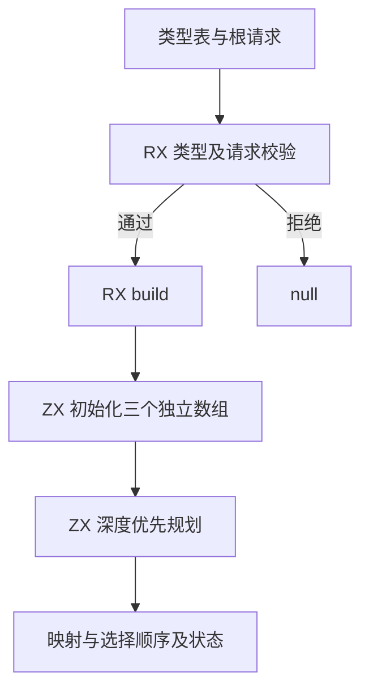
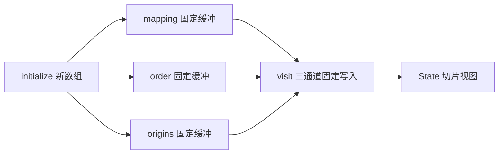
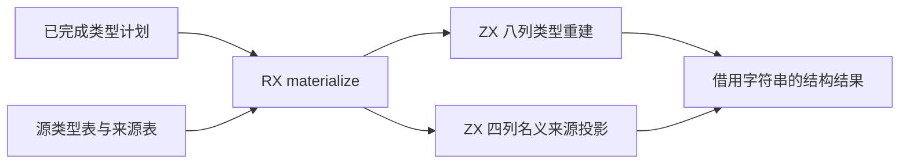

# 真实规划模块核查

## Intent：最终目标

以实际类型提取规划职责验证多个独立产品字段的固定更新缓冲转移，为移除类型提取 Workspace 状态桥提供可审阅实现。

## Data：可用证据

- `planning/plan.rx` 先校验类型表与请求；通过后调用 `build.rx`。
- `build.rx` 显式编排 initialize → visit。初始化与依赖访问分别是 ZX 集合算法。
- initialize 分配 mapping、order、origins 三个互相独立的数组，通过单一循环填写标量前缀。ZX map 没有索引回调参数，没有为此新增语言接口。
- visit 保留原提取算法的栈式依赖访问顺序及 nominal 错误判定，仅记录映射、选择顺序与来源索引。
- 真实源码经 parseModules、项目类型推导及当前 genz 生成 plan.zig 和 plan_abi.zig，成功。
- 生成代码 function_28_value 通过 transferred_items_21、transferred_items_24、transferred_items_27 建立三个 fromOwnedSlice 视图；三个 started 均为 true；随后将三个非空 lane 一次传入 function_27_buffered。
- 固定更新分别通过 lane_0、lane_1、lane_2 的 buffer.items 索引写入；非空通道且 started=true，跳过 appendSlice。不能根据文件全文仍有 appendSlice 推断此路径发生复制。
- execute 的校验通过分支调用 function_28_value，因而该证据属于入口的实际调用路径。
- 工具 compile_plan.zig 导出普通入口强制分析 execute，zig build-obj 成功；这不是运行行为测试，没有新增测试用例。
- 已有 9 项缓存相关专项通过的范围不变，不能替代本次多通道运行行为验证。

## Edges：边界与限制

- 完整 artifact 类型提取尚未接入本规划模块，原 Workspace 桥仍在。
- 当前单次规划从标量前缀开始；多个根与迟到原生模块的共享状态需另行完成。
- 额外 order/origins 元数据为每个源类型 12 字节，不能声称整体空间成本与原实现相同。规划数组不预分配所有类型载荷。
- 缓冲视图只允许固定长度更新。它不持有真实增长容量，不能扩展到 push、pop 或跨调用扩容。
- 输入 scalar_count 必须不超过源类型数；请求校验已补齐此边界，防止初始化索引越界。
- 校验分支中的引用当前不满足 region=0 证明；通过独立 build RX 模块表达已验证输入的构造职责，没有放宽所有权检查。
- 生成工具依赖与正式生成器相同的 lint/naming 模块声明；前一轮工具漏载依赖造成的诊断不属于语言源码问题。

## Answer：交付与成功标准

本节点交付真实 RX/ZX 规划源码、逐字草稿、生成 Zig/ABI 与强制入口编译工具。成功标准是项目生成、实际三通道调用证据、入口编译三者均成立；不宣称完整状态迁移或最终自举完成。

## 自我批判

最初误用了其他语言常见的 map 索引参数，说明草稿语法检查不能替代真实编译。首次生成成功仍未启用转移，也说明“存在 buffered 函数”不等于入口走缓冲路径。本节点已追到实际调用与写入位置，并强制编译入口，但没有执行多根状态链，不能将当前局部成功外推为完整提取状态方案完成。

## 物化模块追加核查

新增 materializing/materialize.rx：RX 连接 rows 与 nominal 两个原子集合算法，输出 Table 与 Bindings。rows 重映射固定引用和动态成员引用，按计划顺序重建八列；nominal 使用计划来源索引投影四列。字符串仍借用来源，接入正式产物前必须处理跨 arena 生命周期。

初版 rows 的嵌套成员循环会在每行结束时交还动态数组，生成产物揭示了重复复制风险。已改为单一行／成员游标循环，保持八个列缓冲在整个序列化期间存活。当前 materialize.zig 的实际入口调用 function_4，其行循环以 state_1.index 为游标，八次 toOwnedSlice（state_owned_126 至 state_owned_133）全在循环后，不再每行收回缓冲；空数组 dupe 不是载荷复制。

真实 RX 模块重新生成成功；按更新后的 ABI 类型强制编译 execute 成功（zig build-obj）。工具初次沿用旧 ABI 数字失败，已按当前生成签名更新；没有把失败当作通过。未新增或运行行为测试。物化结果只对已验证、Ready 的内部计划成立，尚未接入正式多根提取入口。

## 阶段构建结果

常规 zig build -j2 --summary all 成功，36/36 步骤通过，完整输出见正式构建结果.txt。此构建覆盖通用 genz 与现有编译器；新规划和物化模块另以真实 RX 生成及入口 build-obj 验证，尚未注册到正式提取入口。Zig 格式检查与 git diff --check 通过，没有运行全量测试。
