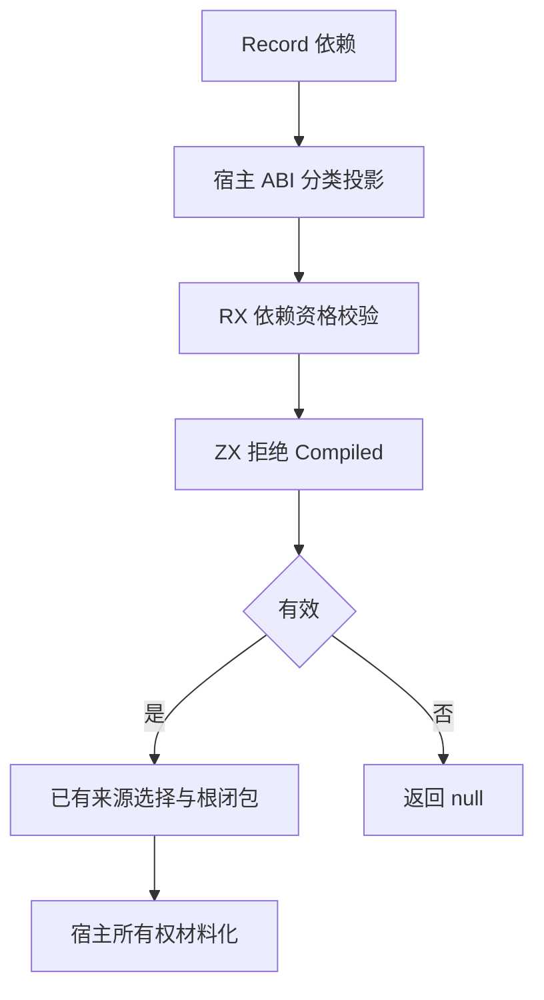
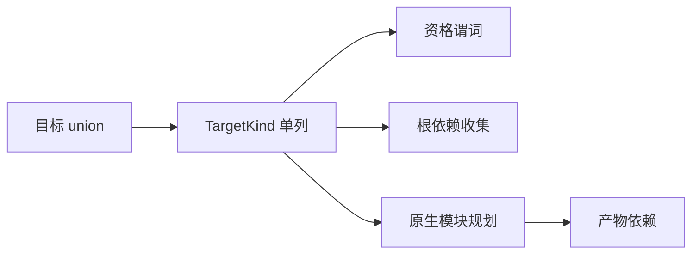

# 产物依赖资格校验自举

- **Intent：** 将 artifact 依赖目标的资格规则从 Zig 材料化宿主迁入 RX/ZX。
- **Data：** prepared/contents.dependencies 在正式路径拒绝 Compiled，允许 Source/Native/External；唯一调用在 prepared/root，前置必经 roots。现有投影用 import_native 布尔列丢失目标类别。
- **Edges：** 不影响分析和链接层消费 compiled library；只约束当前 artifact.extract 接纳的记录依赖。不新增并行列或重复投影，保留 seed 自有规则和现有资源处理。
- **Answer：** 一列 TargetKind 投影、RX 显式前置资格校验、ZX 原子集合谓词；宿主去除资格判断。构建和限定既有专项验证，记录剩余规则后提交。

## 架构图

## 数据流图

## 实施步骤

1. 在共同职责目录定义 TargetKind 枚举，由 roots 与 planning 模型共享。
2. 以 import_kinds 替换现有 import_native，一次穷尽 union→enum ABI 投影；保持 specifiers 平行列。
3. roots/native_root 与 planning/native_dependencies 只在 Native 时收集原生模块，不改变 Source/External 的允许行为。
4. prepared/run 通过现有 borrow.slice 在两个生成 ABI 间借用该列；该函数检查 enum tag、成员名和值，不增加复制或新抽象。
5. roots.rx 在 select 之前显式执行依赖资格谓词，覆盖 types、entry、function 全部记录。宿主 compiled 分支改为 unreachable，表明已经验证的内部契约。
6. 执行已有 artifact 无效输入、资源、混合依赖及导入专项；不新增测试，不跑全量测试。

## 自我批判

这里解决的是 artifact 记录依赖是否可接纳，不是 compiled library 是否可使用。错误更早返回可能改变分配失败顺序，但最终仍为 InvalidModule。不能由单个规则迁移推断整个 artifact 或编译器已自举。
