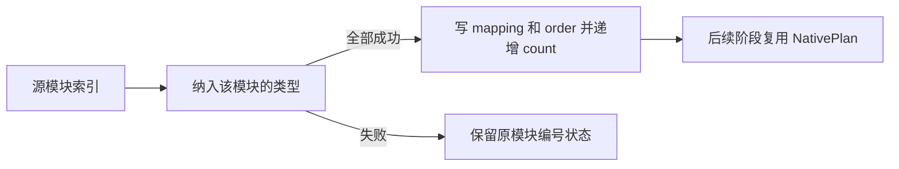

# 产物模块编号与导入规划

## Intent：最终目标

将原生模块首次纳入的编号、追加顺序及后续导入推进逻辑迁入 RX/ZX，替代只能记录选择与否的过渡掩码，为正式产物状态迁移保留真实顺序。

## Data：可用证据

artifact/build.zig 的 nativeModule 在纳入全部类型成功后，追加模块并写 native_mapping；重复模块直接返回。初始扫描按即时类型映射前向执行；随后先 type imports，再按 dependency identity 或 specifier 处理显式 native imports，最后函数导入可能继续追加模块。1cd5896ff 已提供通用跨阶段独占缓冲和普通指针 ABI 出口。

## Edges：边界与限制

- 编号在模块全部类型纳入成功后提交；失败不得提前递增模块 count。
- mapping 使用 0 未纳入、编号+1 已纳入，order 保存首次纳入的源模块索引；不按最终布尔掩码重新排序。
- NativePlan 只分配源模块数量的固定元数据，不复制全部模块载荷；额外 order 元数据为每源模块 4 字节。
- 重复类型已存在映射时直接返回原状态，避免重新分配 DFS 栈并保留原对象身份。
- RX 明确连接初始规划、类型导入和显式模块导入，错误在阶段边界短路；集合内部循环保留 ZX。
- 不新增测试，不跑全量；真实模块生成与入口编译先行，既有产物专项按相关范围核查。
- 未完成正式宿主接入或字符串生命周期前，不能声称 Workspace 已撤除。

## Answer：交付及成功标准

NativePlan 模型、初始化、单模块纳入、前向发现及后续导入阶段源码和逐字草稿；生成调用路径需保留类型三列与模块两列缓冲。编号与错误提交顺序须逐条对照原实现，阶段成功后再提交推送。

## 自我复核重点

检查空模块、重复导入、多个模块相同 key 的扫描行为、迟到模块的顺序、类型错误后模块编号未提交，以及已映射类型的根身份。不能仅以生成成功作为顺序正确的证明。

## 初始化顺序复核

旧 Build.init 先分配 native_mapping，再初始化 Types，之后才进入 roots。新 NativePlan 初始化移到 plan.rx 最前，作为元数据准备；不得在 roots 已返回失败状态后再分配模块数组。后续 native 扫描与 imports 仍由 RX Ready 门禁短路。此调整保留失败后的阶段边界，也避免为局部分支放宽所有权证明。
