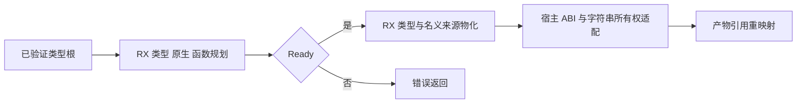
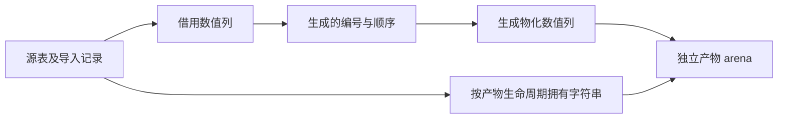

# 产物规划宿主接入

## Intent：最终目标

正式 artifact 提取使用 RX/ZX 的类型、原生模块和函数编号规划及类型物化，移除正式路径对旧增量编号状态的依赖。源程序释放后，产物仍独立有效。

## Data：可用证据

c3d6411d0 已提供完整前置编号规划，生成入口复用七列缓冲。现 artifact/build.zig 仍在正式路径自行 include 类型、纳入 native 和 function，Nodes 复制时再次调用 Types.include。roots.collect 已有正式 RX/ZX 路径；semantic extracting/materializing 已有 RX 类型表及 nominal 列物化。

## Edges：边界与限制

生成器引导仍保留 seed 路径；正式 generated 路径必须真实调用新规划。源类型表及 nominal 字符串不可在源 arena 释放后继续借用；拥有字符串是产物语义要求，不把这种生命周期复制伪称零复制。不得复制已经由生成器拥有的数值列来掩盖适配设计。Nodes 内的复制与其他引用重映射仍需后续迁移，当前只把 ABI/所有权适配留在宿主，不新增专用语义运行库。

## Answer：交付与验收

新 RX 规划→状态门禁→类型物化，正式 build 注册及宿主接线，编号映射直接消费，复用既有产物提取、无效输入和分配失败专项；不新增测试、不运行全量。记录源生命周期、错误类别、首次编号顺序及实际调用闭包。每个 ZX ≤120 行。

## 自我批判

不能仅注册一个生成模块却继续使用旧 builder 来宣称迁移。必须审查最终分支和真实测试调用；仍由手写 Zig 完成的节点复制及宿主流程单独列为未完成。

## 标准构建发现的错误集合边界

真实重生成全部模块后，RX graph 新增 Overflow 来自 std.math.add(usize, list.len, 1) 的容量检查，按现有路径适配器同样映射为 OutOfMemory。path_segments 的 IndexOutOfBounds 来自 reduce 降为普通循环后保留的防御性索引检查，三个生成位置均位于同一 source/index 的 index < source.len 条件之内，访问前没有更改这两个字段；沿用 graph 的内部不变量处理为 unreachable。仅列出已检查的错误，不添加 catch-all，也不删生成检查或伪造错误集合。
