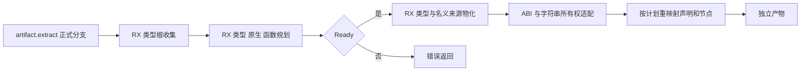

# 产物规划宿主接入实施记录

## Intent：最终目标

让正式 artifact 提取实际使用 RX/ZX 的类型、原生模块和函数编号规划及类型物化，保持独立产物的源内存生命周期与引用重映射语义。

## Data：可用证据

基于 c3d6411d0 接入。`artifact.extract` 的 generated_parser 分支现在调用 prepared 适配层；旧 Builder 仅由 seed 分支使用。标准构建已重新生成模块并通过，最终 `zig build -j2` 退出码为 0，见 `标准构建结果.json`。没有执行全量测试。

| 既有专项     | 通过数量 | 主要覆盖                                   |
| ------------ | -------: | ------------------------------------------ |
| 产物提取     |        6 | 类型与函数编号、源分析释放后继续读取       |
| 无效输入     |        6 | InvalidAnalysis、InvalidIr、缺失与重复来源 |
| 产物分配失败 |        2 | 每个分配失败位置的资源清理                 |
| 混合产物提取 |       10 | 全类型图、共享依赖、原生声明、来源与源释放 |
| 混合分配失败 |        3 | 失败不改变源类型和来源列                   |
| Store 槽位   |        5 | 权限、局部编号、引用与字符串生命周期       |
| 缓存往返     |        2 | 原分析和编码字节释放后的重新联结           |
| RX 依赖图    |        2 | 包括三模块 512 个有向图的有限穷举          |
| RX 模块      |       15 | 路径规范化、无环边界、分配失败             |
| 合计         |       51 | 仅本次相关专项                             |

产物专项使用 generated_parser=true，链接当前正式源码与新生成 artifact_prepare；RX 专项使用标准构建真实重生成的 graph/paths。日志及编译命令均在本目录。未新增测试用例，也未修改既有测试断言。

## Answer：正式路径变化

`planning/materialize.rx` 明确连接编号规划、Ready 判断及类型表/名义来源物化。build 注册了 generated_artifact_prepare 与其独立 ABI。正式宿主不再调用旧 nativeModule/importFunction/Types.include 重新决定编号。

宿主只对所需 ABI 和所有权做适配：

- 复用一次 record 列投影，同时供根收集和规划使用；源函数签名列直接借用。
- 根收集仍按原 specifier 扫描，显式原生依赖规划仍使用 identity 或 specifier，保留两者原有职责。
- 生成器直接在产物 arena 构造物化数值列和字符串描述符列。宿主接管这些列，不再完整复制一次。
- 宿主复制 labels、field_names、names、owners、members 的字符串字节。名义来源 names 借用已拥有的类型 labels，避免依赖源分析 arena。
- Nodes.TypeMap 新 planned 分支直接读取带零哨兵的计划，缺失或越界映射返回 InvalidModule，不映射成 void。
- 原生和函数声明按 plan.order 复制；导入函数仍只保存签名。既有节点、contract、Store 和 external 的内容复制保持生效。

函数与原生 mapping 仍转换为既有 Nodes 的临时 nullable ID 表；这些表不进入最终产物。元数据、字符串和节点复制仍有分配，不能由“接管数值列”推导整个提取零分配。

## 标准构建中的附带修复

真实重生成暴露两个旧宿主错误集合边界。graph 的 Overflow 来自列表容量的 std.math.add 检查，按既有路径适配器语义映射到 OutOfMemory。paths 的 IndexOutOfBounds 来自 reduce 降为普通循环后保留的索引检查；三个生成位置都在同一 source/index 的 index < source.len 保护内，访问前没有修改二者，按内部不变量处理为 unreachable。只列举已经检查的错误，没有添加 catch-all 或删除生成检查。后续 17 个 RX 专项及标准构建通过。

macOS 环境中若干本地构建辅助程序未签名，进程停在进入程序前。逐个验证为未签名后，仅签名本工作树缓存中的辅助程序；每次终止原构建并确认退出后才重试。配置程序单独执行退出码 0，最终完整标准构建同样为 0。签名过程没有修改仓库源码、测试结果或系统安全设置；证据见 `签名环境观察.json`、`标准构建结果.json` 与构建日志。旧错误集合编译失败完整保留在 `错误集合构建失败.txt`。

## Edges：尚未完成的职责

正式路径已经使用 RX/ZX 的编号和类型物化，但 `prepared/root.zig` 的外层宿主流程、声明/内容复制及 Nodes 的引用重映射仍是手写 Zig。旧 builder 仍服务 seed 引导。此节点不等于完整 artifact 自举，更不等于整个编译器完成自举。

后续应继续迁移节点和元数据变换，再把完整产物阶段连接到 RX；不得把目前的过渡适配层改名为运行库来宣称完成。

## 自我批判

最初专项命令没有指定二进制输出，虽编译成功却不能运行；补充明确输出路径后重新编译并实际运行，只有后者计入验证。标准构建最初的环境等待和后续错误集合编译失败都没有算作通过。

直接修改字符串描述符只有在它们确属产物 arena 新生成列时才安全。本次已检查 rows/nominal 从空列构建，并由混合分配失败专项验证输入列不变、由源释放与缓存往返专项验证独立生命周期。这个结论不应推广到其他返回借用列的生成模块。

提交钩子会整理草稿和生成 Zig 的排版；编译与运行日志记录的是实际生成后的执行结果，不能把排版差异解释为另一次运行验证。
