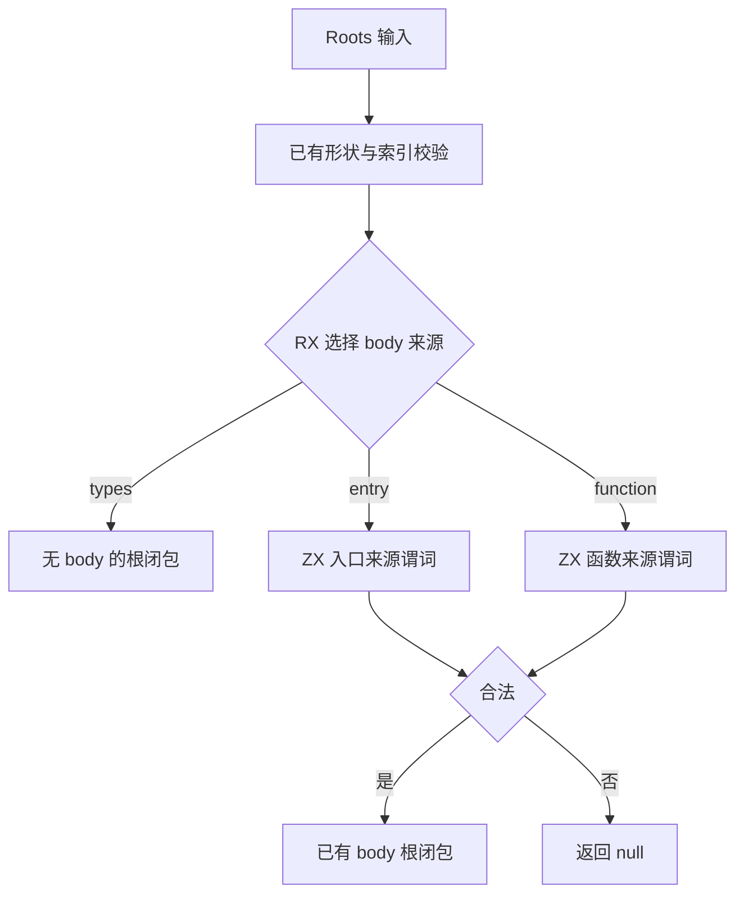
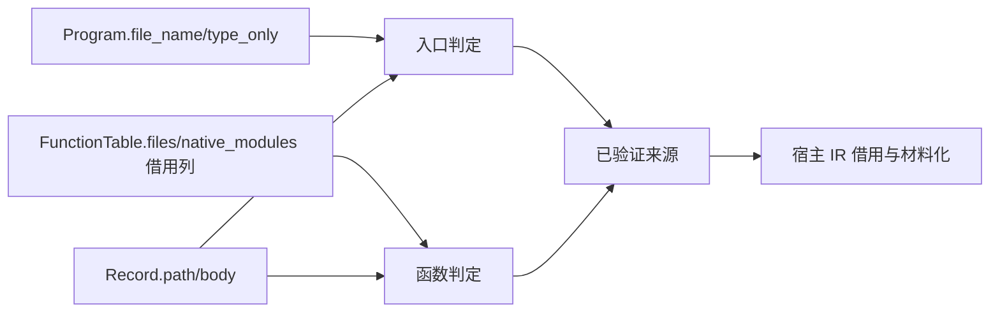

# 产物输出来源校验自举

- **Intent：** 将 artifact 输出函数的来源合法性从 Zig 宿主移入现有 RX 根选择流程与 ZX 原子谓词。
- **Data：** prepared/contents.function 是正式路径，判定 entry 的 type_only/路径以及 function 的越界、external/路径；它的唯一调用在 prepared/root，必经 roots。FunctionTable.at 通过 native_modules 是否为空重建 external。
- **Edges：** 不禁止正常 external 函数导入，只约束作为模块输出 body 的函数；types 记录不检查 entry 来源。宿主继续借用与材料化 IR。dependencies 的 compiled 目标拒绝是独立待迁规则，不扩大本节点范围。
- **Answer：** RX 显式校验再选取 body，ZX 两个来源谓词；宿主删除重复语义判定。限定已有 artifact 专项及构建通过，核对错误和所有权边界后提交。

## 架构图

## 数据流图

## 实施步骤

1. roots/model.zx 的 Request 增 file_name/type_only，Functions 增 files，Record 增 path。roots/run.zig 与 record.zig 仅借用原始元数据，不复制列或字符串。
2. roots/valid.zx 核对 files 长度；沿用现有 function id 边界检查。
3. roots/select.rx 的 entry/function 分支分别调用入口/函数来源谓词；合法时才进入 with_body，否则返回 null。
4. prepared/contents.function 仅按已验证记录借用函数或组装 entry，然后调用 nodes.function；删除原来散落的合法性规则。
5. 运行既有 artifact 提取、无效输入、资源失败及 mixed 专项；不新增测试、不跑全量测试。

## 自我批判与行为边界

内部 roots 会更早拒绝错误来源，但 artifact.extract 的错误类型仍为 InvalidModule；OOM 发生顺序可能因为更早拒绝而变化。源码审计未发现依赖旧宽松 roots 行为的直接调用或测试。这是输出来源规则的自举，不宣称整个 artifact 内容或编译器已自举。
