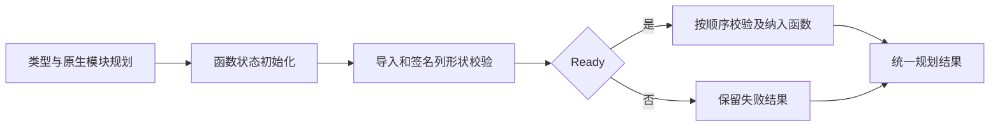

# 函数导入编号规划实施记录

## Intent：最终目标

把产物函数导入的签名校验、首次出现顺序和依赖纳入规则迁入 RX/ZX，延续既有类型与原生模块规划，为替换正式 artifact 宿主准备可执行规划状态。

## Data：可用证据

以 `e2ab4035f` 的实际编译器源码重建生成工具；工具解析正式 RX/ZX 源文件、推导完整入口，再生成 Zig。单文件与分模块两种实际入口均通过 Zig `build-obj` 编译，退出码均为 0。参数和结果分别位于 `最终入口编译参数.json` 与 `最终入口编译结果.json`。

这两种检查实例化导出的 `compilePlan`，它调用生成的 `execute` 并使用真实输入、输出类型；不是只导入未使用的 Zig 文件。本次没有新增测试、没有执行全量测试，也没有把编译成功作为运行对照证明。

实际 `execute` 的最终函数导入调用接管七列缓冲，均使用 `ArrayList.fromOwnedSlice` 与 `started=true`：

| 规划     | 复用列                  |
| -------- | ----------------------- |
| 类型     | mapping、order、origins |
| 原生模块 | mapping、order          |
| 函数     | mapping、order          |

观察记录见 `入口缓冲观察.json`，完整生成代码可核对实际调用点。此证据仅支持这些入口列未被完整复制，不能据此宣称整个产物规划零分配或证明峰值容量。

## Answer：实施结果

- `functions/model.zx` 定义签名列、导入列、函数编号状态以及统一规划结果。
- `initialize_functions.zx` 按源函数数量初始化 mapping/order，count 从 0 开始。
- `validate.zx` 校验签名列和导入列等长；此前状态失败时原样返回。
- `dependencies.zx` 计算单个函数的依赖闭包，按 native module、input type、output type 推进。类型编号在访问类型规划前校验；失败返回此前已完成的依赖状态。
- `imports.zx` 按导入顺序校验 ID 和签名，首次纳入才计算依赖并提交编号。重复导入仍检查签名，不改变编号和 order。
- `function_imports.rx` 显式连接形状校验、Ready 判断、集合算法和失败结果；`plan.rx` 连接前置导入、函数状态初始化及新阶段。

mapping 使用源 ID 索引，保存目标编号加 1，0 表示未纳入；order 在目标编号处保存源 ID。函数依赖未全部成功时，不提交当前函数的 mapping、order 或 count。

## Edges：边界与限制

此节点尚未接入 `artifact/build.zig` 的正式提取入口。旧 function_mapping 和复制逻辑仍在使用；导出、函数体、Store 物化、完整产物引用重映射及源内存生命周期仍需接通和验证。不能把新增规划文件或入口编译成功称为完整自举。

新增校验保证本阶段新增签名列和导入列的长度一致；输入规划状态仍必须来自前置初始化，类型表、原生模块表及其类型成员仍遵守前置阶段契约。该内部阶段不是接受任意破损所有列的公共解析器。

ZX 文件为 10—55 行，均低于 120 行。单项依赖闭包和有序去重集合算法保留在 ZX，跨规划阶段及结果短路在 RX；没有添加循环专用标签、解释器或动态调用层。

## 自我批判

第一次生成被内建格式规则拒绝，使用当前 compiler.format 后重新生成成功。形状校验是在静态复核后补齐的，最终两种入口已使用含校验的源码重新生成并编译。只读对照确认导入签名检查在 mapping 去重之前，防止错误重复导入绕过验证。

静态调用对照与入口编译无法证明完整运行语义或错误分配路径；正式宿主替换后必须使用仓库既有产物提取和无效输入专项验证。当前成果是一个内部规划阶段，整体 RX/ZX 自举继续进行。
