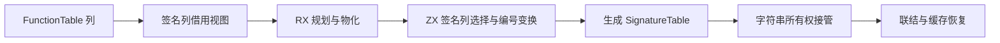
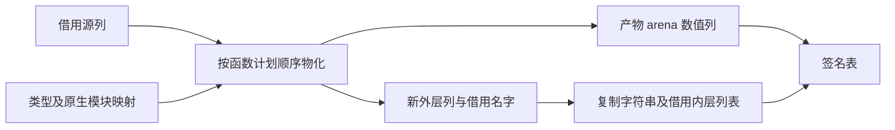

# 函数签名列式物化

## Intent：最终目标

将产物函数签名的选择、编号重映射及完整表构造迁入 RX/ZX。正式生成列直接由产物 arena 接管，移除 prepared/declarations 中逐行 Signature 的宿主算法。

## Data：可用证据

Signature 当前为行数组，包含 ir.External 可选内嵌结构；无法把 ZX 生成的对象指针数组视为这个行数组。FunctionTable 已有 external 各列，只有 native_inputs 仍为 ?NativeType 的内嵌结构，阻止无复制借用。直接消费路径包括 link、semantic_cache.restore、native_restore，另有 seed builder 和 native_artifact 两条构造路径。只读审查已确认 artifact-local FunctionId 必须等于签名行号，native artifact 还要求与 function_imports 严格同序。

## Edges：边界与限制

保留 Signature 行读取视图供消费者使用，正式存储改为 SignatureTable。不能生成行数组再转列，也不能新增专用原生语义桥。native_inputs 改为可选名称数组，FunctionTable.at 仍返回既有 ir.NativeType；此变化涉及 IR 序列化，ir_version 从 35 升到 36。artifact cache 的 functions 从数组变对象，module marker 从 v2 升到 v3，明确拒绝旧形状。

所有外来产物进入 at() 前必须校验签名列等长及非原生行元数据为空。保持输入/输出类型、输出 ownership、原生 module/member/export、allocator/io/process/tuple/fallible/concurrent 标志及 errors 完整。改动现有测试仅用于新的存储形状，不增加用例，不执行全量。

## Answer：交付与成功标准

core 增加签名列模型及种子/原生装载使用的 storage；ZX 增加同形签名模型及原子物化算法；RX 编排计划、类型、原生模块和签名物化。正式宿主只借用输入列、接管输出列并复制必需的字符串所有权。消费及缓存校验统一适配，复用提取、联结、缓存、native name 和所有权专项。标准构建验证真实生成路径。

## 自我批判与迁移边界

列式存储是直接物化的必要条件，不是完整自举的证明。core 仍有宿主表视图和 seed storage，最终应继续迁移状态归属；外层产物调度仍未全部迁入 RX。检查不能只看构建通过，需要确认生产选择与编号规则已从 declarations 删除，输出新列未被再次复制。

跨文件适配优先评估结构重构工具。当前会话已有 grit 帮助命令不可运行的直接证据，因此对已审查的具体接收者进行限定替换，不对所有名为 functions 的字段全局替换。使用清单与差异审查覆盖每处改动。
