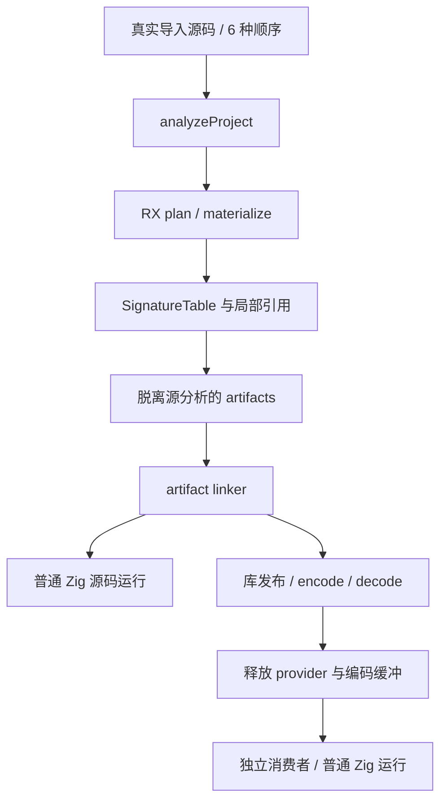
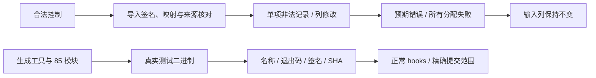

# 制品函数导入列式复验执行记录

## IDEA

- Intent：验证 RX artifact plan 在签名列式物化、引用列重映射和原生模块物化后的真实函数导入契约。
- Data：固定 b9708ea6a1fa8b80509782061d4ad9ae345b77e5，重新生成 85 个模块；旧 abd9f9e29 阶段全部终态并归档。新阶段 Debug / ReleaseSafe 各 54 个命名回归加 1 个发现入口通过；24 个派生二进制各 3 项通过，共 180 次命名测试执行、26 个实际运行二进制。
- Edges：只新增测试包源码与两处构建注册。测试 ABI 以 SignatureTable.count / at 为准，不加兼容旧数组的运行时分支。手写 adapter 仍是过渡，测试通过不代表完整自举；不宣称覆盖固定提交之后的新生产实现。
- Answer：真实源码分析、合法控制后单项负例、资源清理与不可变输入、脱离分析后的 artifact relink、源码/独立库实际程序执行；正常 hooks、范围保护、英文规范提交与 push。

## 真实模块与判断依据

first 为单一 value+1 运算；second 为列表谓词；noise 提供枚举类型与函数签名；main 导入三个模块，并可给 first 添加 twin 别名，执行 first(twin(in))。测试六种真实导入顺序，使全局函数 ID 和类型声明顺序变化；判断依据为真实文件路径、签名结构、引用对应关系及别名同一性，不硬编码某个全局 ID。

未调用的 noise/second 签名仍需保留。noise 的枚举声明来源必须进入局部类型闭包；多个 first/twin 导入元数据可以保留名称，但必须映射到同一局部函数签名。所有旧分析释放后，依赖路径、别名、枚举来源和签名仍应有效。

类型对照仅处理 fixture 实际使用的 scalar/list/object/enumeration；其他类型通过既有 mixed/frontier 回归覆盖，不以该小型 oracle 宣称通用类型等价证明。

## 非法记录与列结构

每个伪造导入前先提取并验证真实合法控制。分别篡改函数 ID、输入/输出类型、类型表外引用以及已包含函数的后续 twin 别名输入/输出。完整 Program 仍通过 IR 校验，因此拒绝来源应为 ModuleRecord 的导入契约，不能用破坏整个 IR 来冒充覆盖。

新增列式边界：逐列缩短 1 行必须在访问前拒绝；普通源函数不能携带原生 ABI effect 标记；结构仍合法但 output ownership 与真实实现不一致应报告 ConflictingInterface。只复制被修改的测试列，不更改生产表或添加运行库。

资源门禁单独扫 extraction 的所有分配失败，保留类型表与声明来源快照，核对成功/失败均不修改输入列。测试中的独立快照不属于生产复制整张类型表的实现。

## 实际程序流水线

真实源码 → analyze → 每个模块 extract → artifact linker → validateIr → 普通 Zig 输出。库路径在 artifact linker 后借用 AnalysisResult 视图调用既有 library.link；视图替换的是从真实 artifact relink 得到的 Program / origins，既有 owning analysis 仍独立管理生命周期，不对借用视图调用 deinit。

库 encode/decode 后覆盖并释放编码缓冲，释放 provider、所有 extracted artifact、relinked Program 与发布库；随后独立消费者通过公共 Input/Output 类型再次分析并生成 Zig。六个源码导入顺序各运行 source/library 两条路径，再分别使用 Debug/ReleaseSafe 构建执行。

每个派生程序有三项实际运行门禁：两次 alias 调用得到输入+2，覆盖 0、1、17、65537 和 u64 最大值减 2；后续执行保留早先输出；所有运行分配失败清理。运行时 oracle 为独立 Zig 加法，不调用被测编译器求预期。

## 迁移阶段与脚本修正

旧数组签名阶段全部通过：每模式 51 个命名回归及 1 个发现入口；24 个派生二进制各 3 项通过。运行期间主分支改为 SignatureTable，因此旧实现与证据单独归档，不将其算作列式接口通过证明。

列式首轮命令遗漏 generated_artifact_remap 前的 --dep，Zig 参数解析即失败，未执行任何测试。终态命令、错误日志与原脚本均保存；修正标记后运行新的 final2 门禁，没有仅因观察超时重启进程。

## 架构与数据流

## 发布与目标核对

本批新增 18 项导入 / 列结构 / 生命周期 / 资源行为测试及 3 项运行模板，复用原有 36 项 artifact 回归。两个模式累计 180 次命名测试执行；两个发现入口单列，不当作功能用例。

矩阵独立审计仍为 128615 项目录用例、824 adapted、2081 excluded、103 equivalent、50589 上游文件未审查、6954 个上游关联目录用例。本批只补自有特性回归，不修改上游分类。

交付前按用户目标索引重新核对原话：英文 commit、ZX 最多 120 行、禁止生产复制整张表及 RX 真实编排。新 ZX fixture 为 7—9 行；生产包未修改。旧数组阶段、命令脚本错误及最终列式阶段分开保留，不把阶段结果混算。

## 自我批判

门禁发现入口单独计数；同一运行测试在 24 个程序执行不等于 72 个独立设计用例。此批为 zxc 自有特性回归，不增加 Test262 上游分类。不把源/库都通过推断为所有自举职责完成，仍需按规则检查传递依赖和 stage 1—3。
