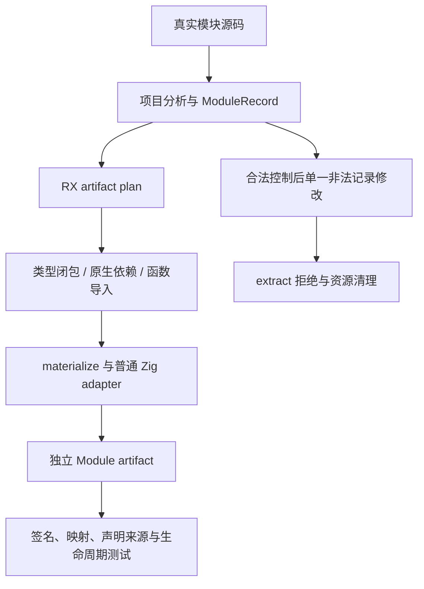

# 制品函数导入计划

## IDEA

- Intent：核对新 RX artifact materialize 入口的真实导入计划、局部引用和独立所有权；补全有合法控制的函数导入负例。
- Data：固定 abd9f9e29，包含 bbc16a941 的 RX plan 集成。新生成 artifact_prepare 与 ABI 后共 83 个模块。已有 mixed/frontier 验证类型图，但函数导入排序、同一函数多别名和输入/输出伪造边界尚需细化。
- Edges：只修改测试包。RX 真实编排/ZX 原子逻辑、零运行库及 ZX 120 行约束保持；本批门禁不能宣称完整自举或 stage 1—3。现有原生 adapter 仍存在，按规则记为过渡。
- Answer：真实源码 fixture、依赖/别名/函数映射、完整合法控制与单一非法修改、脱离分析后的元数据生命周期和分配失败；Debug/ReleaseSafe 实际二进制证据，正常 hooks 后英文 commit / push。

## 自我批判

导入未在函数主体调用不代表可以丢弃公开导入签名。多别名允许元数据多项，但共享函数 ID 应只保留一个局部签名。测试按原始路径/签名与引用对应关系判断，避免把某个全局 ID 顺序硬编码成语义。
