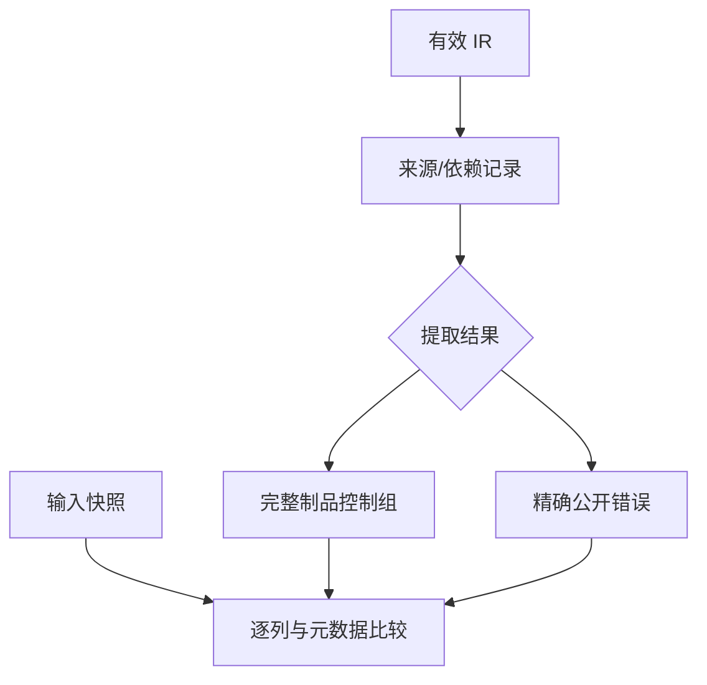

# 制品来源与依赖资格

## IDEA

- **Intent：** 验证来源校验和依赖资格迁入 RX/ZX 后，制品提取保持正确的来源边界、拒绝范围及错误优先级。
- **Data：** 固定 `5252a49da6aae83f9a758d995875633298c439ce`，包含 92e29de6a 与 fa20398f4；现有 artifact invalid/rejection 测试缺少来源路径和 Compiled 目标组合。
- **Edges：** 仅修改 packages/test 与本目录，不修改生产源码。Compiled 资格只限制当前 artifact 记录，不否定编译库分析/链接能力；用现有 library 门禁作控制。记录变异保持完整 IR 有效，不用伪造 AST 冒充源分析。
- **Answer：** 新增来源、依赖位置/分支、组合错误及分配失败测试；重新生成 83 个模块，在两种模式执行相关完整测试根，保存证据后用英文 Conventional Commit 提交 push。

## 实施

1. 独立固定工作树，从最新现存正式命令与当前 build 源码核对模块图。parser 输出仍 82，连 lexer 为 83，顺序及原生接口不变。
2. 从真实 ZX 项目构造 Source/Native/External 三类依赖与 types/entry/function 三类记录，先验证未变异提取成功。
3. 变异记录 path/body/依赖 target；检查来源不一致、原生函数充当源模块 body、范围越界、Compiled 在首中尾和未使用位置的拒绝，以及非当前记录不被误拒。
4. 组合缺失名义来源、IR 错误与记录错误，核对公开错误优先级。分配失败扫描验证失败资源释放及全部相关输入内容保持。
5. 复验上一部分相关根，逐项核对两模式测试名、生成及执行字节，检查发布范围并提交 push。

## 架构图

## 数据流图

## 自我批判

元数据变异覆盖提取接口的防线，不等于语言源码会自然产生这些非法记录。错误优先级限定于公开 extract 与本轮明确组合，不扩展到所有内部阶段。分配失败只注入提取 allocator，fixture 与快照独立持有；若发现实际实现缺陷，只发送可复现的新缺陷给授权实现会话。
