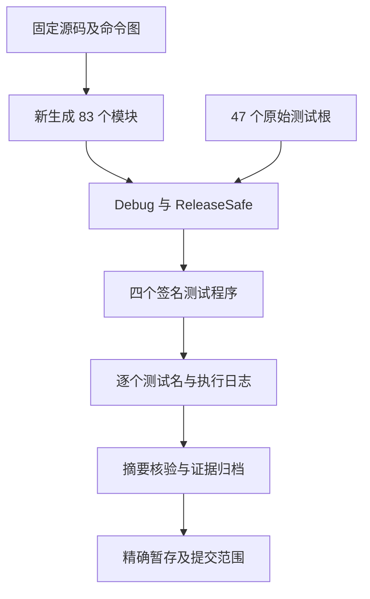

# 制品来源与依赖资格执行记录

## IDEA

- **Intent：** 用真实项目分析结果验证 artifact.extract 的来源与依赖门禁，并检查失败路径的资源释放和输入内容保持。
- **Data：** 源码固定于 `5252a49da6aae83f9a758d995875633298c439ce`；包含来源校验迁移 `92e29de6a` 与依赖资格迁移 `fa20398f4`。执行输入、源码摘要、生成状态和逐个测试名均保存到本目录证据。
- **Edges：** 仅修改测试包及本批记录。47 个相关测试根并非全仓测试或完整 Test262；元数据变异验证公开接口防线，不声称合法源码自然产生这些非法记录。
- **Answer：** 两种模式的实际执行结果、26 个新增具名测试、精确发布清单、英文 Conventional Commit 与远端推送校验。

## 验证对象与判据

| 分类       | 新增具名测试 | 判据                                                                                                    |
| ---------- | -----------: | ------------------------------------------------------------------------------------------------------- |
| 来源       |            9 | entry/function 的路径与 body 一致；Native body、越界 ID 与 type-only entry 被拒；纯类型记录保留合法边界 |
| 依赖       |            8 | Source/Native/External 保留；Compiled 在首、中、尾与未使用位置仍被拒；拒绝范围限定选中记录              |
| 错误优先级 |            6 | InvalidAnalysis、记录范围、InvalidIr、InvalidModule 与 MissingNominalOrigin 的明确组合顺序              |
| 资源       |            3 | 合法、来源拒绝、依赖拒绝三条路径扫描全部可观测分配失败，检查内容保持与恢复提取                          |

真实 fixture 同时包含三条 Source、一条 Native、一条 External 导入，并形成 main、helper、types 三个源模块。六种排列改变前三条导入顺序，类型导入固定；未排列源文件集合。Compiled 变异复制记录及 imports，不改完整 IR。拒绝测试在提取前仍验证完整 IR 有效。

输入快照用 JSON 保存 program、modules、nominal origins 的语义内容，比较提取前后字节。它不证明指针地址、arena capacity 或内部布局保持。

## 架构图

## 数据流图

## 执行与修正

生成器及其输入工具六个步骤均实际执行成功，重新生成 83 个模块；使用 generated_parser=true。两种模式均执行 types_and_artifacts 与 compaction 两个聚合入口，入口只导入原始测试文件；没有使用 --test-no-exec。

首轮两种模式均在编译阶段发现测试夹具类型反射错误：从 undefined slice 取元素来推导 Record，触发 Zig 非法 undefined 使用。改为通过 @FieldType 和 @typeInfo 读取元素类型。两条旧进程均终态退出后，归档旧输入、夹具、状态和日志，再更新草稿、执行输入及静态检查。此错误属于测试实现，没有向实现会话发送消息。

最终两种模式均终态退出 0：每种模式 types_and_artifacts 307 个、compaction 16 个，合计 323 个具名测试；两种模式共 **646 次具名执行**，四个程序均通过严格签名核验。47 个原始测试根在两种模式中完全一致，逐个测试名与源码抽取的预期集合一致。24 项最终静态检查通过。

未发现本轮确认的新实现缺陷，未向实现会话发送消息。验证期间主分支新增 `fc9e715487c259d28c227f2fedcda9c9f18bf231` 文档提交，packages 字节未变化；本批执行仍固定于前述源码版本。

## 自我批判与未覆盖边界

本轮对源码、记录、名义来源内容保持与合法恢复有明确检查；恢复仅验证提取结果和依赖深相等，没有运行生成应用，不能扩大为应用运行行为通过。分配失败只注入待测提取 allocator，合法恢复使用独立 testing allocator。静态检查通过不代表语义编译通过，首轮反射错误就是具体反例。

真实 Native 正向依赖覆盖默认 specifier 路线，未增加 Native identity 优先级及 fallback 的独立错误矩阵。本批也未增加 Test262 适配条目。完整生产级对齐目标保持未完成。

提交标题和正文均使用英文，标题为 `test(compiler): cover artifact provenance and dependency eligibility`。按精确文件清单提交，保护其他并行工作及既有外来修改；测试证据只对应固定版本，不自动延伸到后续实现提交。
