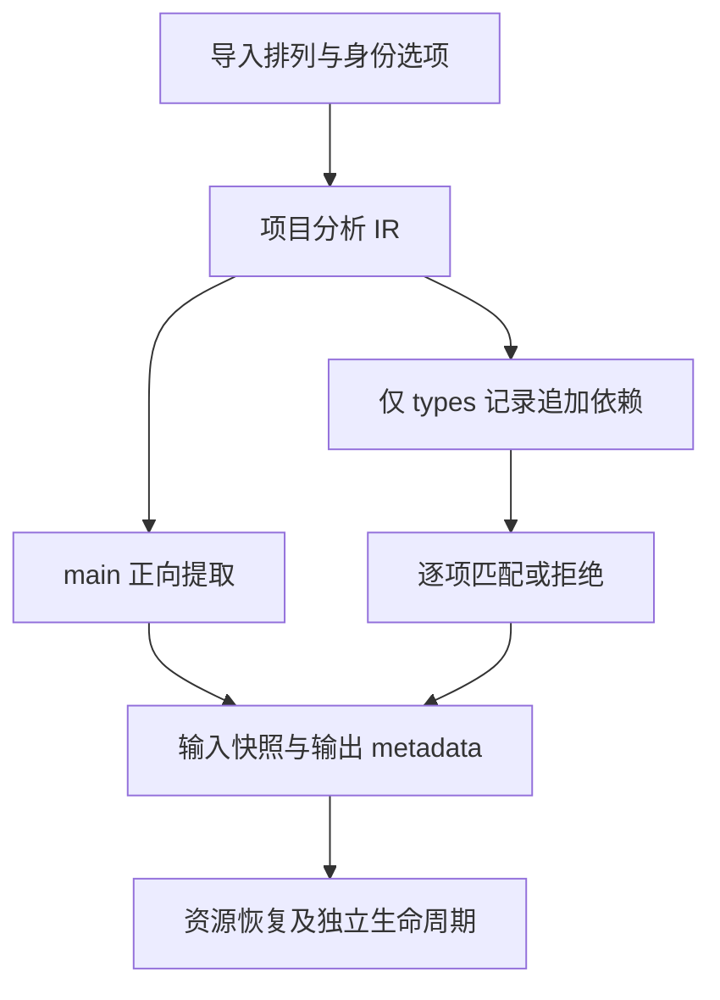

# 原生依赖身份与扫描边界

## IDEA

- **Intent：** 验证制品提取的 Native 依赖键契约与完整扫描，避免错误 fallback、漏拒和跨依赖状态残留。
- **Data：** 固定 `b351a31bc37445127905cf8b8d3e287ba54a6b8f`；native_dependencies 使用 dependency.identity ?? specifier，与 native module.key 比较。现有正向 fixture 分别覆盖 identity 和 specifier，但没有独立组合矩阵。
- **Edges：** 只修改测试包及本目录，不修改生产实现。真实项目生成 IR；元数据变异只测试公开 extract 防线，不扩展语言源码契约。旧工作树和执行证据保持固定，本批使用新工作树。
- **Answer：** 新增身份、扫描顺序、内容保持及资源失败测试；两模式实际执行相关测试根，归档生成源码和执行日志，英文 Conventional Commit 后 push。

## 执行步骤

1. 核对公开 extract、RX 规划和 ZX 原子匹配规则，先从真实项目提取合法结果。
2. 使用三个不同原生模块，排列导入顺序。隔离无函数依赖的 types 记录，确保声明依赖本身触发原生模块保留。
3. 检查 identity 优先与空/null 边界、specifier fallback、不同记录范围、只匹配 Native、首中尾和匹配后失败的扫描状态。
4. 验证重复 Native 去重、源输入语义保持、独立结果生命周期及每个可观测分配失败点恢复。
5. 重新生成当前 83 个模块，执行两模式相关回归，精确核验发布范围，提交推送。

## 架构图

## 数据流图

## 自我批判

预期必须来自公开键契约与有效 IR，不因观察到当前行为就把它固化成正确结果。身份错配与 specifier 错配分开处理；匹配后的状态重置需使用同一次提取中的多条依赖来证明。内部循环排列不冒充额外具名测试，也不冒充新增 Test262 条目。
