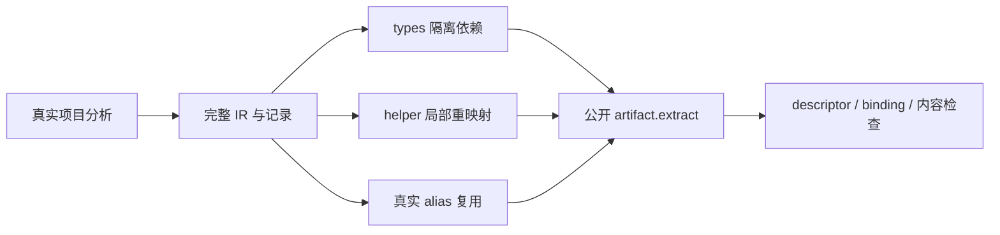
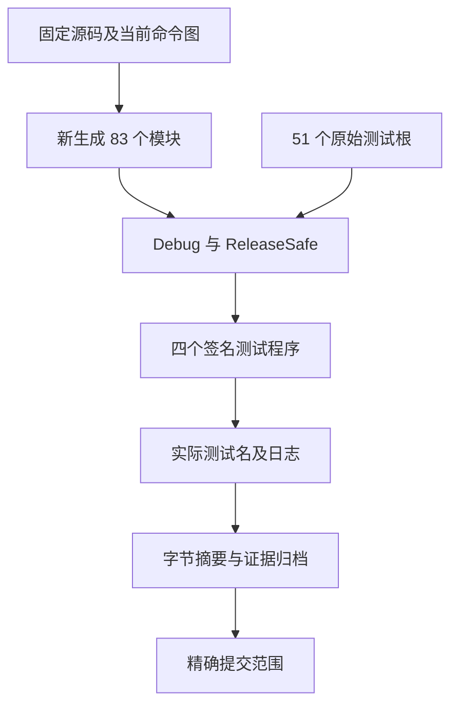

# 原生依赖身份与扫描边界执行记录

## IDEA

- **Intent：** 验证 Native 依赖键选择、扫描完成条件、首次纳入与局部重映射，避免迁移后遗漏真实边界。
- **Data：** 固定 `b351a31bc37445127905cf8b8d3e287ba54a6b8f`；公开 artifact.extract 调用的 RX 规划及 native_dependencies/native_include ZX。对照已有 native_link、artifact/mixed 与前一批 provenance 测试。
- **Edges：** 只修改 packages/test 及本目录。51 个相关测试根不等于全仓或完整 Test262；新增矩阵中元数据变异不声称是合法源码会自然产生的状态。
- **Answer：** 25 个新增具名测试、两模式实际结果、27 项最终静态检查、83 个新生成模块、执行证据及精确提交推送。

## 关键证据与设计修正

Native provider.identity 为 null 时，Project.importNative 仍将 provider.key() 写入 dependency.identity。既有默认 provider 正向用例无法证明 dependency.identity 的 null fallback。本批保留真实分析对照后，显式将复制依赖的 identity 置 null，分别验证未识别 provider 的 specifier 匹配成功、显式 identity provider 不误用 specifier 匹配。

普通 fixture 包含 main、helper、types 三条可达 source 和三个独立 provider；main 的前三条 Native 导入按六种排列改变真实全局 Native 表顺序。helper 只使用 third，检查输出保留一个 provider、local module id 为零，同时对应真实全局 signature 的 key 与文件。types 记录只有 scalar Count 导出，function_imports/type_imports 均为空；复制 Native 依赖到它时，不能通过函数或 nominal 根提前纳入 provider。

真实 alias fixture 让 helper 先加载 zig:canonical，再由 main 加载 zig:alias；两 provider 共享 host@1，分析只产生一个 canonical descriptor。main 的 alias dependency 保留不同 specifier，但按 identity 成功提取。这个正向场景来自真实分析，独立于元数据变异。

## 测试粒度

| 类别             | 新增具名测试 | 独立观察                                                                                                                        |
| ---------------- | -----------: | ------------------------------------------------------------------------------------------------------------------------------- |
| 身份键           |            9 | provider 两类 key、null fallback、错误/空 identity、不允许失败 fallback、不同 specifier 正向                                    |
| 扫描与映射       |           11 | 空依赖、首中尾 provider、无使用仍纳入、重复去重、先匹配后 missing、missing 首中位置、非 Native 忽略、global→local、C/A/C/B 顺序 |
| 分配失败         |            3 | identified 成功、null fallback 成功、匹配后缺失拒绝；逐个可观测分配失败及合法恢复                                               |
| alias 与生命周期 |            2 | 真实 alias 共享 identity；明确复制的输入字符毒化及 analysis 释放后输出保持                                                      |

内部六种导入排列及逐个分配失败点不额外计作具名测试。身份矩阵对每个 provider 运行，错误 key 选取全表不存在的 missing@1，不把另一合法 provider 的 key 错判为必须拒绝。

函数断言检查 record.function_imports 的唯一 ID 数、输出 binding 数和每条 local ID 的实际 signature，避免输出函数表丢失后产生空循环。只对当前 scalar-only fixture 深比完整 Native descriptor；若以后增加 native type bindings，必须改为比较语义对应的 remapped type，而非沿用全局 ID 深比较。

Source/External 对照分别包含匹配真实 provider 的 key 和不存在的 key，两种情况下 types 产物的 Native 表都为空。C/A/C/B 依赖保留四条 dependency，Native 表只保留三个 descriptor，顺序为 C/A/B。

## 架构图

## 数据流图

## 执行结果

生成器六个实际步骤均退出 0，重新生成 83 个模块；27 项最终静态检查通过。

Debug 与 ReleaseSafe 均实际执行并终态退出 0：每种模式 types_and_artifacts 332 个、compaction 16 个，合计 348 个具名测试；两种模式共 **696 次具名执行**。51 个原始测试根、逐个预期测试名与两模式执行日志一致。四个测试程序均经过严格签名核验，没有使用 --test-no-exec。

本轮没有确认新的实现缺陷，未向实现会话发送消息。最终提交按精确文件清单，保留其他工作区修改；本批只证明固定版本与这些测试覆盖的行为，完整生产级对齐目标仍未完成。

## 自我批判

快照证明 program、records、nominal origins 的语义内容保持，不证明指针或 capacity 不变。lifetime 用例只毒化明确 dupe 的 specifier、identity、names 与 import_name，随后释放 analysis；没有写入静态字面量，也没有把未知借用缓冲强制改为可写。输出快照验证 Native descriptor 和 dependency 元数据所有权，不冒充生成应用运行结果。

资源注入仅作用于 extract allocator；恢复路径借用仍存活的源 arena，以合法 records 和普通 testing allocator 重新提取，不 deinit AnalysisResult 副本。通过这些路径不能推断编译库链接、原生副作用或应用运行时整体已验证。本批未新增 Test262 适配条目，完整目标仍未完成。

只读审查提供了 provider/null 关系及两个断言薄弱点，均已落到真实测试；静态审查不代替实际执行。只有确认新的实现缺陷才向授权实现会话发送消息。提交标题及正文均使用英文 Conventional Commits。
