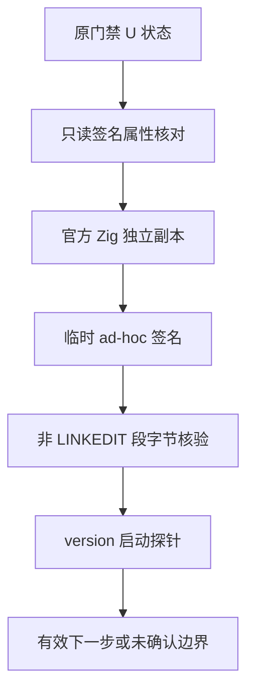
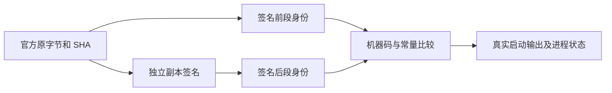

# 原生工具启动阻塞核验

## IDEA

- Intent：确认原生启动阻塞是否受可执行文件签名状态影响，寻找能够恢复真实测试的最小工具路径。
- Data：原 Zig、生成测试、独立同字节 Zig version 探针持续为 U 状态，存活超过二十分钟；原 Zig 和测试二进制 codesign 查询均为未签名。Node 具有开发者签名且实际可执行；原 Zig 没有扩展属性。现有 CI 只在 PR/workflow_dispatch 时触发，当前 0ed436bde 无运行，工作流只验证发行打包及独立编译器，不能代替待验用例。
- Edges：只使用官方 Zig 可执行文件的独立副本；原始 SHA 必须为 1cd710413b0f587df7bd796ac5b02b10378210a933a029b6434759514ca141df。不写原 SDK、不调整系统安全策略、不操作签名身份或私钥、不改源检出、不中断原门禁。ad-hoc 签名不冒充开发者认证或公证。签名前后逐段核对非 LINKEDIT 数据，尤其机器码；仅执行 version 探针，不把它当作测试通过。
- Answer：中文证据记录、原始与签名后 SHA、Mach-O 段及签名校验、命令和进程终态或真实等待。探针成功后才评估独立工具检出的编译路径；失败则保留边界，不能循环制造探针或声称根因已经确定。

## 自我批判

签名状态和 U 等待的相关性不是因果证明。临时签名副本启动成功仍不证明原 OS 等待的具体内核原因，也不证明所有测试可运行；必须进一步核对真实编译与普通产物。不得因探针失败放宽已有源码、用例或生产级验收标准。
