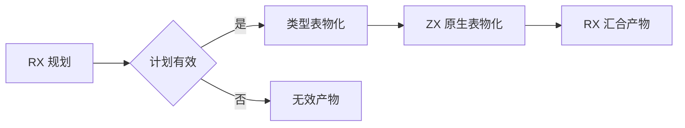
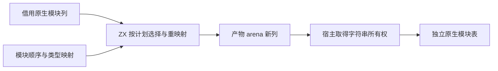

# 原生模块产物物化

## Intent：最终目标

将正式产物中原生模块表的选择、顺序、类型引用变换和表构造迁入 RX/ZX。继续借用输入列，生成结果列直接由产物 arena 持有；宿主仅完成字符串所有权接管。

## Data：可用证据

prepared/declarations.zig 的 natives 按计划遍历模块，再逐行复制并重映射 types；规划输出已经提供 order/count/mapping。ir/canonical/native/model.zx 与 NativeModuleTable 的列布局一致，现有 borrow.columns 可以静态验证并接管这些列。类型物化已使用同一方案保留生成数组、复制借用字符串。

## Edges：边界与限制

保持身份、导入名、类型命名空间及绑定名不变，保持计划顺序。输入内层字符串切片仍被借用，不能在复制之前原地修改，避免污染源分析。只允许修改生成的新列；内层字符串列表先取得独立列表，再复制字节。原生类型编号列不做二次复制。种子路径不受影响，不改变 NativeModuleTable 的公共形状。

## Answer：交付格式与成功标准

新增一个原生表物化 ZX 算法，接入既有 materialize.rx 阶段，删除正式宿主重复算法。草稿与日志保留本目录；复用混合产物、分配失败、缓存和联结专项，不新增测试、不执行全量。标准构建验证生成入口。ZX 文件不超过 120 行。

## 自我批判

此职责不能简化为仅把逐项映射搬入 ZX，而仍由 Zig 选择与构造原生表。验收需要确认旧 natives 算法删除、RX 中出现真实阶段、新编号列直接接管、输入未被修改。宿主所有权适配及函数签名物化仍为过渡依赖，不能据此宣称完整产物自举。

## 生成代码审查修正

初稿在循环状态中嵌套 Modules，再对每列赋值，生成器会为每次嵌套对象更新物化对象。将列直接放入同一循环状态，最后仅组装一次 Modules，避免此处不必要的逐行对象重建。先等初稿已启动验证结束，再应用最终稿并重新生成、验证，不在构建过程中修改输入。该优化不构成通用生成器嵌套对象问题的修复。
