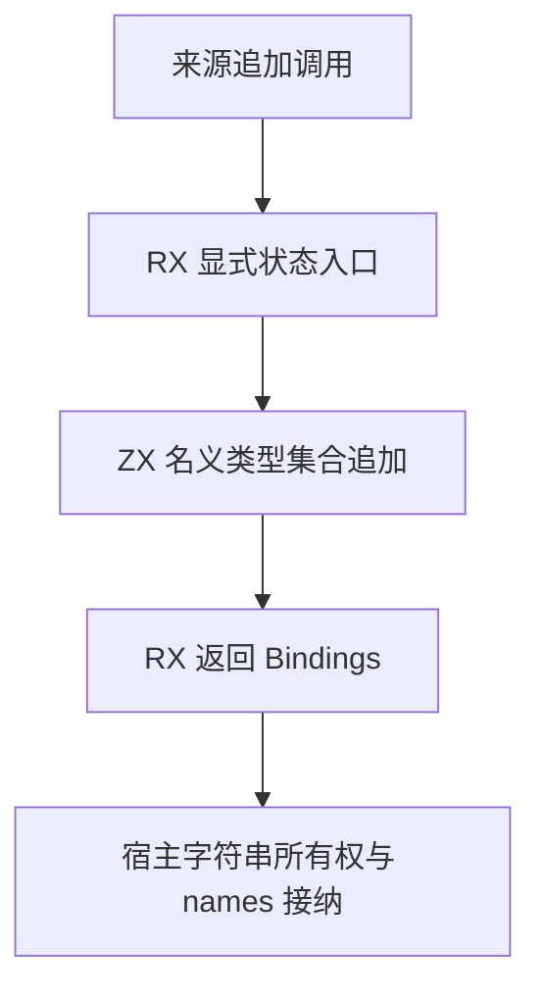
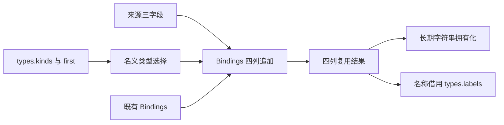

# 名义来源状态自举

- **Intent：** 将类型来源追加的状态写入改为显式 ZX Bindings，撤除 origin_writer 专用原生桥。
- **Data：** semantic/produce.zig 正式路径通过 Writer 逐项追加 Origins.Storage；正式消费者包含 modules/semantic_cache/native_artifact.zig，其他若干调用在 seed 路径。类型合并已提供列式 Bindings 与通用缓冲通道绑定。
- **Edges：** 不改变来源身份编码、选择规则和 first 起点；不复制既有列；保持 seed 引导实现。正式宿主仅保留 ABI、字符串生命周期与标准容器资源处理。对失败后部分追加的契约先核对，禁止新增测试或全量测试。
- **Answer：** RX 显式接收输入和返回更新状态；ZX 一个内聚集合算法选择名义类型并追加四列；生成器静态复用已有数组。验证来源行为、缓存消费者及分配失败，核对真实调用闭包后提交。

## 架构图

## 数据流图

## 实施边界

来源追加本身是一个原子集合算法；RX 可只有一次计算调用和显式 Return，不用人为拆阶段制造编排。所有控制该集合遍历的状态均由 ZX 显式表达。

宿主将 Storage 四列的 ArrayList 描述符交给生成缓冲通道，started 为真，不复制已有内容。生成计算期间新增来源字符串先借用输入；成功后再取得独立生命周期。同一次调用的来源相同，是否可以只复制一份不可变 owner/member，需核对所有权释放方式后决定。

若生成或资源接纳失败，四列必须保持同样长度，不能暴露半行状态；先核对现有失败契约，记录与原 Writer 行为的差异。names 不参与名义选择，继续从对应类型标签引用。

## 验收与自我批判

核对原生消费者和 seed 分支，不能仅凭单个模块编译通过宣布完整职责自举。检查缓冲入口及传递调用的描述符分配、列路径匹配、旧桥残留、ZX 行数与既有专项。长期 Origins.Storage 的平台资源实现仍是独立边界，不宣称整个编译器已经自举。
