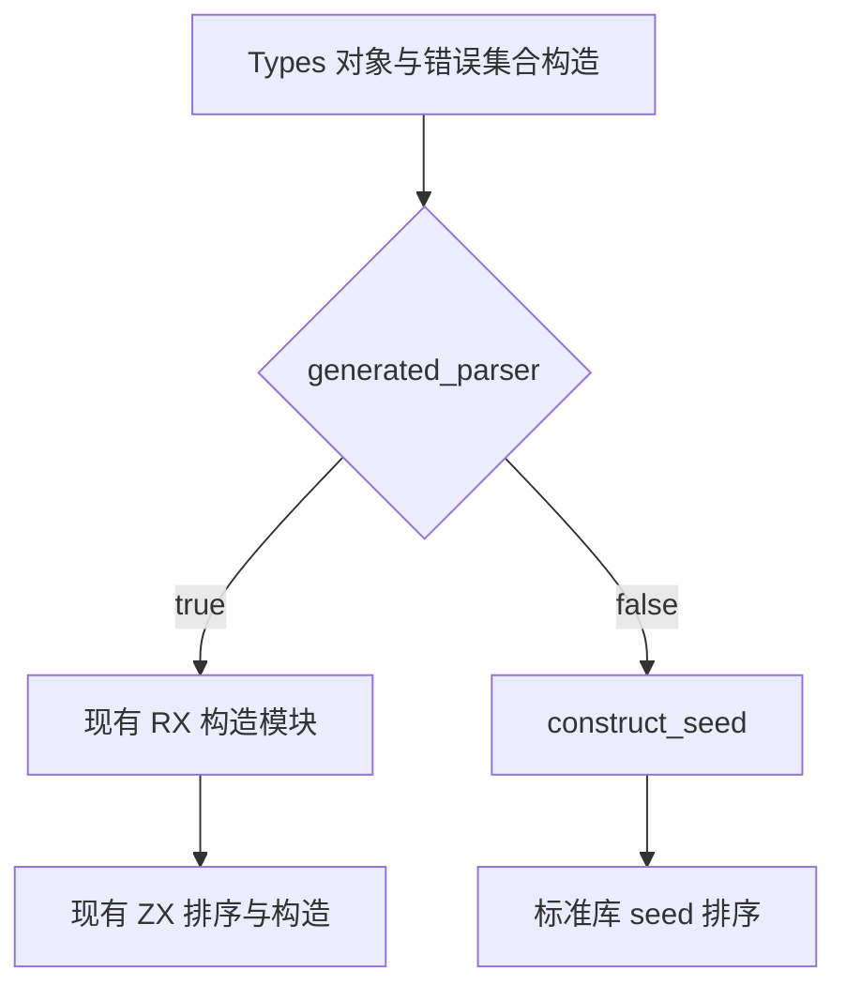
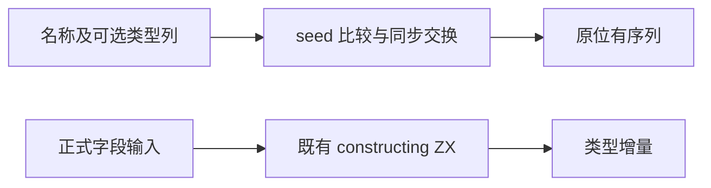

# 名称排序旧桥清理

- **Intent：** 删除已经没有正式消费者的 generated_name_sort 与 named_columns 专用桥，保留 seed 排序契约。
- **Data：** Types.errorSet/object 在 generated_parser=true 时调用 construction.create；construct_seed 是 ordering.sort 与 Fields.sort 的唯一消费者。全仓未找到专项直接导入旧排序入口。正式字段排序由 constructing/fields/sort.zx 实现。
- **Edges：** 不修改实际排序算法或 Fields 数据契约，不新增测试，不执行全量测试；构建生成器使用位置参数，移除两输出时必须同步后续索引。
- **Answer：** 清理死代码与构建依赖，构建并执行相关既有类型构造专项，复核生成参数与剩余调用后提交。

## 架构图

## 数据流图

## 执行边界

移除 ordering 下 sort.rx、sort.zx、sift.zx、columns.zig、columns.d.zx；ordering.zig 仅保留 seed 排序并相对导入 view.zig。清理 name_sort、ordering_abi、named_columns 与 named_view 构建接线，保留 Fields 的原有接口。生成输出删除两项后逐一核对输入位置对应，不只修改末尾计数。

## 自我批判

这是无消费者的过渡桥清理，不能计作又一个活算法的迁移；正式排序在此前已迁入 ZX。本节点以依赖简化和一致构建为成功标准，不借删除文件夸大自举完成度。
